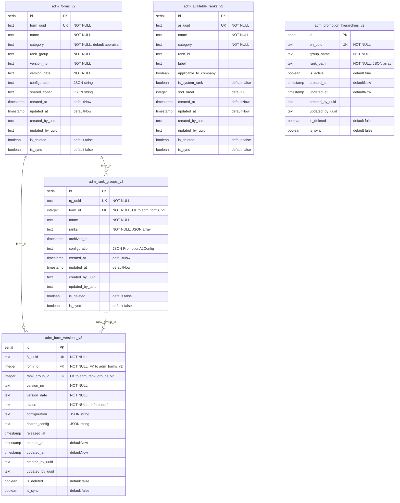

# Admin Module V2 Migration Plan

## Overview

Migrate the Admin module tables to v2 with UUID identifiers and audit columns, following the established v2 pattern (crew-pool, recruitment, rotation, vessel). All existing column names are preserved exactly. Logic and API response shapes remain identical to v1 for seamless UI binding.

---

## Table Naming Convention

All admin v2 tables use prefix `adm_` + original table name + `_v2`:

| V1 Table | V2 Table |
|----------|----------|
| `forms` | `adm_forms_v2` |
| `form_versions` | `adm_form_versions_v2` |
| `rank_groups` | `adm_rank_groups_v2` |
| `available_ranks` | `adm_available_ranks_v2` |
| `promotion_hierarchies` | `adm_promotion_hierarchies_v2` |

---

## Audit Columns (added to ALL tables)

Every v2 table includes the standard audit columns via the shared `auditColumns` spread (matching the established pattern in `shared/v2/crew-pool/schema.ts`):

```
created_at          timestamp   defaultNow
updated_at          timestamp   defaultNow
created_by_uuid     text
updated_by_uuid     text
is_deleted          boolean     default false
is_sync             boolean     default false
```

`sort_order` is **NOT** part of the standard audit columns. It is only included on tables that already have it in v1 (`available_ranks`) or where ordering is explicitly needed per-table.

> **Note:** If a v1 table already has `created_at` or `updated_at`, the v2 table keeps them (no duplication). Only the missing audit columns are added.

---

## Table Definitions

### Table 1: `adm_forms_v2`

| # | Column | Type | Constraint | V1 Column | Notes |
|---|--------|------|-----------|-----------|-------|
| 1 | id | serial | PK | id | Same as v1 |
| 2 | form_uuid | text | NOT NULL, UNIQUE | - | **New** UUID identifier |
| 3 | name | text | NOT NULL | name | Same as v1 |
| 4 | category | text | NOT NULL, default "appraisal" | category | Same as v1 (appraisal / promotion) |
| 5 | rank_group | text | NOT NULL | rank_group | Same as v1 |
| 6 | version_no | text | NOT NULL | version_no | Same as v1 |
| 7 | version_date | text | NOT NULL | version_date | Same as v1 |
| 8 | configuration | text | | configuration | Same as v1 (JSON string) |
| 9 | shared_config | text | | shared_config | Same as v1 (JSON string) |
| 10 | created_at | timestamp | defaultNow | - | **New** audit |
| 11 | updated_at | timestamp | defaultNow | - | **New** audit |
| 12 | created_by_uuid | text | | - | **New** audit |
| 13 | updated_by_uuid | text | | - | **New** audit |
| 14 | is_deleted | boolean | default false | - | **New** audit |
| 15 | is_sync | boolean | default false | - | **New** audit |

---

### Table 2: `adm_form_versions_v2`

| # | Column | Type | Constraint | V1 Column | Notes |
|---|--------|------|-----------|-----------|-------|
| 1 | id | serial | PK | id | Same as v1 |
| 2 | fv_uuid | text | NOT NULL, UNIQUE | - | **New** UUID identifier |
| 3 | form_id | integer | NOT NULL, FK -> adm_forms_v2 | form_id | Same as v1 |
| 4 | rank_group_id | integer | FK -> adm_rank_groups_v2 | rank_group_id | Same as v1 (nullable) |
| 5 | version_no | text | NOT NULL | version_no | Same as v1 |
| 6 | version_date | text | NOT NULL | version_date | Same as v1 |
| 7 | status | text | NOT NULL, default "draft" | status | Same as v1 (draft / released) |
| 8 | configuration | text | | configuration | Same as v1 (JSON string) |
| 9 | shared_config | text | | shared_config | Same as v1 (JSON string) |
| 10 | released_at | timestamp | | released_at | Same as v1 |
| 11 | created_at | timestamp | defaultNow | created_at | Exists in v1 (kept) |
| 12 | updated_at | timestamp | defaultNow | - | **New** audit |
| 13 | created_by_uuid | text | | - | **New** audit |
| 14 | updated_by_uuid | text | | - | **New** audit |
| 15 | is_deleted | boolean | default false | - | **New** audit |
| 16 | is_sync | boolean | default false | - | **New** audit |

---

### Table 3: `adm_rank_groups_v2`

| # | Column | Type | Constraint | V1 Column | Notes |
|---|--------|------|-----------|-----------|-------|
| 1 | id | serial | PK | id | Same as v1 |
| 2 | rg_uuid | text | NOT NULL, UNIQUE | - | **New** UUID identifier |
| 3 | form_id | integer | NOT NULL, FK -> adm_forms_v2 | form_id | Same as v1 |
| 4 | name | text | NOT NULL | name | Same as v1 |
| 5 | ranks | text | NOT NULL | ranks | Same as v1 (JSON array string) |
| 6 | archived_at | timestamp | | archived_at | Same as v1 |
| 7 | configuration | text | | configuration | Same as v1 (JSON = PromotionA2Config) |
| 8 | created_at | timestamp | defaultNow | - | **New** audit |
| 9 | updated_at | timestamp | defaultNow | - | **New** audit |
| 10 | created_by_uuid | text | | - | **New** audit |
| 11 | updated_by_uuid | text | | - | **New** audit |
| 12 | is_deleted | boolean | default false | - | **New** audit |
| 13 | is_sync | boolean | default false | - | **New** audit |

---

### Table 4: `adm_available_ranks_v2`

| # | Column | Type | Constraint | V1 Column | Notes |
|---|--------|------|-----------|-----------|-------|
| 1 | id | serial | PK | id | Same as v1 |
| 2 | ar_uuid | text | NOT NULL, UNIQUE | - | **New** UUID identifier |
| 3 | name | text | NOT NULL | name | Same as v1 |
| 4 | category | text | NOT NULL | category | Same as v1 |
| 5 | rank_id | text | | rank_id | Same as v1 |
| 6 | label | text | | label | Same as v1 |
| 7 | applicable_to_company | boolean | | applicable_to_company | Same as v1 |
| 8 | is_system_rank | boolean | default false | is_system_rank | Same as v1 |
| 9 | sort_order | integer | default 0 | sort_order | Exists in v1 (kept) |
| 10 | created_at | timestamp | defaultNow | - | **New** audit |
| 11 | updated_at | timestamp | defaultNow | - | **New** audit |
| 12 | created_by_uuid | text | | - | **New** audit |
| 13 | updated_by_uuid | text | | - | **New** audit |
| 14 | is_deleted | boolean | default false | - | **New** audit |
| 15 | is_sync | boolean | default false | - | **New** audit |

---

### Table 5: `adm_promotion_hierarchies_v2`

| # | Column | Type | Constraint | V1 Column | Notes |
|---|--------|------|-----------|-----------|-------|
| 1 | id | serial | PK | id | Same as v1 |
| 2 | ph_uuid | text | NOT NULL, UNIQUE | - | **New** UUID identifier |
| 3 | group_name | text | NOT NULL | group_name | Same as v1 |
| 4 | rank_path | text | NOT NULL | rank_path | Same as v1 (JSON array) |
| 5 | is_active | boolean | default true | is_active | Same as v1 |
| 6 | created_at | timestamp | defaultNow | created_at | Exists in v1 (kept) |
| 7 | updated_at | timestamp | defaultNow | updated_at | Exists in v1 (kept) |
| 8 | created_by_uuid | text | | - | **New** audit |
| 9 | updated_by_uuid | text | | - | **New** audit |
| 10 | is_deleted | boolean | default false | - | **New** audit |
| 11 | is_sync | boolean | default false | - | **New** audit |

---

## ER Diagram



---

## V2 Folder Structure

```
shared/v2/admin/
  ├── schema.ts              # Drizzle table definitions (5 tables with auditColumns)
  └── types.ts               # Insert schemas (createInsertSchema) + Select/Insert types

server/v2/admin/
  ├── repositories/
  │   ├── formsRepository.ts
  │   ├── formVersionsRepository.ts
  │   ├── rankGroupsRepository.ts
  │   ├── availableRanksRepository.ts
  │   ├── promotionHierarchiesRepository.ts
  │   └── index.ts
  ├── services/
  │   ├── formsService.ts           # Forms + FormVersions business logic
  │   ├── rankGroupsService.ts
  │   ├── availableRanksService.ts
  │   ├── promotionHierarchiesService.ts
  │   └── index.ts
  ├── controllers/
  │   ├── formsController.ts        # Forms + FormVersions endpoints
  │   ├── rankGroupsController.ts
  │   ├── availableRanksController.ts
  │   ├── promotionHierarchiesController.ts
  │   └── index.ts
  ├── routes.ts                     # Express router (/api/v2/admin/...)
  └── index.ts

client/src/modules/admin/v2/
  ├── AdminModule_v2.tsx            # Copied from v1 AdminModule.tsx, updated for v2 API
  ├── api/adminApiV2.ts             # API client functions (fetch wrappers)
  ├── hooks/useAdminV2.ts           # React Query hooks
  └── index.ts
```

### Frontend V2 Setup: Copy V1 Files

The v1 admin frontend consists of a single file:

| V1 Source File | V2 Destination File |
|----------------|---------------------|
| `client/src/modules/admin/AdminModule.tsx` | `client/src/modules/admin/v2/AdminModule_v2.tsx` |

**Steps:**
1. Copy `AdminModule.tsx` → `v2/AdminModule_v2.tsx`
2. Rename the component export from `AdminModule` to `AdminModule_v2`
3. Update all API calls to use `/api/v2/admin/` endpoints instead of `/api/` v1 endpoints
4. Replace integer ID parameters with UUID parameters in route handlers and API calls
5. Add version toggle integration following the established pattern (`VesselVersionToggle`, `RotationVersionToggle`):
   - Create `AdminVersionToggle` component for UI toggle switch
   - Use `useAdminVersion` hook with localStorage persistence (key: `admin_module_version`)
   - Wire parent `admin/index.tsx` to switch between `AdminModule` (v1) and `AdminModule_v2` based on version

---

## API Endpoints

All v2 endpoints follow the same patterns as v1, prefixed with `/api/v2/admin/`. Parameters use UUIDs instead of integer IDs.

### Forms

| Method | V2 Endpoint | V1 Equivalent | Description |
|--------|------------|---------------|-------------|
| GET | `/api/v2/admin/forms` | `/api/forms` | List all forms |
| GET | `/api/v2/admin/forms/:formUuid` | `/api/forms/:id` | Get form by UUID |
| POST | `/api/v2/admin/forms` | `/api/forms` | Create form |
| PUT | `/api/v2/admin/forms/:formUuid` | `/api/forms/:id` | Update form |
| DELETE | `/api/v2/admin/forms/:formUuid` | `/api/forms/:id` | Soft-delete form |
| GET | `/api/v2/admin/forms/for-rank/:rankLabel` | `/api/forms/for-rank/:rankLabel` | Get form config for rank |
| POST | `/api/v2/admin/forms/cleanup-duplicates` | `/api/forms/cleanup-duplicates` | Cleanup duplicate forms |

### Form Versions

| Method | V2 Endpoint | V1 Equivalent | Description |
|--------|------------|---------------|-------------|
| GET | `/api/v2/admin/forms/:formUuid/versions` | `/api/forms/:formId/versions` | List versions for form |
| POST | `/api/v2/admin/forms/:formUuid/versions` | `/api/forms/:formId/versions` | Create version |

### Rank Groups

| Method | V2 Endpoint | V1 Equivalent | Description |
|--------|------------|---------------|-------------|
| GET | `/api/v2/admin/rank-groups` | `/api/rank-groups` | List all rank groups |
| GET | `/api/v2/admin/rank-groups/form/:formUuid` | `/api/rank-groups/form/:formId` | List by form UUID |
| GET | `/api/v2/admin/rank-groups/check-assignment` | `/api/rank-groups/check-assignment` | Check rank assignment |
| GET | `/api/v2/admin/rank-groups/:rgUuid` | `/api/rank-groups/:id` | Get by UUID |
| POST | `/api/v2/admin/rank-groups` | `/api/rank-groups` | Create rank group |
| PUT | `/api/v2/admin/rank-groups/:rgUuid` | `/api/rank-groups/:id` | Update rank group |
| PUT | `/api/v2/admin/rank-groups/:rgUuid/configuration` | `/api/rank-groups/:id/configuration` | Update configuration |
| POST | `/api/v2/admin/rank-groups/:rgUuid/archive` | `/api/rank-groups/:id/archive` | Archive |
| POST | `/api/v2/admin/rank-groups/:rgUuid/unarchive` | `/api/rank-groups/:id/unarchive` | Unarchive |
| DELETE | `/api/v2/admin/rank-groups/:rgUuid` | `/api/rank-groups/:id` | Soft-delete |
| GET | `/api/v2/admin/rank-groups/form/:formUuid/rank-conflicts` | `/api/rank-groups/form/:formId/rank-conflicts` | Check conflicts |

### Available Ranks

| Method | V2 Endpoint | V1 Equivalent | Description |
|--------|------------|---------------|-------------|
| GET | `/api/v2/admin/available-ranks` | `/api/available-ranks` | List all ranks |
| POST | `/api/v2/admin/available-ranks` | `/api/available-ranks` | Create rank |
| PUT | `/api/v2/admin/available-ranks/:arUuid` | `/api/available-ranks/:id` | Update rank |
| DELETE | `/api/v2/admin/available-ranks/:arUuid` | `/api/available-ranks/:id` | Soft-delete rank |
| DELETE | `/api/v2/admin/available-ranks` | `/api/available-ranks` | Soft-delete all |
| POST | `/api/v2/admin/available-ranks/reorder` | `/api/available-ranks/reorder` | Reorder ranks |

### Promotion Hierarchies

| Method | V2 Endpoint | V1 Equivalent | Description |
|--------|------------|---------------|-------------|
| GET | `/api/v2/admin/promotion-hierarchies` | `/api/promotion-hierarchies` | List all |
| GET | `/api/v2/admin/promotion-hierarchies/:phUuid` | `/api/promotion-hierarchies/:id` | Get by UUID |
| POST | `/api/v2/admin/promotion-hierarchies` | `/api/promotion-hierarchies` | Create |
| PATCH | `/api/v2/admin/promotion-hierarchies/:phUuid` | `/api/promotion-hierarchies/:id` | Update |
| DELETE | `/api/v2/admin/promotion-hierarchies/:phUuid` | `/api/promotion-hierarchies/:id` | Soft-delete |

---

## V1 to V2 Column Comparison Summary

### adm_forms_v2 (v1: forms)

| V1 Column | V2 Column | Change |
|-----------|-----------|--------|
| id | id | No change |
| - | form_uuid | **Added** |
| name | name | No change |
| category | category | No change |
| rank_group | rank_group | No change |
| version_no | version_no | No change |
| version_date | version_date | No change |
| configuration | configuration | No change |
| shared_config | shared_config | No change |
| - | created_at | **Added** |
| - | updated_at | **Added** |
| - | created_by_uuid | **Added** |
| - | updated_by_uuid | **Added** |
| - | is_deleted | **Added** |
| - | is_sync | **Added** |

### adm_form_versions_v2 (v1: form_versions)

| V1 Column | V2 Column | Change |
|-----------|-----------|--------|
| id | id | No change |
| - | fv_uuid | **Added** |
| form_id | form_id | No change |
| rank_group_id | rank_group_id | No change |
| version_no | version_no | No change |
| version_date | version_date | No change |
| status | status | No change |
| configuration | configuration | No change |
| shared_config | shared_config | No change |
| created_at | created_at | No change (existed in v1) |
| released_at | released_at | No change |
| - | updated_at | **Added** |
| - | created_by_uuid | **Added** |
| - | updated_by_uuid | **Added** |
| - | is_deleted | **Added** |
| - | is_sync | **Added** |

### adm_rank_groups_v2 (v1: rank_groups)

| V1 Column | V2 Column | Change |
|-----------|-----------|--------|
| id | id | No change |
| - | rg_uuid | **Added** |
| form_id | form_id | No change |
| name | name | No change |
| ranks | ranks | No change |
| archived_at | archived_at | No change |
| configuration | configuration | No change |
| - | created_at | **Added** |
| - | updated_at | **Added** |
| - | created_by_uuid | **Added** |
| - | updated_by_uuid | **Added** |
| - | is_deleted | **Added** |
| - | is_sync | **Added** |

### adm_available_ranks_v2 (v1: available_ranks)

| V1 Column | V2 Column | Change |
|-----------|-----------|--------|
| id | id | No change |
| - | ar_uuid | **Added** |
| name | name | No change |
| category | category | No change |
| rank_id | rank_id | No change |
| label | label | No change |
| applicable_to_company | applicable_to_company | No change |
| sort_order | sort_order | No change (existed in v1) |
| is_system_rank | is_system_rank | No change |
| - | created_at | **Added** |
| - | updated_at | **Added** |
| - | created_by_uuid | **Added** |
| - | updated_by_uuid | **Added** |
| - | is_deleted | **Added** |
| - | is_sync | **Added** |

### adm_promotion_hierarchies_v2 (v1: promotion_hierarchies)

| V1 Column | V2 Column | Change |
|-----------|-----------|--------|
| id | id | No change |
| - | ph_uuid | **Added** |
| group_name | group_name | No change |
| rank_path | rank_path | No change |
| is_active | is_active | No change |
| created_at | created_at | No change (existed in v1) |
| updated_at | updated_at | No change (existed in v1) |
| - | created_by_uuid | **Added** |
| - | updated_by_uuid | **Added** |
| - | is_deleted | **Added** |
| - | is_sync | **Added** |

---

## Key Design Decisions

1. **Same column names as v1** - All existing v1 columns keep their exact names in v2 tables
2. **UUID per table** - Each table gets its own UUID column with a table-specific prefix (form_uuid, fv_uuid, rg_uuid, ar_uuid, ph_uuid)
3. **Soft deletes** - `is_deleted` boolean replaces hard deletes; all queries filter `is_deleted = false`
4. **Audit tracking** - `created_by_uuid` and `updated_by_uuid` track which user made changes
5. **Sync flag** - `is_sync` boolean for multi-client sync tracking
6. **API response shape unchanged** - V2 responses include all v1 fields plus the new UUID and audit fields, so UI binding remains compatible
7. **V1 remains untouched** - All v2 code lives in isolated `v2/` folders; v1 routes and tables stay as-is
8. **FK references** - `adm_form_versions_v2.form_id` and `adm_rank_groups_v2.form_id` reference `adm_forms_v2`, not the v1 `forms` table

---

## Admin Config Flow (how it connects to Promotions)

```
Admin Module
  -> adm_forms_v2 (name = "Promotion Review Form", category = "promotion")
    -> adm_rank_groups_v2 (e.g. "Promotion to Master", ranks = ["Master", "Chief Officer"])
      -> adm_rank_groups_v2.configuration (JSON = PromotionA2Config)
        -> Drives criteria IDs: a2.1, a2.2, a2.3a, a2.3b, a2.3c, a2.3d, a2.4, a2.5a, a2.6x, a2.7, a2.8
        -> Provides threshold values: license IDs, age min/max, experience months, etc.
        -> Defines checklist sections and CES test requirements

Promotion Module (consumer)
  -> Fetches GET /api/v2/admin/forms + GET /api/v2/admin/rank-groups
  -> Matches crew member's target rank to rank group
  -> Parses rank_groups.configuration JSON -> PromotionA2Config
  -> Populates criteria table with "Required" values from config
```

---

## Implementation Order

| Step | Task | Files |
|------|------|-------|
| 1 | Schema definitions | `shared/v2/admin/schema.ts` |
| 2 | Type definitions | `shared/v2/admin/types.ts` |
| 3 | Database push | `npm run db:push` |
| 4 | Repositories | `server/v2/admin/repositories/*.ts` |
| 5 | Services | `server/v2/admin/services/*.ts` |
| 6 | Controllers | `server/v2/admin/controllers/*.ts` |
| 7 | Routes + Registration | `server/v2/admin/routes.ts`, `server/v2/admin/index.ts` |
| 8 | Frontend API client | `client/src/modules/admin/v2/api/adminApiV2.ts` |
| 9 | Frontend hooks | `client/src/modules/admin/v2/hooks/useAdminV2.ts` |
| 10 | Documentation | `docs/DATABASE_SCHEMA.md` update |
