# Recruitment Database Structure

## Overview

| Category | Table Count |
|----------|-------------|
| Master Tables (shared) | 9 |
| Candidate Core | 1 |
| Candidate Profile | 6 |
| Documents & Certificates | 14 |
| Screening B1 - Initial | 3 |
| Screening B2 - References | 4 |
| Screening B3 - Security | 4 |
| Screening B4 - Certificates | 4 |
| Screening B5 - Tests | 4 |
| Screening B6 - Interviews | 4 |
| Screening B7 - Training | 2 |
| Screening B8 - Shortlisting | 4 |
| Approvals & Decisions | 6 |
| **TOTAL** | **65 tables** (56 recruitment-only + 9 masters) |

---

## Master Tables (Shared - 9 tables)

### master_nationalities
| Column | Type | Constraint |
|--------|------|------------|
| nat_uuid | text | PK |
| name | text | |
| code | text | |

### master_countries
| Column | Type | Constraint |
|--------|------|------------|
| country_uuid | text | PK |
| name | text | |
| code | text | |

### master_vessel_types
| Column | Type | Constraint |
|--------|------|------------|
| vt_uuid | text | PK |
| name | text | |
| code | text | |

### master_vessels
| Column | Type | Constraint |
|--------|------|------------|
| vessel_uuid | text | PK |
| name | text | |
| vessel_type_uuid | text | FK → master_vessel_types |
| imo | text | |
| flag | text | |
| deadweight | text | |

### master_ports
| Column | Type | Constraint |
|--------|------|------------|
| port_uuid | text | PK |
| name | text | |
| country_uuid | text | FK → master_countries |

### master_users
| Column | Type | Constraint |
|--------|------|------------|
| user_uuid | text | PK |
| name | text | |
| email | text | |
| position | text | |

### master_languages
| Column | Type | Constraint |
|--------|------|------------|
| lang_uuid | text | PK |
| name | text | |
| code | text | |

### master_fleet_groups
| Column | Type | Constraint |
|--------|------|------------|
| fg_uuid | text | PK |
| name | text | |

### master_additional_groups
| Column | Type | Constraint |
|--------|------|------------|
| ag_uuid | text | PK |
| name | text | |

---

## Candidate Core (1 table)

### recruitment_candidates
| Column | Type | Constraint |
|--------|------|------------|
| id | serial | PK |
| rec_can_uuid | text | UK |
| file_no | text | UK |
| first_name | text | |
| middle_name | text | |
| family_name | text | |
| gender | text | |
| dob | text | |
| nationality_uuid | text | FK → master_nationalities |
| present_rank | text | |
| rank_applied_for | text | |
| status | text | |
| uploaded_photo | text | |
| created_at | timestamp | |
| updated_at | timestamp | |
| created_by_uuid | text | FK → master_users |
| updated_by_uuid | text | FK → master_users |
| is_deleted | boolean | |
| is_sync | boolean | |

---

## Candidate Profile (6 tables)

### cand_vessel_types_applied
| Column | Type | Constraint |
|--------|------|------------|
| id | serial | PK |
| cvta_uuid | text | UK |
| rec_can_uuid | text | FK → recruitment_candidates |
| vessel_type_uuid | text | FK → master_vessel_types |
| sort_order | int | |
| created_at | timestamp | |
| updated_at | timestamp | |
| created_by_uuid | text | FK → master_users |
| updated_by_uuid | text | FK → master_users |
| is_deleted | boolean | |
| is_sync | boolean | |

### cand_personal_details
| Column | Type | Constraint |
|--------|------|------------|
| id | serial | PK |
| cpd_uuid | text | UK |
| rec_can_uuid | text | FK → recruitment_candidates |
| height_cm | text | |
| weight_kg | text | |
| place_of_birth_city | text | |
| place_of_birth_country_uuid | text | FK → master_countries |
| age_in_years | text | |
| native_language_uuid | text | FK → master_languages |
| foreign_languages | text | |
| english_proficiency | text | |
| manning_agent | text | |
| created_at | timestamp | |
| updated_at | timestamp | |
| created_by_uuid | text | FK → master_users |
| updated_by_uuid | text | FK → master_users |
| is_deleted | boolean | |
| is_sync | boolean | |

### cand_addresses
| Column | Type | Constraint |
|--------|------|------------|
| id | serial | PK |
| addr_uuid | text | UK |
| rec_can_uuid | text | FK → recruitment_candidates |
| country_of_residence_uuid | text | FK → master_countries |
| nearest_airport | text | |
| address_line1 | text | |
| address_line2 | text | |
| contact_landline | text | |
| mobile | text | |
| email | text | |
| created_at | timestamp | |
| updated_at | timestamp | |
| created_by_uuid | text | FK → master_users |
| updated_by_uuid | text | FK → master_users |
| is_deleted | boolean | |
| is_sync | boolean | |

### cand_family_info
| Column | Type | Constraint |
|--------|------|------------|
| id | serial | PK |
| fam_uuid | text | UK |
| rec_can_uuid | text | FK → recruitment_candidates |
| marital_status | text | |
| num_dependent_children | text | |
| father_name | text | |
| mother_name | text | |
| spouse_first_name | text | |
| spouse_middle_name | text | |
| spouse_family_name | text | |
| spouse_dob | text | |
| created_at | timestamp | |
| updated_at | timestamp | |
| created_by_uuid | text | FK → master_users |
| updated_by_uuid | text | FK → master_users |
| is_deleted | boolean | |
| is_sync | boolean | |

### cand_children
| Column | Type | Constraint |
|--------|------|------------|
| id | serial | PK |
| child_uuid | text | UK |
| rec_can_uuid | text | FK → recruitment_candidates |
| first_name | text | |
| middle_name | text | |
| family_name | text | |
| dob | text | |
| gender | text | |
| sort_order | int | |
| created_at | timestamp | |
| updated_at | timestamp | |
| created_by_uuid | text | FK → master_users |
| updated_by_uuid | text | FK → master_users |
| is_deleted | boolean | |
| is_sync | boolean | |

### cand_next_of_kin
| Column | Type | Constraint |
|--------|------|------------|
| id | serial | PK |
| nok_uuid | text | UK |
| rec_can_uuid | text | FK → recruitment_candidates |
| first_name | text | |
| middle_name | text | |
| family_name | text | |
| telephone | text | |
| email | text | |
| address | text | |
| relationship | text | |
| created_at | timestamp | |
| updated_at | timestamp | |
| created_by_uuid | text | FK → master_users |
| updated_by_uuid | text | FK → master_users |
| is_deleted | boolean | |
| is_sync | boolean | |

---

## Documents & Certificates (14 tables)

### cand_documents
| Column | Type | Constraint |
|--------|------|------------|
| id | serial | PK |
| doc_uuid | text | UK |
| rec_can_uuid | text | FK → recruitment_candidates |
| document_id | text | |
| document_name | text | |
| number | text | |
| issued | text | |
| expiry | text | |
| issuing_authority | text | |
| issuing_country_uuid | text | FK → master_countries |
| sort_order | int | |
| created_at | timestamp | |
| updated_at | timestamp | |
| created_by_uuid | text | FK → master_users |
| updated_by_uuid | text | FK → master_users |
| is_deleted | boolean | |
| is_sync | boolean | |

### cand_documents_attachments
| Column | Type | Constraint |
|--------|------|------------|
| id | serial | PK |
| att_uuid | text | UK |
| doc_uuid | text | FK → cand_documents |
| file_name | text | |
| file_type | text | |
| file_size | text | |
| file_path | text | |
| file_data | text | |
| uploaded_by_uuid | text | FK → master_users |
| sort_order | int | |
| created_at | timestamp | |
| updated_at | timestamp | |
| created_by_uuid | text | FK → master_users |
| updated_by_uuid | text | FK → master_users |
| is_deleted | boolean | |
| is_sync | boolean | |

### cand_visas
| Column | Type | Constraint |
|--------|------|------------|
| id | serial | PK |
| visa_uuid | text | UK |
| rec_can_uuid | text | FK → recruitment_candidates |
| country_uuid | text | FK → master_countries |
| serial_no | text | |
| issued | text | |
| expiry | text | |
| visa_type | text | |
| sort_order | int | |
| created_at | timestamp | |
| updated_at | timestamp | |
| created_by_uuid | text | FK → master_users |
| updated_by_uuid | text | FK → master_users |
| is_deleted | boolean | |
| is_sync | boolean | |

### cand_visas_attachments
| Column | Type | Constraint |
|--------|------|------------|
| id | serial | PK |
| att_uuid | text | UK |
| visa_uuid | text | FK → cand_visas |
| file_name | text | |
| file_type | text | |
| file_size | text | |
| file_path | text | |
| file_data | text | |
| uploaded_by_uuid | text | FK → master_users |
| sort_order | int | |
| created_at | timestamp | |
| updated_at | timestamp | |
| created_by_uuid | text | FK → master_users |
| updated_by_uuid | text | FK → master_users |
| is_deleted | boolean | |
| is_sync | boolean | |

### cand_education
| Column | Type | Constraint |
|--------|------|------------|
| id | serial | PK |
| edu_uuid | text | UK |
| rec_can_uuid | text | FK → recruitment_candidates |
| date_of_completion | text | |
| institution | text | |
| subjects_field | text | |
| qualifications | text | |
| sort_order | int | |
| created_at | timestamp | |
| updated_at | timestamp | |
| created_by_uuid | text | FK → master_users |
| updated_by_uuid | text | FK → master_users |
| is_deleted | boolean | |
| is_sync | boolean | |

### cand_education_attachments
| Column | Type | Constraint |
|--------|------|------------|
| id | serial | PK |
| att_uuid | text | UK |
| edu_uuid | text | FK → cand_education |
| file_name | text | |
| file_type | text | |
| file_size | text | |
| file_path | text | |
| file_data | text | |
| uploaded_by_uuid | text | FK → master_users |
| sort_order | int | |
| created_at | timestamp | |
| updated_at | timestamp | |
| created_by_uuid | text | FK → master_users |
| updated_by_uuid | text | FK → master_users |
| is_deleted | boolean | |
| is_sync | boolean | |

### cand_licenses
| Column | Type | Constraint |
|--------|------|------------|
| id | serial | PK |
| lic_uuid | text | UK |
| rec_can_uuid | text | FK → recruitment_candidates |
| license_id | text | |
| certificate_document | text | |
| abbr | text | |
| requirement | text | |
| certificate_no | text | |
| issuing_authority | text | |
| issuing_country_uuid | text | FK → master_countries |
| issued | text | |
| expiry | text | |
| sort_order | int | |
| created_at | timestamp | |
| updated_at | timestamp | |
| created_by_uuid | text | FK → master_users |
| updated_by_uuid | text | FK → master_users |
| is_deleted | boolean | |
| is_sync | boolean | |

### cand_licenses_attachments
| Column | Type | Constraint |
|--------|------|------------|
| id | serial | PK |
| att_uuid | text | UK |
| lic_uuid | text | FK → cand_licenses |
| file_name | text | |
| file_type | text | |
| file_size | text | |
| file_path | text | |
| file_data | text | |
| uploaded_by_uuid | text | FK → master_users |
| sort_order | int | |
| created_at | timestamp | |
| updated_at | timestamp | |
| created_by_uuid | text | FK → master_users |
| updated_by_uuid | text | FK → master_users |
| is_deleted | boolean | |
| is_sync | boolean | |

### cand_training_courses
| Column | Type | Constraint |
|--------|------|------------|
| id | serial | PK |
| train_uuid | text | UK |
| rec_can_uuid | text | FK → recruitment_candidates |
| course_id | text | |
| training_course | text | |
| abbr | text | |
| requirement | text | |
| certificate_no | text | |
| issuing_authority | text | |
| issuing_country_uuid | text | FK → master_countries |
| issued | text | |
| expiry | text | |
| sort_order | int | |
| created_at | timestamp | |
| updated_at | timestamp | |
| created_by_uuid | text | FK → master_users |
| updated_by_uuid | text | FK → master_users |
| is_deleted | boolean | |
| is_sync | boolean | |

### cand_training_attachments
| Column | Type | Constraint |
|--------|------|------------|
| id | serial | PK |
| att_uuid | text | UK |
| train_uuid | text | FK → cand_training_courses |
| file_name | text | |
| file_type | text | |
| file_size | text | |
| file_path | text | |
| file_data | text | |
| uploaded_by_uuid | text | FK → master_users |
| sort_order | int | |
| created_at | timestamp | |
| updated_at | timestamp | |
| created_by_uuid | text | FK → master_users |
| updated_by_uuid | text | FK → master_users |
| is_deleted | boolean | |
| is_sync | boolean | |

### cand_sea_service
| Column | Type | Constraint |
|--------|------|------------|
| id | serial | PK |
| sea_uuid | text | UK |
| rec_can_uuid | text | FK → recruitment_candidates |
| vessel_name | text | |
| vessel_uuid | text | FK → master_vessels |
| vessel_type_uuid | text | FK → master_vessel_types |
| deadweight | text | |
| engine_type_power | text | |
| owner_operator | text | |
| rank | text | |
| from_date | text | |
| to_date | text | |
| period_months | text | |
| sort_order | int | |
| created_at | timestamp | |
| updated_at | timestamp | |
| created_by_uuid | text | FK → master_users |
| updated_by_uuid | text | FK → master_users |
| is_deleted | boolean | |
| is_sync | boolean | |

### cand_sea_service_attachments
| Column | Type | Constraint |
|--------|------|------------|
| id | serial | PK |
| att_uuid | text | UK |
| sea_uuid | text | FK → cand_sea_service |
| file_name | text | |
| file_type | text | |
| file_size | text | |
| file_path | text | |
| file_data | text | |
| uploaded_by_uuid | text | FK → master_users |
| sort_order | int | |
| created_at | timestamp | |
| updated_at | timestamp | |
| created_by_uuid | text | FK → master_users |
| updated_by_uuid | text | FK → master_users |
| is_deleted | boolean | |
| is_sync | boolean | |

### cand_additional_info
| Column | Type | Constraint |
|--------|------|------------|
| id | serial | PK |
| info_uuid | text | UK |
| rec_can_uuid | text | FK → recruitment_candidates |
| information | text | |
| response | text | |
| sort_order | int | |
| created_at | timestamp | |
| updated_at | timestamp | |
| created_by_uuid | text | FK → master_users |
| updated_by_uuid | text | FK → master_users |
| is_deleted | boolean | |
| is_sync | boolean | |

### cand_additional_info_attachments
| Column | Type | Constraint |
|--------|------|------------|
| id | serial | PK |
| att_uuid | text | UK |
| info_uuid | text | FK → cand_additional_info |
| file_name | text | |
| file_type | text | |
| file_size | text | |
| file_path | text | |
| file_data | text | |
| uploaded_by_uuid | text | FK → master_users |
| sort_order | int | |
| created_at | timestamp | |
| updated_at | timestamp | |
| created_by_uuid | text | FK → master_users |
| updated_by_uuid | text | FK → master_users |
| is_deleted | boolean | |
| is_sync | boolean | |

---

## Screening B1 - Initial Screening (3 tables)

### screening_b1_initial
| Column | Type | Constraint |
|--------|------|------------|
| id | serial | PK |
| b1_uuid | text | UK |
| rec_can_uuid | text | FK → recruitment_candidates |
| age_meets_criteria | text | |
| rank_meets_criteria | text | |
| certificates_valid | text | |
| shortlisted | text | |
| submitted_by_uuid | text | FK → master_users |
| submitted_date | text | |
| created_at | timestamp | |
| updated_at | timestamp | |
| created_by_uuid | text | FK → master_users |
| updated_by_uuid | text | FK → master_users |
| is_deleted | boolean | |
| is_sync | boolean | |

### screening_b1_comments
| Column | Type | Constraint |
|--------|------|------------|
| id | serial | PK |
| comment_uuid | text | UK |
| b1_uuid | text | FK → screening_b1_initial |
| field_key | text | |
| user_uuid | text | FK → master_users |
| comment_text | text | |
| sort_order | int | |
| created_at | timestamp | |
| updated_at | timestamp | |
| created_by_uuid | text | FK → master_users |
| updated_by_uuid | text | FK → master_users |
| is_deleted | boolean | |
| is_sync | boolean | |

### screening_b1_attachments
| Column | Type | Constraint |
|--------|------|------------|
| id | serial | PK |
| att_uuid | text | UK |
| b1_uuid | text | FK → screening_b1_initial |
| file_name | text | |
| file_type | text | |
| file_size | text | |
| file_path | text | |
| file_data | text | |
| uploaded_by_uuid | text | FK → master_users |
| sort_order | int | |
| created_at | timestamp | |
| updated_at | timestamp | |
| created_by_uuid | text | FK → master_users |
| updated_by_uuid | text | FK → master_users |
| is_deleted | boolean | |
| is_sync | boolean | |

---

## Screening B2 - References (4 tables)

### screening_b2_references
| Column | Type | Constraint |
|--------|------|------------|
| id | serial | PK |
| b2_uuid | text | UK |
| rec_can_uuid | text | FK → recruitment_candidates |
| references_completed | text | |
| employer_feedback | text | |
| submitted_by_uuid | text | FK → master_users |
| submitted_date | text | |
| created_at | timestamp | |
| updated_at | timestamp | |
| created_by_uuid | text | FK → master_users |
| updated_by_uuid | text | FK → master_users |
| is_deleted | boolean | |
| is_sync | boolean | |

### screening_b2_reference_items
| Column | Type | Constraint |
|--------|------|------------|
| id | serial | PK |
| ref_uuid | text | UK |
| b2_uuid | text | FK → screening_b2_references |
| ref_date | text | |
| name_designation | text | |
| contact_info | text | |
| sort_order | int | |
| created_at | timestamp | |
| updated_at | timestamp | |
| created_by_uuid | text | FK → master_users |
| updated_by_uuid | text | FK → master_users |
| is_deleted | boolean | |
| is_sync | boolean | |

### screening_b2_comments
| Column | Type | Constraint |
|--------|------|------------|
| id | serial | PK |
| comment_uuid | text | UK |
| b2_uuid | text | FK → screening_b2_references |
| field_key | text | |
| user_uuid | text | FK → master_users |
| comment_text | text | |
| sort_order | int | |
| created_at | timestamp | |
| updated_at | timestamp | |
| created_by_uuid | text | FK → master_users |
| updated_by_uuid | text | FK → master_users |
| is_deleted | boolean | |
| is_sync | boolean | |

### screening_b2_attachments
| Column | Type | Constraint |
|--------|------|------------|
| id | serial | PK |
| att_uuid | text | UK |
| b2_uuid | text | FK → screening_b2_references |
| file_name | text | |
| file_type | text | |
| file_size | text | |
| file_path | text | |
| file_data | text | |
| uploaded_by_uuid | text | FK → master_users |
| sort_order | int | |
| created_at | timestamp | |
| updated_at | timestamp | |
| created_by_uuid | text | FK → master_users |
| updated_by_uuid | text | FK → master_users |
| is_deleted | boolean | |
| is_sync | boolean | |

---

## Screening B3 - Security (4 tables)

### screening_b3_security
| Column | Type | Constraint |
|--------|------|------------|
| id | serial | PK |
| b3_uuid | text | UK |
| rec_can_uuid | text | FK → recruitment_candidates |
| checks_completed | text | |
| results | text | |
| submitted_by_uuid | text | FK → master_users |
| submitted_date | text | |
| created_at | timestamp | |
| updated_at | timestamp | |
| created_by_uuid | text | FK → master_users |
| updated_by_uuid | text | FK → master_users |
| is_deleted | boolean | |
| is_sync | boolean | |

### screening_b3_authorities
| Column | Type | Constraint |
|--------|------|------------|
| id | serial | PK |
| auth_uuid | text | UK |
| b3_uuid | text | FK → screening_b3_security |
| check_date | text | |
| authority | text | |
| sort_order | int | |
| created_at | timestamp | |
| updated_at | timestamp | |
| created_by_uuid | text | FK → master_users |
| updated_by_uuid | text | FK → master_users |
| is_deleted | boolean | |
| is_sync | boolean | |

### screening_b3_comments
| Column | Type | Constraint |
|--------|------|------------|
| id | serial | PK |
| comment_uuid | text | UK |
| b3_uuid | text | FK → screening_b3_security |
| field_key | text | |
| user_uuid | text | FK → master_users |
| comment_text | text | |
| sort_order | int | |
| created_at | timestamp | |
| updated_at | timestamp | |
| created_by_uuid | text | FK → master_users |
| updated_by_uuid | text | FK → master_users |
| is_deleted | boolean | |
| is_sync | boolean | |

### screening_b3_attachments
| Column | Type | Constraint |
|--------|------|------------|
| id | serial | PK |
| att_uuid | text | UK |
| b3_uuid | text | FK → screening_b3_security |
| file_name | text | |
| file_type | text | |
| file_size | text | |
| file_path | text | |
| file_data | text | |
| uploaded_by_uuid | text | FK → master_users |
| sort_order | int | |
| created_at | timestamp | |
| updated_at | timestamp | |
| created_by_uuid | text | FK → master_users |
| updated_by_uuid | text | FK → master_users |
| is_deleted | boolean | |
| is_sync | boolean | |

---

## Screening B4 - Certificate Authentication (4 tables)

### screening_b4_certificates
| Column | Type | Constraint |
|--------|------|------------|
| id | serial | PK |
| b4_uuid | text | UK |
| rec_can_uuid | text | FK → recruitment_candidates |
| certificates_authenticated | text | |
| results | text | |
| submitted_by_uuid | text | FK → master_users |
| submitted_date | text | |
| created_at | timestamp | |
| updated_at | timestamp | |
| created_by_uuid | text | FK → master_users |
| updated_by_uuid | text | FK → master_users |
| is_deleted | boolean | |
| is_sync | boolean | |

### screening_b4_cert_items
| Column | Type | Constraint |
|--------|------|------------|
| id | serial | PK |
| cert_uuid | text | UK |
| b4_uuid | text | FK → screening_b4_certificates |
| auth_date | text | |
| certificate | text | |
| authority | text | |
| sort_order | int | |
| created_at | timestamp | |
| updated_at | timestamp | |
| created_by_uuid | text | FK → master_users |
| updated_by_uuid | text | FK → master_users |
| is_deleted | boolean | |
| is_sync | boolean | |

### screening_b4_comments
| Column | Type | Constraint |
|--------|------|------------|
| id | serial | PK |
| comment_uuid | text | UK |
| b4_uuid | text | FK → screening_b4_certificates |
| field_key | text | |
| user_uuid | text | FK → master_users |
| comment_text | text | |
| sort_order | int | |
| created_at | timestamp | |
| updated_at | timestamp | |
| created_by_uuid | text | FK → master_users |
| updated_by_uuid | text | FK → master_users |
| is_deleted | boolean | |
| is_sync | boolean | |

### screening_b4_attachments
| Column | Type | Constraint |
|--------|------|------------|
| id | serial | PK |
| att_uuid | text | UK |
| b4_uuid | text | FK → screening_b4_certificates |
| file_name | text | |
| file_type | text | |
| file_size | text | |
| file_path | text | |
| file_data | text | |
| uploaded_by_uuid | text | FK → master_users |
| sort_order | int | |
| created_at | timestamp | |
| updated_at | timestamp | |
| created_by_uuid | text | FK → master_users |
| updated_by_uuid | text | FK → master_users |
| is_deleted | boolean | |
| is_sync | boolean | |

---

## Screening B5 - Tests (4 tables)

### screening_b5_tests
| Column | Type | Constraint |
|--------|------|------------|
| id | serial | PK |
| b5_uuid | text | UK |
| rec_can_uuid | text | FK → recruitment_candidates |
| tests_completed | text | |
| submitted_by_uuid | text | FK → master_users |
| submitted_date | text | |
| created_at | timestamp | |
| updated_at | timestamp | |
| created_by_uuid | text | FK → master_users |
| updated_by_uuid | text | FK → master_users |
| is_deleted | boolean | |
| is_sync | boolean | |

### screening_b5_test_items
| Column | Type | Constraint |
|--------|------|------------|
| id | serial | PK |
| test_uuid | text | UK |
| b5_uuid | text | FK → screening_b5_tests |
| test_date | text | |
| subject | text | |
| score | text | |
| result | text | |
| sort_order | int | |
| created_at | timestamp | |
| updated_at | timestamp | |
| created_by_uuid | text | FK → master_users |
| updated_by_uuid | text | FK → master_users |
| is_deleted | boolean | |
| is_sync | boolean | |

### screening_b5_comments
| Column | Type | Constraint |
|--------|------|------------|
| id | serial | PK |
| comment_uuid | text | UK |
| b5_uuid | text | FK → screening_b5_tests |
| field_key | text | |
| user_uuid | text | FK → master_users |
| comment_text | text | |
| sort_order | int | |
| created_at | timestamp | |
| updated_at | timestamp | |
| created_by_uuid | text | FK → master_users |
| updated_by_uuid | text | FK → master_users |
| is_deleted | boolean | |
| is_sync | boolean | |

### screening_b5_attachments
| Column | Type | Constraint |
|--------|------|------------|
| id | serial | PK |
| att_uuid | text | UK |
| b5_uuid | text | FK → screening_b5_tests |
| file_name | text | |
| file_type | text | |
| file_size | text | |
| file_path | text | |
| file_data | text | |
| uploaded_by_uuid | text | FK → master_users |
| sort_order | int | |
| created_at | timestamp | |
| updated_at | timestamp | |
| created_by_uuid | text | FK → master_users |
| updated_by_uuid | text | FK → master_users |
| is_deleted | boolean | |
| is_sync | boolean | |

---

## Screening B6 - Interviews (4 tables)

### screening_b6_interviews
| Column | Type | Constraint |
|--------|------|------------|
| id | serial | PK |
| b6_uuid | text | UK |
| rec_can_uuid | text | FK → recruitment_candidates |
| interview_completed | text | |
| submitted_by_uuid | text | FK → master_users |
| submitted_date | text | |
| created_at | timestamp | |
| updated_at | timestamp | |
| created_by_uuid | text | FK → master_users |
| updated_by_uuid | text | FK → master_users |
| is_deleted | boolean | |
| is_sync | boolean | |

### screening_b6_interview_items
| Column | Type | Constraint |
|--------|------|------------|
| id | serial | PK |
| int_uuid | text | UK |
| b6_uuid | text | FK → screening_b6_interviews |
| interview_date | text | |
| interviewer_uuid | text | FK → master_users |
| status | text | |
| result | text | |
| comments | text | |
| sort_order | int | |
| created_at | timestamp | |
| updated_at | timestamp | |
| created_by_uuid | text | FK → master_users |
| updated_by_uuid | text | FK → master_users |
| is_deleted | boolean | |
| is_sync | boolean | |

### screening_b6_comments
| Column | Type | Constraint |
|--------|------|------------|
| id | serial | PK |
| comment_uuid | text | UK |
| b6_uuid | text | FK → screening_b6_interviews |
| field_key | text | |
| user_uuid | text | FK → master_users |
| comment_text | text | |
| sort_order | int | |
| created_at | timestamp | |
| updated_at | timestamp | |
| created_by_uuid | text | FK → master_users |
| updated_by_uuid | text | FK → master_users |
| is_deleted | boolean | |
| is_sync | boolean | |

### screening_b6_attachments
| Column | Type | Constraint |
|--------|------|------------|
| id | serial | PK |
| att_uuid | text | UK |
| b6_uuid | text | FK → screening_b6_interviews |
| file_name | text | |
| file_type | text | |
| file_size | text | |
| file_path | text | |
| file_data | text | |
| uploaded_by_uuid | text | FK → master_users |
| sort_order | int | |
| created_at | timestamp | |
| updated_at | timestamp | |
| created_by_uuid | text | FK → master_users |
| updated_by_uuid | text | FK → master_users |
| is_deleted | boolean | |
| is_sync | boolean | |

---

## Screening B7 - Training Requirements (2 tables)

### screening_b7_training
| Column | Type | Constraint |
|--------|------|------------|
| id | serial | PK |
| b7_uuid | text | UK |
| rec_can_uuid | text | FK → recruitment_candidates |
| submitted_by_uuid | text | FK → master_users |
| submitted_date | text | |
| created_at | timestamp | |
| updated_at | timestamp | |
| created_by_uuid | text | FK → master_users |
| updated_by_uuid | text | FK → master_users |
| is_deleted | boolean | |
| is_sync | boolean | |

### screening_b7_training_items
| Column | Type | Constraint |
|--------|------|------------|
| id | serial | PK |
| train_item_uuid | text | UK |
| b7_uuid | text | FK → screening_b7_training |
| training | text | |
| identified_by_uuid | text | FK → master_users |
| category | text | |
| due_date | text | |
| comments | text | |
| sort_order | int | |
| created_at | timestamp | |
| updated_at | timestamp | |
| created_by_uuid | text | FK → master_users |
| updated_by_uuid | text | FK → master_users |
| is_deleted | boolean | |
| is_sync | boolean | |

---

## Screening B8 - Shortlisting (4 tables)

### screening_b8_shortlisting
| Column | Type | Constraint |
|--------|------|------------|
| id | serial | PK |
| b8_uuid | text | UK |
| rec_can_uuid | text | FK → recruitment_candidates |
| shortlisted | text | |
| submitted_by_uuid | text | FK → master_users |
| submitted_date | text | |
| created_at | timestamp | |
| updated_at | timestamp | |
| created_by_uuid | text | FK → master_users |
| updated_by_uuid | text | FK → master_users |
| is_deleted | boolean | |
| is_sync | boolean | |

### screening_b8_selected_approvers
| Column | Type | Constraint |
|--------|------|------------|
| id | serial | PK |
| approver_uuid | text | UK |
| b8_uuid | text | FK → screening_b8_shortlisting |
| user_uuid | text | FK → master_users |
| sort_order | int | |
| created_at | timestamp | |
| updated_at | timestamp | |
| created_by_uuid | text | FK → master_users |
| updated_by_uuid | text | FK → master_users |
| is_deleted | boolean | |
| is_sync | boolean | |

### screening_b8_comments
| Column | Type | Constraint |
|--------|------|------------|
| id | serial | PK |
| comment_uuid | text | UK |
| b8_uuid | text | FK → screening_b8_shortlisting |
| field_key | text | |
| user_uuid | text | FK → master_users |
| comment_text | text | |
| sort_order | int | |
| created_at | timestamp | |
| updated_at | timestamp | |
| created_by_uuid | text | FK → master_users |
| updated_by_uuid | text | FK → master_users |
| is_deleted | boolean | |
| is_sync | boolean | |

### screening_b8_attachments
| Column | Type | Constraint |
|--------|------|------------|
| id | serial | PK |
| att_uuid | text | UK |
| b8_uuid | text | FK → screening_b8_shortlisting |
| file_name | text | |
| file_type | text | |
| file_size | text | |
| file_path | text | |
| file_data | text | |
| uploaded_by_uuid | text | FK → master_users |
| sort_order | int | |
| created_at | timestamp | |
| updated_at | timestamp | |
| created_by_uuid | text | FK → master_users |
| updated_by_uuid | text | FK → master_users |
| is_deleted | boolean | |
| is_sync | boolean | |

---

## Approvals & Decisions (6 tables)

### cand_approvals
| Column | Type | Constraint |
|--------|------|------------|
| id | serial | PK |
| approval_uuid | text | UK |
| rec_can_uuid | text | FK → recruitment_candidates |
| approval_date | text | |
| approver_uuid | text | FK → master_users |
| status | text | |
| approval_result | text | |
| comments | text | |
| sort_order | int | |
| created_at | timestamp | |
| updated_at | timestamp | |
| created_by_uuid | text | FK → master_users |
| updated_by_uuid | text | FK → master_users |
| is_deleted | boolean | |
| is_sync | boolean | |

### cand_suitability
| Column | Type | Constraint |
|--------|------|------------|
| id | serial | PK |
| suit_uuid | text | UK |
| rec_can_uuid | text | FK → recruitment_candidates |
| created_at | timestamp | |
| updated_at | timestamp | |
| created_by_uuid | text | FK → master_users |
| updated_by_uuid | text | FK → master_users |
| is_deleted | boolean | |
| is_sync | boolean | |

### cand_suitability_vessel_types
| Column | Type | Constraint |
|--------|------|------------|
| id | serial | PK |
| svt_uuid | text | UK |
| suit_uuid | text | FK → cand_suitability |
| vessel_type_uuid | text | FK → master_vessel_types |
| sort_order | int | |
| created_at | timestamp | |
| updated_at | timestamp | |
| created_by_uuid | text | FK → master_users |
| updated_by_uuid | text | FK → master_users |
| is_deleted | boolean | |
| is_sync | boolean | |

### cand_suitability_fleet_groups
| Column | Type | Constraint |
|--------|------|------------|
| id | serial | PK |
| sfg_uuid | text | UK |
| suit_uuid | text | FK → cand_suitability |
| fleet_group_uuid | text | FK → master_fleet_groups |
| sort_order | int | |
| created_at | timestamp | |
| updated_at | timestamp | |
| created_by_uuid | text | FK → master_users |
| updated_by_uuid | text | FK → master_users |
| is_deleted | boolean | |
| is_sync | boolean | |

### cand_recruitment_decision
| Column | Type | Constraint |
|--------|------|------------|
| id | serial | PK |
| decision_uuid | text | UK |
| rec_can_uuid | text | FK → recruitment_candidates |
| recruitment_status | text | |
| submitted_by_uuid | text | FK → master_users |
| submitted_date | text | |
| created_at | timestamp | |
| updated_at | timestamp | |
| created_by_uuid | text | FK → master_users |
| updated_by_uuid | text | FK → master_users |
| is_deleted | boolean | |
| is_sync | boolean | |

### cand_assigned_groups
| Column | Type | Constraint |
|--------|------|------------|
| id | serial | PK |
| cag_uuid | text | UK |
| decision_uuid | text | FK → cand_recruitment_decision |
| group_uuid | text | FK → master_additional_groups |
| sort_order | int | |
| created_at | timestamp | |
| updated_at | timestamp | |
| created_by_uuid | text | FK → master_users |
| updated_by_uuid | text | FK → master_users |
| is_deleted | boolean | |
| is_sync | boolean | |

---

## Table Summary

| Category | Count | Tables |
|----------|-------|--------|
| Master Tables | 9 | nationalities, countries, vessel_types, vessels, ports, users, languages, fleet_groups, additional_groups |
| Candidate Core | 1 | recruitment_candidates |
| Candidate Profile | 6 | vessel_types_applied, personal_details, addresses, family_info, children, next_of_kin |
| Documents | 2 | cand_documents + attachments |
| Visas | 2 | cand_visas + attachments |
| Education | 2 | cand_education + attachments |
| Licenses | 2 | cand_licenses + attachments |
| Training | 2 | cand_training_courses + attachments |
| Sea Service | 2 | cand_sea_service + attachments |
| Additional Info | 2 | cand_additional_info + attachments |
| Screening B1 | 3 | screening_b1_initial, _comments, _attachments |
| Screening B2 | 4 | screening_b2_references, _reference_items, _comments, _attachments |
| Screening B3 | 4 | screening_b3_security, _authorities, _comments, _attachments |
| Screening B4 | 4 | screening_b4_certificates, _cert_items, _comments, _attachments |
| Screening B5 | 4 | screening_b5_tests, _test_items, _comments, _attachments |
| Screening B6 | 4 | screening_b6_interviews, _interview_items, _comments, _attachments |
| Screening B7 | 2 | screening_b7_training, _training_items |
| Screening B8 | 4 | screening_b8_shortlisting, _selected_approvers, _comments, _attachments |
| Approvals | 1 | cand_approvals |
| Suitability | 3 | cand_suitability, _vessel_types, _fleet_groups |
| Decision | 2 | cand_recruitment_decision, cand_assigned_groups |
| **TOTAL** | **65** | (56 recruitment-only + 9 masters) |

---

## Relationships Diagram

```mermaid
---
config:
  layout: elk
---
erDiagram
    %% Master → Candidate
    master_nationalities ||--o{ recruitment_candidates : "nationality"
    master_users ||--o{ recruitment_candidates : "created_by/updated_by"
    
    %% Candidate → Profile
    recruitment_candidates ||--o{ cand_vessel_types_applied : has
    recruitment_candidates ||--o| cand_personal_details : has
    recruitment_candidates ||--o| cand_addresses : has
    recruitment_candidates ||--o| cand_family_info : has
    recruitment_candidates ||--o{ cand_children : has
    recruitment_candidates ||--o| cand_next_of_kin : has
    
    %% Candidate → Documents
    recruitment_candidates ||--o{ cand_documents : has
    recruitment_candidates ||--o{ cand_visas : has
    recruitment_candidates ||--o{ cand_education : has
    recruitment_candidates ||--o{ cand_licenses : has
    recruitment_candidates ||--o{ cand_training_courses : has
    recruitment_candidates ||--o{ cand_sea_service : has
    recruitment_candidates ||--o{ cand_additional_info : has
    
    %% Master → Profile
    master_vessel_types ||--o{ cand_vessel_types_applied : "vessel_type"
    master_countries ||--o{ cand_personal_details : "place_of_birth"
    master_languages ||--o{ cand_personal_details : "native_language"
    master_countries ||--o{ cand_addresses : "country_of_residence"
    master_countries ||--o{ cand_documents : "issuing_country"
    master_countries ||--o{ cand_visas : "country"
    master_countries ||--o{ cand_licenses : "issuing_country"
    master_countries ||--o{ cand_training_courses : "issuing_country"
    master_vessels ||--o{ cand_sea_service : "vessel"
    master_vessel_types ||--o{ cand_sea_service : "vessel_type"
    
    %% Documents → Attachments
    cand_documents ||--o{ cand_documents_attachments : has
    cand_visas ||--o{ cand_visas_attachments : has
    cand_education ||--o{ cand_education_attachments : has
    cand_licenses ||--o{ cand_licenses_attachments : has
    cand_training_courses ||--o{ cand_training_attachments : has
    cand_sea_service ||--o{ cand_sea_service_attachments : has
    cand_additional_info ||--o{ cand_additional_info_attachments : has
    
    %% Candidate → Screening
    recruitment_candidates ||--o| screening_b1_initial : has
    recruitment_candidates ||--o| screening_b2_references : has
    recruitment_candidates ||--o| screening_b3_security : has
    recruitment_candidates ||--o| screening_b4_certificates : has
    recruitment_candidates ||--o| screening_b5_tests : has
    recruitment_candidates ||--o| screening_b6_interviews : has
    recruitment_candidates ||--o| screening_b7_training : has
    recruitment_candidates ||--o| screening_b8_shortlisting : has
    
    %% Screening → Items/Comments/Attachments
    screening_b1_initial ||--o{ screening_b1_comments : has
    screening_b1_initial ||--o{ screening_b1_attachments : has
    screening_b2_references ||--o{ screening_b2_reference_items : has
    screening_b2_references ||--o{ screening_b2_comments : has
    screening_b2_references ||--o{ screening_b2_attachments : has
    screening_b3_security ||--o{ screening_b3_authorities : has
    screening_b3_security ||--o{ screening_b3_comments : has
    screening_b3_security ||--o{ screening_b3_attachments : has
    screening_b4_certificates ||--o{ screening_b4_cert_items : has
    screening_b4_certificates ||--o{ screening_b4_comments : has
    screening_b4_certificates ||--o{ screening_b4_attachments : has
    screening_b5_tests ||--o{ screening_b5_test_items : has
    screening_b5_tests ||--o{ screening_b5_comments : has
    screening_b5_tests ||--o{ screening_b5_attachments : has
    screening_b6_interviews ||--o{ screening_b6_interview_items : has
    screening_b6_interviews ||--o{ screening_b6_comments : has
    screening_b6_interviews ||--o{ screening_b6_attachments : has
    screening_b7_training ||--o{ screening_b7_training_items : has
    screening_b8_shortlisting ||--o{ screening_b8_selected_approvers : has
    screening_b8_shortlisting ||--o{ screening_b8_comments : has
    screening_b8_shortlisting ||--o{ screening_b8_attachments : has
    
    %% Screening → Users
    master_users ||--o{ screening_b1_comments : "user"
    master_users ||--o{ screening_b2_comments : "user"
    master_users ||--o{ screening_b3_comments : "user"
    master_users ||--o{ screening_b4_comments : "user"
    master_users ||--o{ screening_b5_comments : "user"
    master_users ||--o{ screening_b6_comments : "user"
    master_users ||--o{ screening_b6_interview_items : "interviewer"
    master_users ||--o{ screening_b7_training_items : "identified_by"
    master_users ||--o{ screening_b8_comments : "user"
    master_users ||--o{ screening_b8_selected_approvers : "user"
    
    %% Candidate → Approvals/Decisions
    recruitment_candidates ||--o{ cand_approvals : has
    recruitment_candidates ||--o| cand_suitability : has
    recruitment_candidates ||--o| cand_recruitment_decision : has
    cand_suitability ||--o{ cand_suitability_vessel_types : has
    cand_suitability ||--o{ cand_suitability_fleet_groups : has
    cand_recruitment_decision ||--o{ cand_assigned_groups : has
    master_users ||--o{ cand_approvals : "approver"
    master_vessel_types ||--o{ cand_suitability_vessel_types : "vessel_type"
    master_fleet_groups ||--o{ cand_suitability_fleet_groups : "fleet_group"
    master_additional_groups ||--o{ cand_assigned_groups : "group"
```



---

## Screening Workflow

```
B1: Initial Screening
    ↓ (Pass)
B2: References Check
    ↓ (Pass)
B3: Security Check
    ↓ (Pass)
B4: Certificate Authentication
    ↓ (Pass)
B5: Tests
    ↓ (Pass)
B6: Interviews
    ↓ (Pass)
B7: Training Requirements
    ↓
B8: Shortlisting
    ↓ (Shortlisted)
Approvals → Suitability → Decision
    ↓ (Approved)
Transfer to Crew Pool
```

---

## Data Transfer: Recruitment → Crew Pool

### Field Mapping

| Recruitment | Crew Pool | Notes |
|-------------|-----------|-------|
| rec_can_uuid | source_rec_can_uuid | Reference to original |
| file_no | emp_no | Generate new emp_no |
| cand_* tables | crew_* tables | Direct copy |
| cand_sea_service | crew_sea_service | Set service_type = 'external' |
| - | bmi | Calculate: weight / (height/100)^2 |
| - | crew_pool | Set default |
| - | next_availability | Set null |
| - | archived_at | Set null |

---

## Migration V2 Folder Structure

```
├── shared/
│   └── schema-recruitment-v2.ts              # 56 recruitment tables
│
├── server/modules/recruitment-v2/
│   ├── repositories/                          # 22 repository files
│   │   ├── candidates.repository.ts
│   │   ├── cand-vessel-types.repository.ts
│   │   ├── cand-personal.repository.ts
│   │   ├── cand-addresses.repository.ts
│   │   ├── cand-family.repository.ts
│   │   ├── cand-documents.repository.ts
│   │   ├── cand-visas.repository.ts
│   │   ├── cand-education.repository.ts
│   │   ├── cand-licenses.repository.ts
│   │   ├── cand-training.repository.ts
│   │   ├── cand-sea-service.repository.ts
│   │   ├── cand-additional-info.repository.ts
│   │   ├── screening-b1.repository.ts
│   │   ├── screening-b2.repository.ts
│   │   ├── screening-b3.repository.ts
│   │   ├── screening-b4.repository.ts
│   │   ├── screening-b5.repository.ts
│   │   ├── screening-b6.repository.ts
│   │   ├── screening-b7.repository.ts
│   │   ├── screening-b8.repository.ts
│   │   ├── cand-approvals.repository.ts
│   │   ├── cand-suitability.repository.ts
│   │   └── cand-decision.repository.ts
│   │
│   ├── services/                              # 12 service files
│   │   ├── candidates.service.ts
│   │   ├── cand-profile.service.ts
│   │   ├── cand-documents.service.ts
│   │   ├── cand-certificates.service.ts
│   │   ├── cand-sea-service.service.ts
│   │   ├── screening-b1-b2.service.ts
│   │   ├── screening-b3-b4.service.ts
│   │   ├── screening-b5-b6.service.ts
│   │   ├── screening-b7-b8.service.ts
│   │   ├── approvals.service.ts
│   │   ├── suitability-decision.service.ts
│   │   └── transfer-to-crew.service.ts
│   │
│   ├── controllers/                           # 15 controller files
│   │   ├── candidates.controller.ts
│   │   ├── cand-profile.controller.ts
│   │   ├── cand-documents.controller.ts
│   │   ├── cand-visas.controller.ts
│   │   ├── cand-education.controller.ts
│   │   ├── cand-licenses.controller.ts
│   │   ├── cand-training.controller.ts
│   │   ├── cand-sea-service.controller.ts
│   │   ├── cand-additional-info.controller.ts
│   │   ├── screening-b1-b4.controller.ts
│   │   ├── screening-b5-b8.controller.ts
│   │   ├── approvals.controller.ts
│   │   ├── suitability.controller.ts
│   │   ├── decision.controller.ts
│   │   └── transfer.controller.ts
│   │
│   ├── routes.ts
│   └── index.ts
│
└── client/src/modules/recruitment-v2/
    ├── api/                                   # 15 API files
    ├── mappers/                               # 8 mapper files
    ├── hooks/                                 # 22 hook files
    └── components/
        ├── CandidateFormV2.tsx
        └── ScreeningFormV2.tsx
```

---

## API Endpoints

```
Base Path: /api/v2/recruitment/candidates

# Candidates CRUD
GET    /                              # List all
POST   /                              # Create
GET    /:recCanUuid                   # Get profile
PATCH  /:recCanUuid                   # Update
DELETE /:recCanUuid                   # Soft delete

# Profile Sections
GET/PUT    /:recCanUuid/personal
GET/PUT    /:recCanUuid/address
GET/PUT    /:recCanUuid/family
POST/DELETE /:recCanUuid/children/:childUuid

# Documents & Certificates (CRUD + attachments)
/:recCanUuid/documents
/:recCanUuid/visas
/:recCanUuid/education
/:recCanUuid/licenses
/:recCanUuid/training
/:recCanUuid/sea-service
/:recCanUuid/additional-info

# Screening B1-B8
GET/PUT /:recCanUuid/screening/b1
POST    /:recCanUuid/screening/b1/comments
POST    /:recCanUuid/screening/b1/attachments
... (same pattern for b2-b8)

# B2 specific
POST/DELETE /:recCanUuid/screening/b2/references/:refUuid

# Approvals & Decisions
GET/POST/PATCH /:recCanUuid/approvals
GET/PUT /:recCanUuid/suitability
GET/PUT /:recCanUuid/decision

# Transfer
POST /:recCanUuid/transfer-to-crew
```
