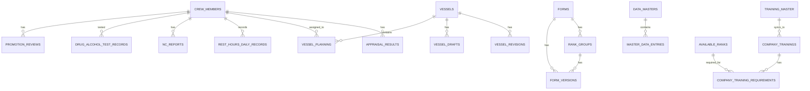

# Database Schema Documentation

## Overview

The Seafarer Performance Management System uses PostgreSQL as its database, accessed via Drizzle ORM. The schema is defined in `shared/schema.ts` and contains 52 tables organized into logical domains.

## Entity Relationship Diagram



## Table Categories

### 1. User & Authentication
| Table | Purpose |
|-------|---------|
| `users` | System user accounts |

### 2. Crew Management
| Table | Purpose |
|-------|---------|
| `crew_members` | Core crew member profiles |
| `recruitment_candidates` | Recruitment applications |
| `vessel_planning` | Crew-vessel assignments |
| `rotation_plans` | Rotation scheduling |
| `rotation_archive` | Historical rotation records |

### 3. Vessel Management
| Table | Purpose |
|-------|---------|
| `vessels` | Internal vessel registry |
| `vessel_groups` | Vessel groupings |
| `vessel_drafts` | Draft rank configurations |
| `vessel_revisions` | Finalized rank configurations |
| `vessel_ranks` | Rank definitions per vessel |
| `revisions` | Revision tracking |

### 4. Forms & Appraisals
| Table | Purpose |
|-------|---------|
| `forms` | Form definitions |
| `form_versions` | Form version history |
| `rank_groups` | Rank groupings for forms |
| `available_ranks` | System rank definitions |
| `appraisal_results` | Completed appraisals |

### 5. Rest Hours Compliance
| Table | Purpose |
|-------|---------|
| `rest_hours_vessel_records` | Monthly vessel summaries |
| `rest_hours_crew_records` | Monthly crew summaries |
| `rest_hours_daily_records` | Daily work/rest data |
| `fixed_tasks` | Fixed schedule templates |
| `variable_tasks` | Variable schedule entries |
| `vessel_violation_comments` | Vessel comments on violations |
| `office_violation_comments` | Office review comments |
| `nc_reports` | Non-conformity reports |
| `vessel_dateline_adjustments` | Date line crossing adjustments |

### 6. Training & Certifications
| Table | Purpose |
|-------|---------|
| `training_master` | Master training catalog |
| `company_trainings` | Company-specific trainings |
| `company_training_groups` | Training group labels |
| `company_training_requirements` | Rank-training requirements |
| `training_matrix_vessel_drafts` | Vessel training drafts |
| `training_matrix_vessel_revisions` | Vessel training revisions |

### 7. Promotions
| Table | Purpose |
|-------|---------|
| `promotion_hierarchies` | Promotion paths |
| `promotion_forms` | Promotion form data |
| `promotion_reviews` | Promotion review records |
| `company_processing` | Processing status |

### 8. Drug & Alcohol Testing
| Table | Purpose |
|-------|---------|
| `drug_alcohol_test_records` | Test records |

### 9. Master Data
| Table | Purpose |
|-------|---------|
| `data_masters` | Master data categories |
| `master_data_entries` | Master data values |
| `company_ranks` | Company rank mappings |

### 10. Oil Major Compliance
| Table | Purpose |
|-------|---------|
| `oil_major_rules` | Compliance rules |

### 11. Accounts (WIP)
| Table | Purpose |
|-------|---------|
| `pay_elements` | Pay element definitions |
| `contract_pay_elements` | Contract pay mappings |
| `allotments` | Allotment records |
| `advances` | Advance payments |
| `bond_items` | Bond items |

---

## Detailed Table Schemas

### crew_members

The core table for seafarer information.

```sql
CREATE TABLE crew_members (
    id TEXT PRIMARY KEY,                        -- Crew member ID (e.g., "A000452")
    
    -- Photo
    uploaded_photo TEXT,                        -- Base64 encoded photo
    
    -- Personal Information
    emp_no TEXT,                               -- Employee number
    first_name TEXT NOT NULL,
    middle_name TEXT,
    family_name TEXT,
    gender TEXT,                               -- "Male" or "Female"
    date_of_birth TEXT,                        -- Format: DD-MMM-YYYY
    age TEXT,
    nationality TEXT NOT NULL,
    
    -- Rank and Employment
    present_rank TEXT NOT NULL,
    rank_applied_for TEXT,
    employee_id TEXT,
    
    -- Vessel Information
    present_vessel TEXT NOT NULL,              -- Vessel ID (UUID from Master 014)
    vessel_type TEXT NOT NULL,
    last_vessel TEXT,
    
    -- Contract and Status
    status TEXT,                               -- "On Board", "On Leave", "Inactive"
    is_active BOOLEAN DEFAULT TRUE,
    sign_on_date TEXT,                         -- Date signed on to vessel
    sign_off_date TEXT,
    contract_period TEXT,
    relief_due TEXT,
    next_availability TEXT,
    reason TEXT,                               -- Sign-off reason
    availability TEXT,
    
    -- Contact Information
    email TEXT,
    mobile TEXT,
    contact_landline TEXT,
    
    -- Address Information
    country_of_residence TEXT,
    nearest_airport TEXT,
    residential_address_line1 TEXT,
    residential_address_line2 TEXT,
    
    -- Physical Information
    place_of_birth_city TEXT,
    place_of_birth_country TEXT,
    height_cm TEXT,
    weight_kg TEXT,
    bmi TEXT,
    
    -- Language and Personal Details
    native_language TEXT,
    foreign_languages TEXT,
    english_proficiency TEXT,
    marital_status TEXT,
    number_of_dependent_children TEXT,
    
    -- Family Information
    father_name TEXT,
    mother_name TEXT,
    spouse_first_name TEXT,
    spouse_middle_name TEXT,
    spouse_family_name TEXT,
    spouse_date_of_birth TEXT,
    
    -- Next of Kin
    nok_first_name TEXT,
    nok_middle_name TEXT,
    nok_family_name TEXT,
    nok_telephone TEXT,
    nok_email TEXT,
    nok_address TEXT,
    nok_relationship TEXT,
    
    -- Additional Information
    manning_agent TEXT,
    crew_pool TEXT,
    vessel_types TEXT,                         -- JSON array
    
    -- Complex Data (JSON strings)
    documents TEXT,                            -- JSON array of documents
    visas TEXT,                                -- JSON array of visas
    education TEXT,                            -- JSON array
    licenses TEXT,                             -- JSON array
    training_courses TEXT,                     -- JSON array
    current_company_sea_service TEXT,          -- JSON array
    external_sea_service TEXT,                 -- JSON array
    pre_joining_medicals TEXT,                 -- JSON array
    doctor_visits TEXT,                        -- JSON array
    children TEXT,                             -- JSON array
    
    created_at TIMESTAMP DEFAULT NOW(),
    updated_at TIMESTAMP DEFAULT NOW()
);
```

### rest_hours_daily_records

Stores daily work/rest hour recordings with violation tracking.

```sql
CREATE TABLE rest_hours_daily_records (
    id SERIAL PRIMARY KEY,
    crew_member_id TEXT NOT NULL,              -- References crew_members.id
    vessel_id TEXT NOT NULL,                   -- Vessel ID (UUID)
    rank TEXT NOT NULL,                        -- Rank at time of recording
    name TEXT NOT NULL,                        -- Full name for display
    month_year TEXT NOT NULL,                  -- Format: "YYYY-MM"
    
    -- Daily records as JSON array
    daily_records TEXT NOT NULL,               -- JSON: See structure below
    
    -- Form settings
    show_planning BOOLEAN DEFAULT FALSE,
    opa_mode BOOLEAN DEFAULT FALSE,
    
    created_at TIMESTAMP DEFAULT NOW(),
    updated_at TIMESTAMP DEFAULT NOW(),
    
    -- Unique constraint to prevent duplicates
    CONSTRAINT rest_hours_daily_records_unique_idx 
        UNIQUE (crew_member_id, vessel_id, month_year)
);
```

**daily_records JSON Structure:**
```json
[
  {
    "day": 1,
    "dayOfWeek": "Mon",
    "hours": ["w", "w", "", "", ...],  // 48 entries (30-min slots)
    "isPlan": false,
    "comments": "Night watch duty",
    "violations": [1, 3],              // Violation codes
    "hoursOfRest24hr": 10.5,
    "hoursOfWork24hr": 13.5,
    "hoursOfRest48hr": 21.0,
    "hoursOfWork48hr": 27.0,
    "hoursOfRest7day": 77.0,
    "hoursOfWork7day": 91.0,
    "hoursOfRest96hr": 42.0,
    "hoursOfWork96hr": 54.0
  }
]
```

**Hour Slot Values:**
- `"w"` - Watch duty
- `"d"` - Day work  
- `"a"` - Anchor watch
- `""` - Rest (empty string)

### appraisal_results

Stores crew appraisal data with 3-stage workflow.

```sql
CREATE TABLE appraisal_results (
    id SERIAL PRIMARY KEY,
    crew_member_id TEXT NOT NULL REFERENCES crew_members(id),
    form_id INTEGER NOT NULL REFERENCES forms(id),
    appraisal_type TEXT NOT NULL,              -- "End of Contract", "Mid Term", etc.
    appraisal_date TEXT NOT NULL,
    appraisal_data TEXT NOT NULL,              -- JSON: Complete form data
    competence_rating TEXT,
    behavioral_rating TEXT,
    overall_rating TEXT,
    submitted_at TIMESTAMP DEFAULT NOW(),
    submitted_by TEXT NOT NULL,
    status TEXT NOT NULL DEFAULT 'draft',      -- "draft", "preliminary", "submitted", "reviewed"
    stage_statuses TEXT,                       -- JSON: Stage submission tracking
    stage_payloads TEXT                        -- JSON: Stage-specific data
);
```

### nc_reports

Non-Conformity reports for rest hours violations.

```sql
CREATE TABLE nc_reports (
    id SERIAL PRIMARY KEY,
    crew_member_id TEXT NOT NULL,
    vessel_id TEXT NOT NULL,
    rank TEXT NOT NULL,
    month_value TEXT NOT NULL,                 -- Format: "YYYY-MM"
    
    nc_reference TEXT NOT NULL DEFAULT 'STCW/MLC/ILO',
    
    identified_root_cause TEXT,
    immediate_corrective_action TEXT,
    preventive_action TEXT,
    
    preventive_action_status TEXT NOT NULL DEFAULT 'Pending',  -- "Pending" | "Completed"
    preventive_action_due_date TIMESTAMP,
    preventive_action_date_completed TIMESTAMP,
    
    office_closure_verified_by_name TEXT,
    office_closure_verified_by_position TEXT,
    office_closure_date TIMESTAMP,
    
    status TEXT NOT NULL DEFAULT 'Open',       -- "Open" | "Closed"
    submission_status TEXT NOT NULL DEFAULT 'draft',  -- "draft" | "vessel-submitted" | "office-submitted"
    
    created_at TIMESTAMP DEFAULT NOW(),
    updated_at TIMESTAMP DEFAULT NOW()
);
```

### forms

Form template definitions for appraisals and promotions.

```sql
CREATE TABLE forms (
    id SERIAL PRIMARY KEY,
    name TEXT NOT NULL,
    category TEXT NOT NULL DEFAULT 'appraisal',  -- 'appraisal' | 'promotion'
    rank_group TEXT NOT NULL,
    version_no TEXT NOT NULL,
    version_date TEXT NOT NULL,
    configuration TEXT,                          -- JSON: Form field configuration
    shared_config TEXT                           -- JSON: Shared across rank groups
);
```

### training_master

Master catalog of all training certifications.

```sql
CREATE TABLE training_master (
    id SERIAL PRIMARY KEY,
    training_id TEXT NOT NULL UNIQUE,            -- e.g., "SA001"
    training_name TEXT NOT NULL,
    category TEXT NOT NULL,                      -- "S" (Statutory), "N" (Industry), "M" (Others)
    training_group TEXT NOT NULL,                -- "A"-"G"
    requirement_reference TEXT,                  -- STCW reference
    applicable_to_company BOOLEAN DEFAULT FALSE,
    training_label TEXT,                         -- Company custom name
    sort_order INTEGER DEFAULT 0,
    is_default BOOLEAN DEFAULT FALSE             -- True = from CSV seed
);
```

### oil_major_rules

Compliance rules for oil major vetting requirements.

```sql
CREATE TABLE oil_major_rules (
    id SERIAL PRIMARY KEY,
    oil_major_name TEXT NOT NULL UNIQUE,
    config TEXT NOT NULL,                        -- JSON: Compliance rules
    created_at TIMESTAMP DEFAULT NOW(),
    updated_at TIMESTAMP DEFAULT NOW()
);
```

**Config JSON Structure:**
```json
{
  "enabled": true,
  "rules": [
    {
      "rankPair": ["Master", "Chief Officer"],
      "yearsWithOperator": 1,
      "yearsInRank": 2,
      "yearsOnTankerTypes": 1.5,
      "yearsOnAllTankers": 3,
      "yearsAsOOW": null,
      "dateJoinedGap": 5,
      "languageProficiency": "Good"
    }
  ]
}
```

---

## Indexes and Constraints

### Unique Constraints

| Table | Constraint | Columns |
|-------|------------|---------|
| `rest_hours_daily_records` | `rest_hours_daily_records_unique_idx` | `(crew_member_id, vessel_id, month_year)` |
| `promotion_reviews` | `promotion_reviews_unique_idx` | `(crew_member_id, promotion_to_rank)` |
| `training_master` | `training_master_training_id_unique` | `(training_id)` |
| `company_trainings` | `company_trainings_training_master_id_unique` | `(training_master_id)` |
| `recruitment_candidates` | `recruitment_candidates_file_no_unique` | `(file_no)` |

### Foreign Key Relationships

| Child Table | Column | Parent Table | Parent Column |
|-------------|--------|--------------|---------------|
| `appraisal_results` | `crew_member_id` | `crew_members` | `id` |
| `appraisal_results` | `form_id` | `forms` | `id` |
| `rank_groups` | `form_id` | `forms` | `id` |
| `form_versions` | `form_id` | `forms` | `id` |
| `form_versions` | `rank_group_id` | `rank_groups` | `id` |
| `company_trainings` | `training_master_id` | `training_master` | `id` |
| `company_training_requirements` | `company_training_id` | `company_trainings` | `id` |
| `company_training_requirements` | `rank_id` | `available_ranks` | `id` |

---

## Migration System

Migrations are stored in the `migrations/` folder as SQL files.

### Naming Convention
```
NNNN_descriptive_name.sql
```
Example: `0052_add_rest_hours_daily_records_unique_constraint.sql`

### Migration Tracking
The system tracks applied migrations in a `migrations` table to prevent re-execution.

### Running Migrations
Migrations run automatically on server startup via `migrationRunner.ts`.

### Best Practices
1. Use `IF NOT EXISTS` / `IF EXISTS` clauses for idempotency
2. Create separate backfill migrations for data transformations
3. Never modify existing migrations - create new ones
4. Test migrations locally before deploying

---

## Data Patterns

### JSON Storage Pattern
Complex nested data is stored as JSON strings in TEXT columns:
- `crew_members.documents` - Array of document objects
- `appraisal_results.appraisal_data` - Complete form data
- `rest_hours_daily_records.daily_records` - Array of daily entries

### Soft Delete Pattern
Some tables use soft delete via `is_delete` or `archived_at` columns:
- `recruitment_candidates.is_delete`
- `rank_groups.archived_at`

### Status Workflow Pattern
Multi-stage workflows tracked via status columns:
- Appraisals: `draft` → `preliminary` → `submitted` → `reviewed`
- NC Reports: `draft` → `vessel-submitted` → `office-submitted`
- Rest Hours: `Due` → `Overdue` → `Completed`
