# Accounts Domain Schema (CrewingV2)

Schema module: `shared/v2/accounts/schema.ts`
Types module: `shared/v2/accounts/types.ts` (drizzle-zod insert/select for every table)
Migrations: `migrations/0153_accounts_schema_rebuild.sql`,
`migrations/0154_accounts_amendments.sql`

The Accounts domain is built around an **append-only crew wage ledger**
(`acc_wage_ledger_v2`) as the single system of record. Every payslip, portage
bill total, and settlement is a **projection** of ledger lines — cached totals
are allowed but are always recomputed from the ledger and are never
independently authoritative.

This document is schema-level only. It does not describe the calculation engine
or any UI (both out of scope for the rebuild).

---

## Design principles encoded in the schema

1. **Ledger is the source of truth.** `acc_wage_ledger_v2` is append-only.
   Projections (portage bills, settlements) carry cached totals that must be
   recomputed from ledger lines.
2. **Three-tier value precedence** for any rate-bearing element:
   **wage scale (master)** → **engagement override (contract)** →
   **monthly transaction (variable)**. A later tier overrides an earlier one for
   the period in force.
3. **Everything rate-bearing is effective-dated** (`effective_from` /
   `effective_to`) so a calculation resolves against the version in force during
   the service sub-period.
4. **Ledger sub-periods.** Each ledger line carries `period_from` / `period_to`
   so one calendar month can split at a promotion, sign-on, sign-off,
   scale revision, or phase change.
5. **Closed periods are immutable.** Corrections are new adjustment lines in an
   open period (`is_adjustment = true`, `adjusts_ledger_uuid` → the line being
   adjusted). Existing ledger rows are never mutated or deleted.
6. **Two employment models share one spine.** `voyage_contract` and
   `annual_employment` both hang off `acc_engagements_v2`.
7. **Tenant behaviour is configuration, not code branches.** Preparation mode,
   proration basis, currency, and FX policy live in `acc_tenant_config_v2`.

---

## Conventions

- Every table has a `serial("id")` PK **and** a business `*_uuid` text column
  (`.notNull().unique()`). The uuid is the stable, externally-referenced key.
- **All relationships are on `*_uuid` columns.** There are **no database
  foreign-key constraints** — relationships are logical and enforced in the
  service layer. Joins are done on uuid columns.
- Every table carries the shared `auditColumns` spread: `sort_order`,
  `created_at`, `updated_at`, `created_by_uuid`, `updated_by_uuid`,
  `is_deleted` (soft delete), `is_sync`.
- **Money** = `numeric(14,2)`; **rates/percentages** = `numeric(10,4)`;
  **FX** = `numeric(12,6)`; **`rounding_precision`** = `numeric(6,2)`;
  **`qty`** = `numeric(10,2)`; **`days_served`** = `numeric(6,2)`.
  `numeric` maps to a TypeScript `string` in drizzle-orm (pg returns numeric as
  strings), so all money/rate fields are string-typed in the generated types.
- **Dates** use the `date` type. **Periods** are `text` in `YYYY-MM` format with
  a `CHECK` constraint. Calc-run timestamps use `timestamp`.
- **Enum-like fields** are `text` with a `CHECK` constraint listing allowed
  values (enums documented inline below). All `CHECK`/`UNIQUE` constraints live
  in the migration SQL, not in the Drizzle table definitions.

---

## Entity relationship diagram

Relationships shown are logical (uuid columns); none are enforced by DB foreign
keys.

```mermaid
erDiagram
    acc_tenant_config_v2 {
        text config_uuid PK
    }

    acc_pay_elements_v2 {
        text pay_element_uuid PK
        text percentage_base_element_uuid FK
    }
    acc_wage_scales_v2 {
        text scale_uuid PK
        text superseded_by_scale_uuid FK
    }
    acc_wage_scale_lines_v2 {
        text scale_line_uuid PK
        text scale_uuid FK
        text pay_element_uuid FK
    }
    acc_cba_reference_v2 {
        text cba_ref_uuid PK
        text pay_element_uuid FK
    }

    acc_engagements_v2 {
        text engagement_uuid PK
        text crew_uuid FK
        text wage_scale_uuid FK
    }
    acc_engagement_phases_v2 {
        text phase_uuid PK
        text engagement_uuid FK
    }
    acc_engagement_pay_elements_v2 {
        text epe_uuid PK
        text engagement_uuid FK
        text pay_element_uuid FK
    }

    acc_monthly_transactions_v2 {
        text txn_uuid PK
        text engagement_uuid FK
        text pay_element_uuid FK
    }
    acc_advances_v2 {
        text advance_uuid PK
        text engagement_uuid FK
    }
    acc_bond_items_v2 {
        text bond_item_uuid PK
        text engagement_uuid FK
    }
    acc_allotments_v2 {
        text allotment_uuid PK
        text engagement_uuid FK
    }
    acc_ctm_v2 {
        text ctm_uuid PK
    }
    acc_ctm_lines_v2 {
        text ctm_line_uuid PK
        text ctm_uuid FK
        text advance_uuid FK
    }

    acc_portage_bills_v2 {
        text portage_uuid PK
    }
    acc_portage_approvals_v2 {
        text pb_approval_uuid PK
        text portage_uuid FK
    }
    acc_calculation_runs_v2 {
        text calc_run_uuid PK
        text portage_uuid FK
        text engagement_uuid FK
    }
    acc_wage_ledger_v2 {
        text ledger_uuid PK
        text calc_run_uuid FK
        text portage_uuid FK
        text engagement_uuid FK
        text pay_element_uuid FK
        text adjusts_ledger_uuid FK
    }
    acc_settlements_v2 {
        text settlement_uuid PK
        text engagement_uuid FK
    }

    acc_wage_scales_v2         ||--o{ acc_wage_scale_lines_v2 : "scale_uuid"
    acc_pay_elements_v2        ||--o{ acc_wage_scale_lines_v2 : "pay_element_uuid"
    acc_pay_elements_v2        ||--o{ acc_cba_reference_v2 : "pay_element_uuid"
    acc_pay_elements_v2        ||--o{ acc_engagement_pay_elements_v2 : "pay_element_uuid"
    acc_pay_elements_v2        ||--o{ acc_monthly_transactions_v2 : "pay_element_uuid"
    acc_pay_elements_v2        ||--o{ acc_wage_ledger_v2 : "pay_element_uuid"
    acc_pay_elements_v2        ||--o{ acc_pay_elements_v2 : "percentage_base (self)"
    acc_wage_scales_v2         ||--o{ acc_engagements_v2 : "wage_scale_uuid"
    acc_engagements_v2         ||--o{ acc_engagement_phases_v2 : "engagement_uuid"
    acc_engagements_v2         ||--o{ acc_engagement_pay_elements_v2 : "engagement_uuid"
    acc_engagements_v2         ||--o{ acc_monthly_transactions_v2 : "engagement_uuid"
    acc_engagements_v2         ||--o{ acc_advances_v2 : "engagement_uuid"
    acc_engagements_v2         ||--o{ acc_bond_items_v2 : "engagement_uuid"
    acc_engagements_v2         ||--o{ acc_allotments_v2 : "engagement_uuid"
    acc_engagements_v2         ||--o{ acc_wage_ledger_v2 : "engagement_uuid"
    acc_engagements_v2         ||--|| acc_settlements_v2 : "engagement_uuid (1:1)"
    acc_ctm_v2                 ||--o{ acc_ctm_lines_v2 : "ctm_uuid"
    acc_advances_v2            ||--o{ acc_ctm_lines_v2 : "advance_uuid"
    acc_portage_bills_v2       ||--o{ acc_portage_approvals_v2 : "portage_uuid"
    acc_portage_bills_v2       ||--o{ acc_wage_ledger_v2 : "portage_uuid"
    acc_calculation_runs_v2    ||--o{ acc_wage_ledger_v2 : "calc_run_uuid"
    acc_wage_ledger_v2         ||--o{ acc_wage_ledger_v2 : "adjusts_ledger_uuid (self)"
```

External references (not part of this domain, joined by uuid):
`crew_uuid` → crew pool; `vessel_uuid` / `vessel_type_uuid` / `vessel_group_uuid`
→ vessel & masters; `assignment_uuid` → `crew_assignments.assign_uuid`;
`nationality_uuid` → masters; `rank_id` → `adm_company_ranks_v2.rank_id`
(see deviation below).

---

## Signed-amount convention

`acc_wage_ledger_v2.amount` is **always stored as a positive number**. The sign
is carried by `element_type`:

| `element_type`          | Effect on net pay |
|-------------------------|-------------------|
| `earning`               | adds to net       |
| `deduction`             | subtracts from net|
| `employer_contribution` | not part of crew net; tracked for employer cost |

Net pay for a crew/period = `sum(amount where element_type='earning')`
− `sum(amount where element_type='deduction')`.

`amount_functional` is `amount` converted to the tenant functional currency via
`fx_rate`. `acc_monthly_transactions_v2.amount` follows the same positive-value
convention; the element's `type` supplies the sign.

---

## Table reference

Every table also has the audit columns (`sort_order`, `created_at`,
`updated_at`, `created_by_uuid`, `updated_by_uuid`, `is_deleted`, `is_sync`);
they are omitted from the column lists below to avoid repetition. Money =
`numeric(14,2)`, rate = `numeric(10,4)`, FX = `numeric(12,6)`.

### A. Tenant configuration

#### `acc_tenant_config_v2`
Single-row per-tenant behaviour configuration.

| Column | Type | Notes |
|---|---|---|
| `config_uuid` | text uniq | business key |
| `preparation_mode` | text | CHECK `vessel_prepares` \| `office_prepares` (default `office_prepares`) |
| `proration_basis` | text | CHECK `thirty_day_month` \| `calendar_days` (default `thirty_day_month`) |
| `functional_currency` | text | ISO 4217 (default `USD`) |
| `fx_rate_policy` | text | CHECK `month_end` \| `transaction_date` \| `manual` (default `month_end`) |
| `employment_models_enabled` | text[] | subset of `voyage_contract`, `annual_employment` |
| `seniority_basis` | text | CHECK `rank_service_all_employers` \| `rank_service_company` \| `company_tenure` (default `rank_service_all_employers`); how a crew's seniority step is measured (added 0154) |
| `allow_manual_seniority_anchor` | boolean | default true; whether an operator may manually override the derived seniority step on an engagement (added 0154) |
| `auto_lock_on_approval` | boolean | default true |
| `max_allotment_percent` | numeric(10,4) | allotment soft cap (% of monthly gross); null = no check (added 0163) |
| `gl_wages_payable_code` | text | balancing GL account for net wages payable in the GL export; null shows as UNMAPPED (added 0165) |
| `extra_tab_1_enabled` | boolean NOT NULL default false | **0179** enable configurable vessel-entry tab slot 1 (Vessel Portage). Enabling requires both a label and a pay element (service rule) |
| `extra_tab_1_label` | text | **0179** tab label shown on the vessel portage screen |
| `extra_tab_1_pay_element_uuid` | text | **0179** bound pay element (manual_entry / rate_times_qty only) |
| `extra_tab_2_enabled` | boolean NOT NULL default false | **0179** slot 2 enable flag (same rules as slot 1) |
| `extra_tab_2_label` | text | **0179** slot 2 label |
| `extra_tab_2_pay_element_uuid` | text | **0179** slot 2 bound pay element |
| `settings` | jsonb | free-form extra config |

### B. Master tier

#### `acc_pay_elements_v2` (rebuilt)
Master library of pay elements.

| Column | Type | Notes |
|---|---|---|
| `pay_element_uuid` | text uniq | business key |
| `code` | text uniq | short code |
| `name` | text | |
| `description` | text | |
| `type` | text | CHECK `earning` \| `deduction` \| `employer_contribution` |
| `category` | text | basic, overtime_fixed, overtime_variable, allowance, bonus, statutory, allotment, advance_recovery, bond_slop_chest, communication, one_off, other |
| `calc_method` | text | CHECK `scale_lookup` \| `fixed_amount` \| `rate_times_qty` \| `percentage_of_base` \| `manual_entry` |
| `percentage_base_element_uuid` | text | self-reference; required when `calc_method=percentage_of_base` (service rule) |
| `prorate` | boolean | default false |
| `proration_basis_override` | text | CHECK `thirty_day_month` \| `calendar_days` |
| `rounding_rule` | text | CHECK `nearest` \| `up` \| `down` (default `nearest`) |
| `rounding_precision` | numeric(6,2) | default 0.01 |
| `nationality_conditional` | boolean | default false |
| `applicable_nationality_uuids` | text[] | |
| `shows_on_payslip` | boolean | default true |
| `shows_on_portage` | boolean | default true |
| `status` | text | CHECK `active` \| `inactive` (default `active`) |
| `payment_timing` | text | CHECK `paid_on_board` \| `payable_at_settlement` \| `remitted_to_fund` (default `paid_on_board`); when the element actually settles (added 0154) |
| `gl_code` | text | client GL account code, nullable (reporting later; added 0157) |
| `effective_from` / `effective_to` | date | effectivity window |

`payment_timing` distinguishes value that is paid in the monthly on-board
payslip (`paid_on_board`) from value that is *earned monthly but only paid at
final settlement* (`payable_at_settlement`, e.g. leave pay / end-of-contract
bonuses) and from value remitted to a third-party fund
(`remitted_to_fund`, e.g. provident-fund / pension contributions). It affects
how the element flows through the payslip vs. the settlement, not how it is
calculated.

#### `acc_wage_scales_v2`
Effective-dated wage scale headers.

| Column | Type | Notes |
|---|---|---|
| `scale_uuid` | text uniq | business key |
| `scale_name` | text | |
| `description` | text | |
| `vessel_type_uuid` | text | null + `vessel_group_uuid` null ⇒ fleet-wide |
| `vessel_group_uuid` | text | |
| `currency` | text | ISO 4217 (default `USD`) |
| `effective_from` / `effective_to` | date | |
| `status` | text | CHECK `draft` \| `active` \| `superseded` (default `draft`) |
| `superseded_by_scale_uuid` | text | points to the replacing scale |
| `floor_ack_by_uuid` | text | who acknowledged CBA-floor violations on activation (added 0154) |
| `floor_ack_at` | date | when the floor violations were acknowledged (added 0154) |
| `floor_violations` | jsonb | snapshot of the acknowledged violations (added 0154) |

When a scale is activated with one or more lines below an applicable CBA
minimum, the operator must explicitly acknowledge the violations. That
acknowledgment (who, when, and a snapshot of the violation set) is persisted on
the scale header via the three `floor_*` columns above.

Partial unique index `uq_acc_wage_scales_v2_active` on
(`vessel_type_uuid`, `vessel_group_uuid`) `WHERE status='active'` — at most one
active scale per scope. Overlap-in-time across draft/superseded is a service rule.

#### `acc_wage_scale_lines_v2`
Per rank / nationality / experience rate rows.

| Column | Type | Notes |
|---|---|---|
| `scale_line_uuid` | text uniq | business key |
| `scale_uuid` | text | → `acc_wage_scales_v2` |
| `rank_id` | text | matches `adm_company_ranks_v2.rank_id` (stored as text) |
| `nationality_uuid` | text | null = any |
| `experience_min_months` / `experience_max_months` | integer | band |
| `pay_element_uuid` | text | → `acc_pay_elements_v2` |
| `amount` | money | fixed value line |
| `rate` | rate | rate line |

Unique index on (`scale_uuid`, `rank_id`, `nationality_uuid`,
`experience_min_months`, `pay_element_uuid`).

#### `acc_cba_reference_v2`
Reference-only CBA minimums (advisory, not enforced by calc).

| Column | Type | Notes |
|---|---|---|
| `cba_ref_uuid` | text uniq | business key |
| `cba_name` | text | |
| `rank_id` | text | |
| `pay_element_uuid` | text | nullable |
| `category` | text | |
| `minimum_amount` | money | |
| `currency` | text | ISO 4217 |
| `effective_from` / `effective_to` | date | |
| `source_note` | text | |

### C. Engagement tier (ledger spine)

#### `acc_engagements_v2`
The engagement spine — one per voyage contract or annual employment.

| Column | Type | Notes |
|---|---|---|
| `engagement_uuid` | text uniq | business key |
| `crew_uuid` | text | → crew pool |
| `engagement_type` | text | CHECK `voyage_contract` \| `annual_employment` |
| `assignment_uuid` | text | → `crew_assignments.assign_uuid`; required for `voyage_contract`, null for `annual_employment` (service rule) |
| `vessel_uuid` | text | |
| `start_date` / `end_date` | date | |
| `wage_scale_uuid` | text | → `acc_wage_scales_v2` |
| `rank_id_at_start` | text | snapshot |
| `scale_year_at_start` | integer | 1-based seniority step in force when the engagement started (added 0154) |
| `next_step_date` | date | date the crew is due to advance to the next seniority step (added 0154) |
| `currency` | text | ISO 4217 |
| `status` | text | CHECK `draft` \| `active` \| `completed` \| `settled` \| `cancelled` |
| `notes` | text | |

The seniority "step" is the wage-scale year band. `scale_year_at_start` snapshots
the step in force at sign-on; `next_step_date` is the anchor date from which the
next step becomes due. A scale line's `experience_min_months` /
`experience_max_months` band maps to a year step as
`year = floor(experience_min_months / 12) + 1` (step 1 = 0–11 months, step 2 =
12–23 months, …). Deriving step progression from service records is out of scope
here; the anchor columns exist so a later engagement layer can carry the step.

#### `acc_engagement_phases_v2`
On/off-board phase timeline within an engagement.

| Column | Type | Notes |
|---|---|---|
| `phase_uuid` | text uniq | business key |
| `engagement_uuid` | text | → `acc_engagements_v2` |
| `phase_type` | text | CHECK `on_board` \| `on_leave` \| `standby` \| `training` |
| `from_date` / `to_date` | date | |
| `vessel_uuid` | text | |

#### `acc_engagement_pay_elements_v2`
Contract-level overrides of scale values (tier 2 of precedence).

| Column | Type | Notes |
|---|---|---|
| `epe_uuid` | text uniq | business key |
| `engagement_uuid` | text | → `acc_engagements_v2` |
| `pay_element_uuid` | text | → `acc_pay_elements_v2` |
| `override_mode` | text | CHECK `replace_scale_value` \| `add_element` \| `suppress_element` |
| `amount` | money | |
| `rate` | rate | |
| `payment_timing_override` | text | nullable CHECK `paid_on_board` \| `payable_at_settlement` \| `remitted_to_fund` (added 0157) |
| `effective_from` / `effective_to` | date | |
| `remarks` | text | |

`payment_timing_override` exists because real portage bills carry per-crew
"Pay Leave On Board Y/N" and "Pay PF On Board Y/N" flags — the same element is
paid monthly to one seafarer and withheld to settlement for another. When an
override row for an element is effective in a sub-period, its
`payment_timing_override` replaces the element's `payment_timing` for that
crew member; the engine snapshots the *effective* timing in `calc_snapshot`
and the ledger line's `payment_timing` column.

### D. Transaction tier

#### `acc_monthly_transactions_v2`
Variable per-period transactions (tier 3 of precedence).

| Column | Type | Notes |
|---|---|---|
| `txn_uuid` | text uniq | business key |
| `engagement_uuid` | text | → `acc_engagements_v2` |
| `crew_uuid` | text | |
| `vessel_uuid` | text | |
| `period` | text | `YYYY-MM` CHECK |
| `pay_element_uuid` | text | → `acc_pay_elements_v2` |
| `qty` | numeric(10,2) | |
| `rate` | rate | |
| `amount` | money | NOT NULL |
| `currency` | text | ISO 4217 |
| `fx_rate` | FX | |
| `origin` | text | CHECK `vessel` \| `office` |
| `status` | text | CHECK `draft` \| `submitted` \| `accepted` \| `rejected` |
| `source_type` | text | CHECK `advance` \| `bond` \| `ctm` \| `manual` |
| `source_uuid` | text | link to originating record |
| `remarks` | text | |
| `review_comment` | text | **0161** office comment on reject/return |
| `ctm_line_uuid` | text | **0161** → `acc_ctm_lines_v2` (on-board cash advance dual record) |
| `txn_date` | date | **0179** optional day-level date for dated vessel entries (cash advances, bond). Null = undated month-level entry |

#### `acc_advances_v2` (retained / altered)
Cash advances. Existing columns kept; `amount` & `recovery_amount` converted to
money, `request_date` to date; new columns added.

| Column | Type | Notes |
|---|---|---|
| `advance_uuid` | text uniq | business key |
| `crew_uuid` / `crew_name` / `rank` | text | |
| `amount` | money | NOT NULL default 0 |
| `currency` | text | ISO 4217 |
| `reason` | text | |
| `request_date` | date | |
| `approver` | text | |
| `status` | text | pending \| approved \| rejected \| disbursed \| recovered |
| `cap_check` | boolean | default true |
| `remaining_cap` | money | widened `integer → numeric(14,2)` in 0154 |
| `recovery_amount` | money | |
| `ctm_reference` | text | |
| `engagement_uuid` | text | **new** → `acc_engagements_v2` |
| `period` | text | **new** `YYYY-MM` |
| `recovery_pay_element_uuid` | text | **new** → `acc_pay_elements_v2` |

#### `acc_bond_items_v2` (retained / altered)
Bond / slop-chest purchases. `unit_price`, `total_price`, `deduction_amount`
converted to money; `sale_date` to date; new columns added.

| Column | Type | Notes |
|---|---|---|
| `bond_item_uuid` | text uniq | business key |
| `crew_uuid` / `crew_name` | text | |
| `item_name` | text | NOT NULL |
| `category` | text | |
| `quantity` | integer | default 1 |
| `unit_price` / `total_price` | money | NOT NULL default 0 |
| `currency` | text | ISO 4217 |
| `sale_date` | date | |
| `auto_deduct` | boolean | default true |
| `deduction_amount` | money | |
| `status` | text | pending \| deducted \| cancelled |
| `engagement_uuid` | text | **new** → `acc_engagements_v2` |
| `period` | text | **new** `YYYY-MM` |
| `txn_uuid` | text | **0163** → the crew-month bond rollup transaction |

#### `acc_allotments_v2` (retained / altered)
Crew allotments to beneficiaries. `value` converted to money; `valid_from` /
`valid_to` to date; new columns added.

| Column | Type | Notes |
|---|---|---|
| `allotment_uuid` | text uniq | business key |
| `crew_uuid` / `crew_name` / `rank` | text | |
| `beneficiary_name` | text | NOT NULL |
| `relationship` | text | |
| `allotment_type` | text | percentage \| fixed |
| `value` | money | NOT NULL default 0 |
| `currency` | text | ISO 4217 |
| `bank_name` / `account_number` | text | |
| `priority` | integer | default 1 |
| `valid_from` / `valid_to` | date | |
| `status` | text | CHECK `active` \| `suspended` \| `ended` (0163; legacy `pending`/`expired` remapped) |
| `kyc_complete` / `bank_verified` | boolean | default false |
| `engagement_uuid` | text | **new** → `acc_engagements_v2` |
| `payee_currency` | text | **new** ISO 4217 |
| `iban_swift` | text | **0163** IBAN / SWIFT for the beneficiary bank |
| `bank_country` | text | **0163** beneficiary bank country |

#### `acc_ctm_v2`
Cash-to-master per vessel + period.

| Column | Type | Notes |
|---|---|---|
| `ctm_uuid` | text uniq | business key |
| `vessel_uuid` | text | |
| `period` | text | `YYYY-MM` CHECK |
| `opening_balance` / `received_amount` / `closing_balance` | money | `closing_balance` server-computed, never client-supplied |
| `currency` | text | ISO 4217 |
| `status` | text | CHECK `open` \| `submitted` \| `reconciled` \| `locked` |
| `submitted_by_uuid` | text | **0161** vessel submission audit |
| `submitted_date` | date | **0161** vessel submission audit |
| `portage_uuid` | text | **0161** → `acc_portage_bills_v2` |

#### `acc_ctm_lines_v2`
Individual cash-to-master movements.

| Column | Type | Notes |
|---|---|---|
| `ctm_line_uuid` | text uniq | business key |
| `ctm_uuid` | text | → `acc_ctm_v2` |
| `line_date` | date | |
| `line_type` | text | CHECK `cash_advance_to_crew` \| `receipt` \| `expense` \| `adjustment` |
| `crew_uuid` | text | nullable |
| `advance_uuid` | text | → `acc_advances_v2` (nullable) |
| `amount` | money | |
| `currency` | text | ISO 4217 |
| `description` | text | |

### E. Ledger & lifecycle (core)

#### `acc_portage_bills_v2`
Per vessel + period portage bill header — a **projection** of ledger lines.
Cached totals are recomputed from the ledger and are never authoritative.

| Column | Type | Notes |
|---|---|---|
| `portage_uuid` | text uniq | business key |
| `vessel_uuid` | text | |
| `period` | text | `YYYY-MM` CHECK; unique on (`vessel_uuid`, `period`) |
| `status` | text | CHECK `open` \| `vessel_draft` \| `submitted` \| `office_review` \| `returned` \| `approved` \| `locked` |
| `prepared_mode` | text | CHECK `vessel_prepares` \| `office_prepares` (snapshot of tenant config at creation) |
| `crew_count` | integer | cached |
| `total_earnings` / `total_deductions` / `net_total` | money | cached projections |
| `currency` | text | ISO 4217 |
| `submitted_by_uuid` | text | |
| `submitted_date` | date | |
| `locked_by_uuid` | text | |
| `locked_date` | date | |
| `is_locked` | boolean | default false |

#### `acc_portage_approvals_v2`
Approval trail (models `promo_approvals_v2`).

| Column | Type | Notes |
|---|---|---|
| `pb_approval_uuid` | text uniq | business key |
| `portage_uuid` | text | → `acc_portage_bills_v2` |
| `approver_id` | text | |
| `approver` | text | name snapshot |
| `status` | text | CHECK `Pending` \| `Approved` \| `Rejected` (default `Pending`) |
| `comments` | text | |
| `date` | date | |

#### `acc_calculation_runs_v2`
Audit of every calculation run that produced ledger lines.

| Column | Type | Notes |
|---|---|---|
| `calc_run_uuid` | text uniq | business key |
| `portage_uuid` | text | nullable |
| `engagement_uuid` | text | nullable |
| `run_type` | text | CHECK `monthly` \| `settlement` \| `recalculation` \| `adjustment` |
| `run_date` | timestamp | |
| `run_by_uuid` | text | |
| `input_snapshot` | jsonb | inputs at run time |
| `status` | text | CHECK `completed` \| `failed` |
| `error_detail` | text | populated when failed |

#### `acc_wage_ledger_v2` — system of record (append-only)

| Column | Type | Notes |
|---|---|---|
| `ledger_uuid` | text uniq | business key |
| `calc_run_uuid` | text | → `acc_calculation_runs_v2` |
| `portage_uuid` | text | nullable → `acc_portage_bills_v2` |
| `engagement_uuid` | text | → `acc_engagements_v2` |
| `crew_uuid` | text | |
| `vessel_uuid` | text | |
| `period` | text | `YYYY-MM` CHECK |
| `period_from` / `period_to` | date | sub-period split |
| `days_basis` | integer | proration denominator |
| `days_served` | numeric(6,2) | proration numerator |
| `rank_id` | text | snapshot |
| `pay_element_uuid` | text | → `acc_pay_elements_v2` |
| `element_type` | text | denormalised `earning` \| `deduction` \| `employer_contribution` |
| `element_code` | text | snapshot |
| `qty` | numeric(10,2) | |
| `rate` | rate | |
| `amount` | money | NOT NULL, **always positive** (sign via `element_type`) |
| `currency` | text | ISO 4217 |
| `fx_rate` | FX | |
| `amount_functional` | money | `amount` in tenant functional currency |
| `source_type` | text | CHECK `scale` \| `engagement_override` \| `monthly_txn` \| `allotment` \| `advance_recovery` \| `bond` \| `adjustment` \| `settlement` |
| `source_uuid` | text | originating record |
| `calc_snapshot` | jsonb | full inputs/formula trace for explainability |
| `is_adjustment` | boolean | default false |
| `adjusts_ledger_uuid` | text | self-reference to the line being corrected |

Indexes on (`crew_uuid`, `period`), (`portage_uuid`), (`engagement_uuid`).

#### `acc_settlements_v2`
Final settlement per engagement — a projection. One per engagement.

| Column | Type | Notes |
|---|---|---|
| `settlement_uuid` | text uniq | business key |
| `engagement_uuid` | text uniq | one settlement per engagement |
| `crew_uuid` | text | |
| `settlement_date` | date | defaults to the engagement end date at compute |
| `period` | text | `YYYY-MM` — final month of the engagement |
| `status` | text | CHECK `draft` \| `submitted` \| `approved` \| `paid` \| `locked` |
| `gross_earnings` / `total_deductions` / `net_payable` | money | cached from ledger |
| `currency` | text | ISO 4217 |
| `remarks` | text | |
| `balance_paid` | money | unpaid on-board wage balance settled now (0159) |
| `accruals_paid` | money | accrued `payable_at_settlement` entitlements paid now (0159) |
| `adjustments_earnings` / `adjustments_deductions` | money | totals of settlement adjustments (0159) |
| `paid_date` / `payment_reference` | date / text | set by mark-paid (0159) |
| `statement_snapshot` | jsonb | full statement at compute time: balance by period, accrual items, adjustments, fund remittance, net payable, source calc runs (0159) |

Component identity (0159): `net_payable = balance_paid + accruals_paid +
adjustments_earnings − adjustments_deductions`. The balance service subtracts
**only** `balance_paid` from the running on-board balance; `accruals_paid`
never entered the on-board balance (accruals are settled from the accrual
mini-ledger), so subtracting the whole `net_payable` would double-count and
drive balances negative.

#### `acc_settlement_approvals_v2` (0159)
Approval rows per settlement — mirrors `acc_portage_approvals_v2`.

| Column | Type | Notes |
|---|---|---|
| `st_approval_uuid` | text uniq | business key |
| `settlement_uuid` | text | parent settlement |
| `approver_id` / `approver` | text | id + name snapshot |
| `status` | text | `Pending` \| `Approved` \| `Rejected` |
| `comments` | text | |
| `date` | date | decision date |

#### `acc_settlement_adjustments_v2` (0159)
Settlement-specific one-off lines (travel wages, final claims, recovery of
outstanding advances). Editable only while the settlement is `draft`
(service-enforced).

| Column | Type | Notes |
|---|---|---|
| `adjustment_uuid` | text uniq | business key |
| `settlement_uuid` | text | parent settlement |
| `pay_element_uuid` | text | element (manual-entry elements in the UI picker) |
| `type` | text | `earning` \| `deduction` |
| `amount` | money | stored positive; `type` carries the sign |
| `remarks` | text | |

---

## Service-layer-only rules

These invariants cannot be expressed as DB constraints and must be enforced in
the service layer:

1. **Three-tier precedence.** Resolve a pay element for a service sub-period as
   monthly transaction → engagement override → wage-scale line, taking the
   highest tier present and respecting each source's effectivity window.
2. **Active-scale overlap.** The DB guarantees at most one `active` scale per
   (`vessel_type_uuid`, `vessel_group_uuid`) via a partial unique index, but the
   service must additionally reject activating a scale whose effectivity window
   overlaps another scale for the same scope.
3. **`percentage_of_base` requires a base.** When
   `acc_pay_elements_v2.calc_method = 'percentage_of_base'`,
   `percentage_base_element_uuid` must be set and reference a valid element.
4. **Voyage contract requires an assignment.** When
   `acc_engagements_v2.engagement_type = 'voyage_contract'`, `assignment_uuid`
   is required; for `annual_employment` it must be null.
5. **Closed-period immutability.** Once a period/portage bill is `locked`,
   ledger lines for it are never mutated or deleted. Corrections are new lines in
   an open period with `is_adjustment = true` and `adjusts_ledger_uuid` set to
   the line being adjusted.
6. **Projections recomputed from the ledger.** Cached totals on
   `acc_portage_bills_v2` and `acc_settlements_v2` must be recomputed from ledger
   lines; they are never edited directly as an authoritative source.
7. **Signed amounts.** Ledger `amount` is stored positive; net calculations use
   `element_type` for the sign (see convention above).
8. **Settlement lifecycle (0159).** `draft → submitted → approved → paid →
   locked`; a rejection or an explicit revert-to-draft returns a `submitted`
   settlement to `draft`. Compute requires an ended engagement with an
   approved calc run covering every service month (missing period → 409).
   Recompute is allowed only in `draft`; adjustments are editable only in
   `draft`. Marking paid sets `paid_date`/`payment_reference` and flips the
   engagement to `settled`; post-paid the crew's balances read zero.
9. **Settlement freeze guard (0159).** Once an engagement has a settlement
   past `draft`, ledger-mutating runs for that engagement are rejected with a
   409 naming the settlement; the settlement must be reverted to draft first.
   The guard is **overlap-aware**: a frozen settlement on any same-crew
   engagement whose service window overlaps a run engagement's window also
   blocks the run — pre-existing overlap data cannot bypass the guard.
10. **Engagement overlap guard (0159).** A crew member may not have two open
    engagements covering the same dates: the crewing sync and PATCH updates
    reject overlapping windows — PATCH validates the *effective post-patch*
    record (patched status/dates merged over persisted values) — and
    `GET /engagements/audit` reports existing overlapping clusters (surfaced
    as a banner on the Payroll Run page).

---

## Migration notes (`0153_accounts_schema_rebuild.sql`)

- **Dropped** (discarded test-only tables): `acc_contracts_v2`,
  `acc_contract_pay_elements_v2`, `acc_payruns_v2`, `acc_payrun_entries_v2`
  (`DROP TABLE IF EXISTS ... CASCADE`).
- **Rebuilt**: `acc_pay_elements_v2` was dropped and recreated (the old
  test-only columns are incompatible with the new master shape).
- **Altered (retained)**: `acc_advances_v2`, `acc_bond_items_v2`,
  `acc_allotments_v2` — money columns converted `integer/text → numeric(14,2)`
  and date columns `text → date` using explicit `USING` casts, with a
  regex-cleanup `UPDATE` first to null out malformed test values so the cast
  never aborts. New columns added as nullable.
- **Created**: the 15 new tables with inline `CHECK` / `UNIQUE` constraints and
  indexes; `YYYY-MM` period `CHECK`s added via idempotent `DO` blocks.
- Idempotent throughout (`IF EXISTS` / `IF NOT EXISTS`, guarded `DO` blocks). The
  migration runner executes the whole file in one transaction and tolerates
  duplicate-object errors, so re-runs are safe.

## Migration notes (`0154_accounts_amendments.sql`)

Amendments layered on top of 0153, all additive and idempotent:

- `acc_pay_elements_v2`: added `payment_timing` (NOT NULL default `paid_on_board`)
  with a guarded `CHECK`.
- `acc_advances_v2`: widened `remaining_cap` `integer → numeric(14,2)` (drop
  default → `ALTER TYPE ... USING` cast → re-set default `0`), closing the 0153
  deviation.
- `acc_engagements_v2`: added `scale_year_at_start` (int) and `next_step_date`
  (date) as nullable seniority-anchor snapshot columns.
- `acc_tenant_config_v2`: added `seniority_basis` (NOT NULL default
  `rank_service_all_employers`, guarded `CHECK`) and
  `allow_manual_seniority_anchor` (bool, default true).
- `acc_wage_scales_v2`: added `floor_ack_by_uuid` (text), `floor_ack_at` (date)
  and `floor_violations` (jsonb) for persisted CBA-floor acknowledgment.

## Migration notes (`0156_accounts_engine_prep.sql`)

Engine-prep amendments, all additive and idempotent:

- `acc_tenant_config_v2`: added `day_inclusion_rule` (NOT NULL default
  `both_inclusive`, guarded `CHECK` allowing `both_inclusive` /
  `exclude_sign_off_day`).
- `acc_wage_ledger_v2`: added `payment_timing` (text, nullable) — a snapshot of
  the element's timing at calculation time so ledger totals never depend on
  later master-data edits.

## Migration notes (`0157_accounts_payroll_run_prep.sql`)

Payroll-run prep amendments, additive + one data-fix, idempotent:

- `acc_engagement_pay_elements_v2`: added `payment_timing_override` (text,
  nullable, guarded `CHECK` allowing `paid_on_board` /
  `payable_at_settlement` / `remitted_to_fund`) — per-engagement payment
  timing override (see the table notes above for the rationale).
- `acc_pay_elements_v2`: added `gl_code` (text, nullable) — client GL account
  code for later reporting.
- `acc_calculation_runs_v2`: `status` CHECK relaxed to allow `running` — the
  engine now creates the run row as `running` and only marks it `completed`
  after the ledger line replacement commits; a failed replacement leaves the
  run `failed` with `error_detail` and the prior lines intact.
- **Data-fix**: `acc_engagements_v2.rank_id_at_start` values holding rank
  *names* (dev-tenant residue from the engine dogfood) are converted to rank
  *codes* by resolving against `adm_company_ranks_v2` — exact match first,
  then case-insensitive — only where exactly one distinct `rank_id` matches.
  Values already equal to a live rank code, ambiguous names and unmatched
  values are left untouched (the sync endpoint reports those as errors).

## Migration notes (`0158_accounts_payroll_rbac.sql`)

RBAC-only migration (no accounts-domain schema changes): registers the three
payroll operation menus (`Account Payroll Run`, `Account Portage Bill`,
`Account Monthly Transactions`) under the top-level `Account` menu in
`adm_menumaster_ac` and seeds `adm_roleaccess_ac` per role by copying each
role's grant on the top-level `Account` menu — the same pattern as 0155.
Roles without an `Account` grant receive no rows (default no access).
Idempotent via `ON CONFLICT (name) DO NOTHING` / `NOT EXISTS`.

## Migration notes (`0159_accounts_settlements.sql`)

Final-settlement prep: adds the settlement component columns to
`acc_settlements_v2` (`balance_paid`, `accruals_paid`, `adjustments_earnings`,
`adjustments_deductions`, `paid_date`, `payment_reference`,
`statement_snapshot`), creates `acc_settlement_approvals_v2` and
`acc_settlement_adjustments_v2`, and adds `warnings jsonb` to
`acc_calc_runs_v2` so run warnings persist across sessions instead of living
only in client state. Idempotent (`IF NOT EXISTS`).

## Migration notes (`0160_accounts_settlements_rbac.sql`)

RBAC-only migration: registers `Account Settlements`
(`/accounts/payroll/settlements`, sort order 8) under the top-level `Account`
menu and seeds `adm_roleaccess_ac` per role by copying each role's grant on
the top-level `Account` menu — same pattern as 0155/0158. Idempotent.

## Migration notes (`0161_vessel_submission_ctm.sql`)

Vessel submission package & CTM cash account (Prompt 06):
`acc_monthly_transactions_v2` gains `review_comment` (office comment on
reject/return, shown to the vessel) and `ctm_line_uuid` (link when a vessel
on-board cash advance auto-creates a CTM line — single entry, two records).
`acc_ctm_v2` gains `submitted_by_uuid` / `submitted_date` (vessel submission
audit) and `portage_uuid` (link to the vessel-month portage bill).
Idempotent (`IF NOT EXISTS`).

## Migration notes (`0163_allotments_cash_bond.sql`)

Allotments & cash/bond management (Prompt 07), additive + data remap,
idempotent:

- `acc_allotments_v2`: added `iban_swift` / `bank_country` (text, nullable);
  legacy statuses remapped (`pending → suspended`, `expired → ended`, anything
  else → `active`) before a new guarded `CHECK`
  (`active | suspended | ended`) and default `active` — the allotment
  lifecycle is now suspend/reactivate/end, not free-text.
- `acc_bond_items_v2`: added `txn_uuid` (text, nullable) — link to the
  crew-month bond **rollup** transaction that the item is aggregated into;
  `quantity` widened `integer → numeric(10,2)` (fractional quantities).
- `acc_tenant_config_v2`: added `max_allotment_percent` (`numeric(10,4)`,
  nullable) — office-configurable cap on percentage allotments; `NULL`
  disables the cap check.
- `acc_monthly_transactions_v2`: partial unique index
  `uq_acc_monthly_txn_bond_rollup` on `(crew_uuid, period)` where
  `source_type = 'bond' AND is_deleted = false` — enforces the single-posting
  path (at most ONE live bond rollup per crew-month).

## Migration notes (`0164_allotments_cash_bond_rbac.sql`)

RBAC seed for the two crew-finance office pages (same copy-from-parent
pattern as 0155/0158/0160/0162): registers `Account Allotments`
(`/accounts/crew-finance/allotments`, sort 10) and `Account Cash & Bond`
(`/accounts/crew-finance/cash-bond`, sort 11) under the top-level `Account`
menu and copies each role's `Account` grant row to both new menus. Roles
without an `Account` grant get no row (default no access). Idempotent via
`NOT EXISTS`.

> Superseded by migration `0180_allotments_cash_menu_merge.sql`: the two
> menus were merged into a single combined screen. `Account Allotments` is
> kept as the combined row (display name **Allotments & Cash**, route
> `/accounts/crew-finance/allotments-cash`, tabs Allotments / Advances /
> Bond); `Account Cash & Bond` is deactivated. Each role's grant on the
> combined row is the more permissive (boolean OR per flag) of its two old
> grants.

## Wage calculation engine rules

The engine (`server/v2/accounts/engine/`) enforces these invariants on top of
the service-layer rules above:

1. **Only-writer rule.** `LedgerRepository` (in `engine/ledgerRepository.ts`)
   is the only code path that inserts or deletes `acc_wage_ledger_v2` rows. It
   is intentionally not exported from `repositories/index.ts`; all writes go
   through `wageEngineService`, which replaces *preview* lines
   (`portage_uuid IS NULL`) for an engagement/period atomically in a single
   transaction. Lines attached to a portage bill are never touched by preview
   re-runs.
2. **30/360 day capping.** Under `thirty_day_month` proration a full service
   month always counts 30 days regardless of calendar length (28, 29 or 31),
   a segment ending on the 31st is capped via the day-index rule (31st → 30),
   and multi-segment full months are allocated so segment days always sum to
   exactly 30 (the last segment absorbs the remainder). Sign-on/sign-off days
   are inclusive by default (`day_inclusion_rule = 'both_inclusive'`).
3. **Replacement vs adjustment.** Re-running an *unlocked* engagement/period
   **replaces** its preview ledger lines (all-or-nothing). Once a period's
   portage bill is locked the engine refuses to run (`409 CONFLICT`); the only
   way to correct a locked period is an **adjustment**: a new line in a *later*
   open period with `is_adjustment = true` and `adjusts_ledger_uuid` pointing
   at the original line. Adjustments never mutate the source line.
4. **Determinism.** All money math uses scaled-integer arithmetic (no floats),
   and every collection the engine iterates (elements, scale lines, overrides,
   allotments, advances, bonds, transactions) is explicitly sorted by
   uuid/code, so re-running the same inputs yields byte-identical lines.
5. **FX snapshot.** Money columns on engine-written lines are never null.
   When a line's currency equals the tenant's functional currency, `fx_rate`
   is exactly `1.000000` and `amount_functional = amount`. For cross-currency
   lines (no FX-rate source exists in the schema yet) the engine
   deterministically applies a placeholder `fx_rate` of `1.000000`, mirrors
   the amount into `amount_functional`, and records the fact in
   `calc_snapshot.fxNote` (including the tenant's fx policy) so reviewers can
   see conversion was not performed.

## Deviations from spec

1. **`rank_id` stored as `text` everywhere** (scale lines, CBA reference,
   engagements, ledger). `adm_company_ranks_v2.rank_id` is an integer, but the
   accounts domain stores it as text for consistency with the uuid-as-text join
   convention. Joins cast as needed. This is intentional and low-risk given no
   DB FK constraints exist.
2. **`acc_advances_v2.remaining_cap` widened to `numeric(14,2)` (0154).** 0153
   left this at `integer`; 0154 converts it to money to match the other money
   columns, closing the prior deviation.
3. **`acc_portage_approvals_v2.date` uses the `date` type.** The referenced
   `promo_approvals_v2` pattern was followed for column set and status values;
   the date field uses the accounts-domain `date` convention.
4. **Floor-acknowledgment columns on `acc_wage_scales_v2` (0154).** The activation
   floor-check acceptance criterion requires persisting the acknowledgment (user,
   date, violations snapshot), but the 0153 scale header had nowhere to store it.
   `floor_ack_by_uuid` / `floor_ack_at` / `floor_violations` were added beyond the
   spec's enumerated Part-1 amendment list to satisfy that requirement.
5. **Engine-prep migration numbered `0156`, not `0155`.** The engine spec names
   the migration `0155_accounts_engine_prep.sql`, but `0155` was already taken
   in this repository (sequential numbering), so the same content ships as
   `0156_accounts_engine_prep.sql`.
