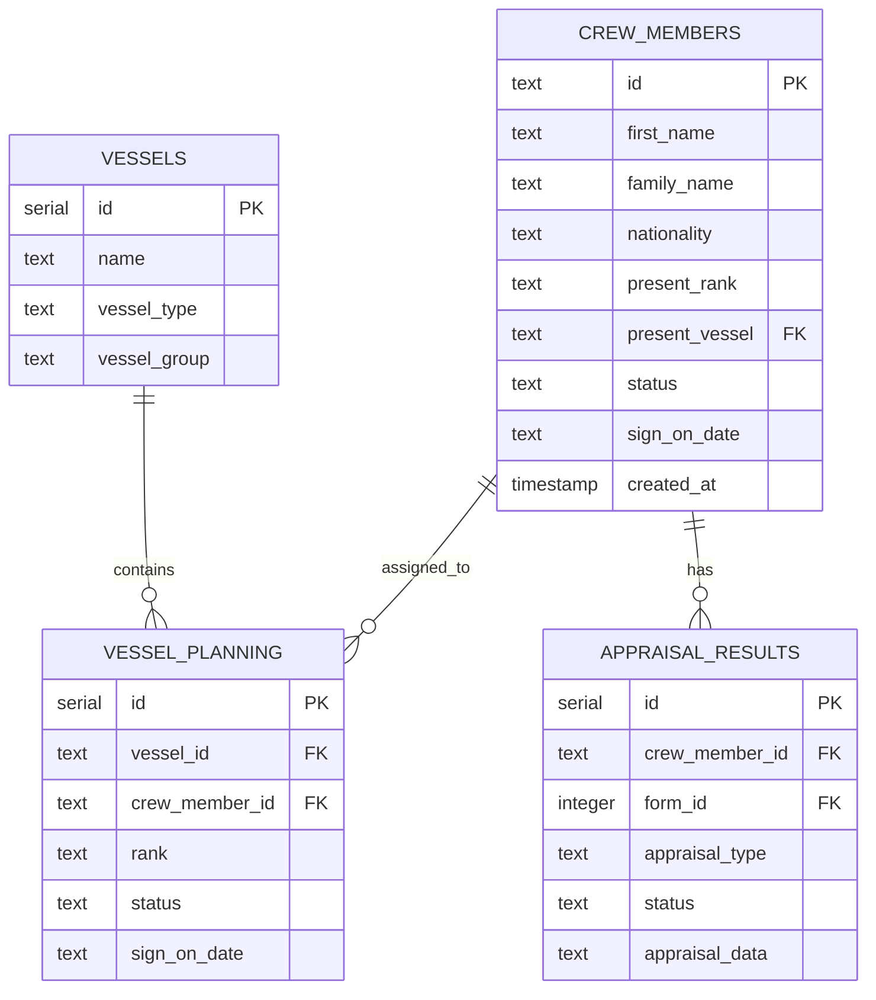
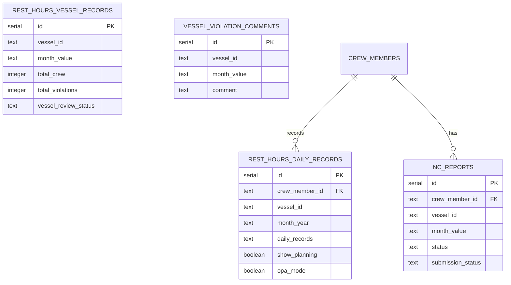
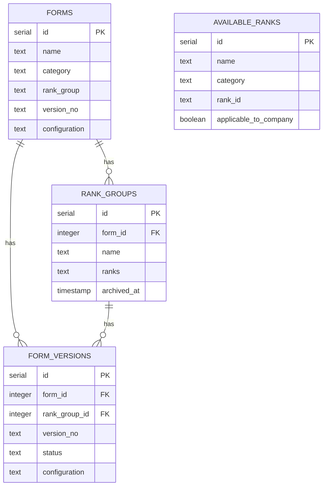
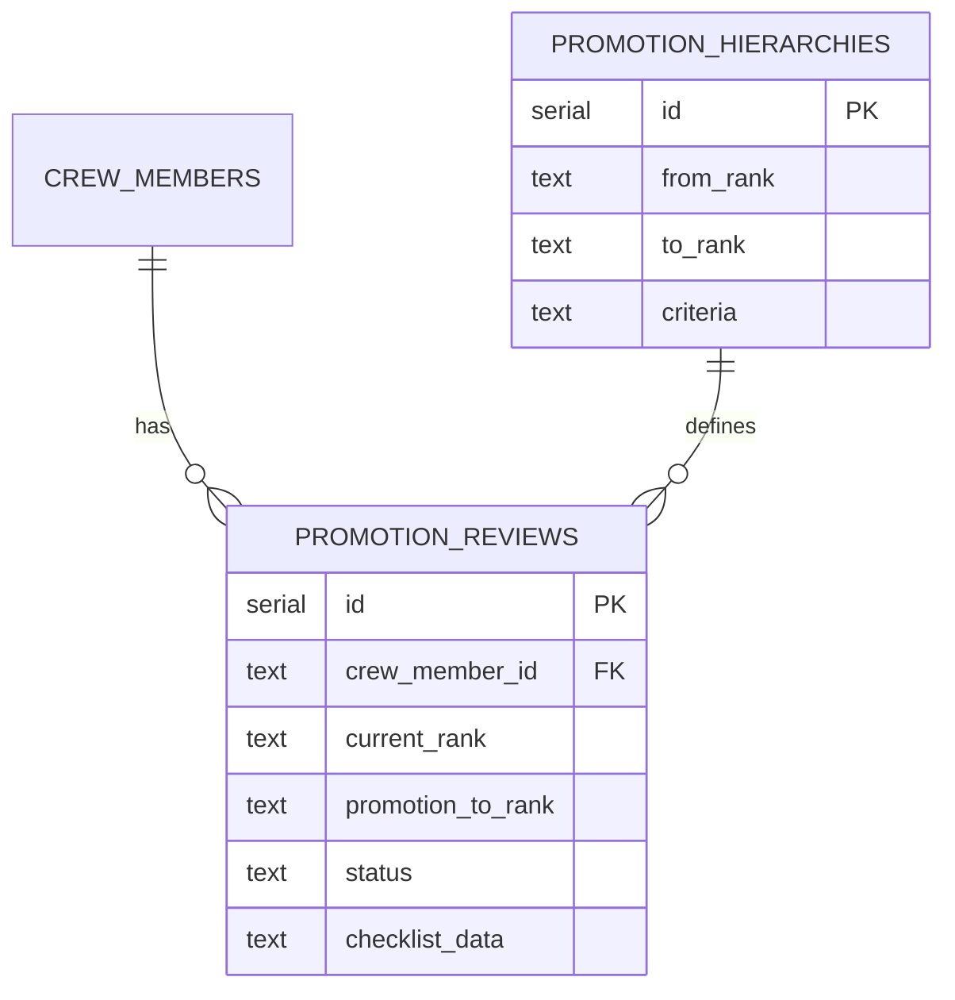
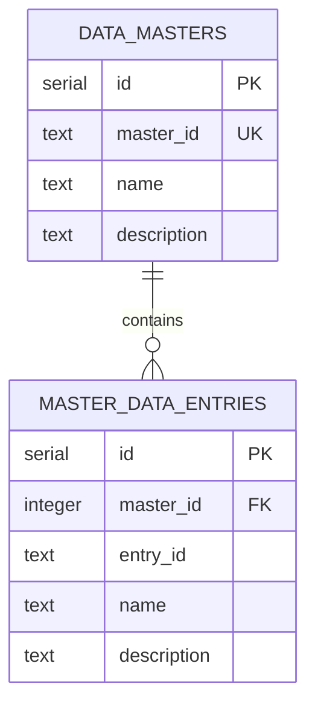

# Entity Relationship Diagrams

## Core Entities



## Rest Hours Module



## Forms & Appraisals



## Training Matrix

```mermaid
erDiagram
    TRAINING_MASTER {
        serial id PK
        text training_id UK
        text training_name
        text category
        text training_group
        boolean applicable_to_company
    }
    
    COMPANY_TRAININGS {
        serial id PK
        integer training_master_id FK UK
        text company_id
        text training_label
        text group_code
    }
    
    COMPANY_TRAINING_REQUIREMENTS {
        serial id PK
        integer company_training_id FK
        integer rank_id FK
        text status
    }
    
    TRAINING_MASTER ||--o| COMPANY_TRAININGS : syncs_to
    COMPANY_TRAININGS ||--o{ COMPANY_TRAINING_REQUIREMENTS : has
    AVAILABLE_RANKS ||--o{ COMPANY_TRAINING_REQUIREMENTS : required_for
```

## Promotions



## Master Data


