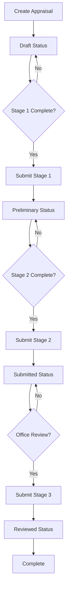
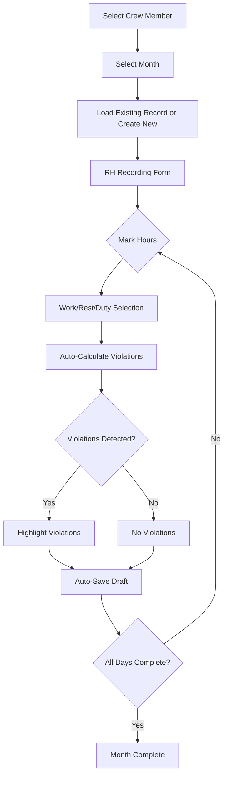
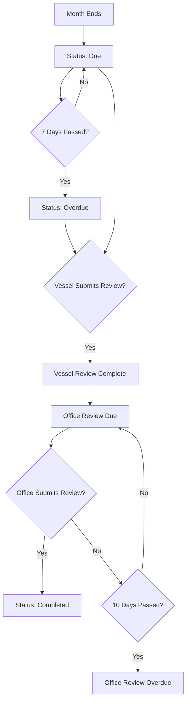
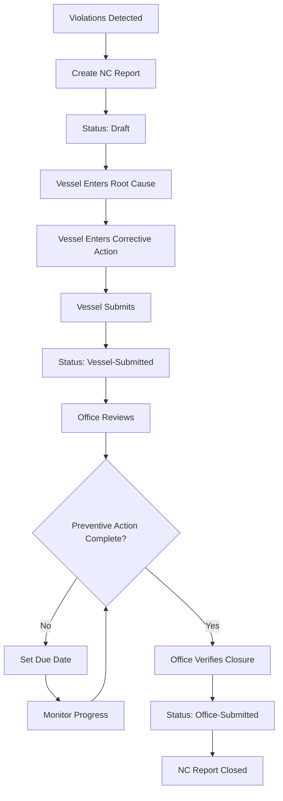
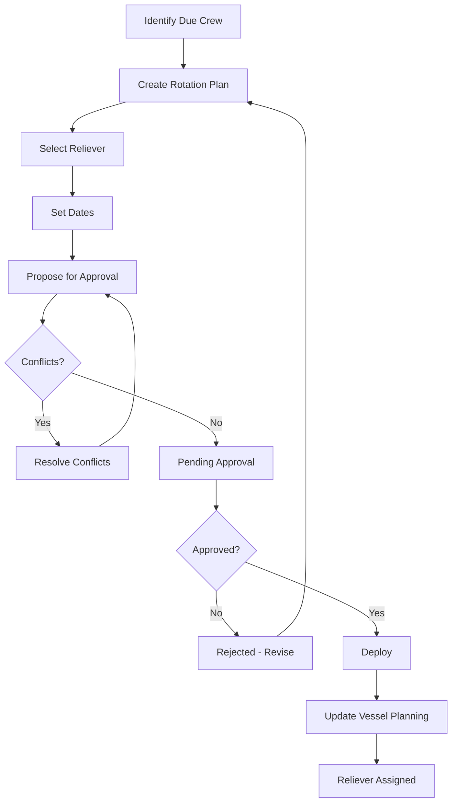
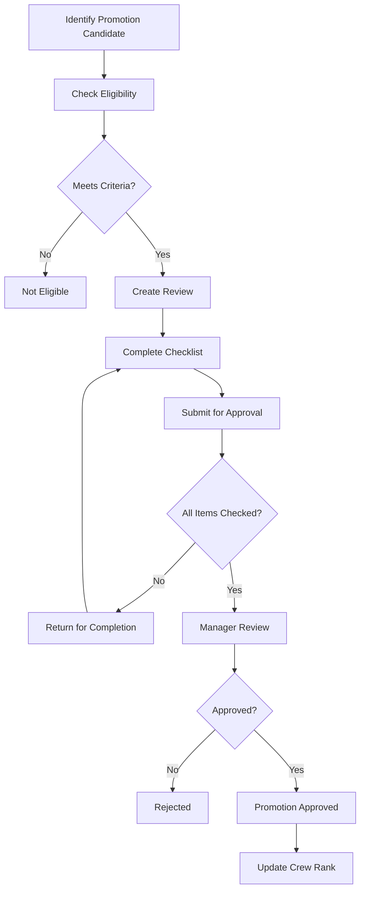
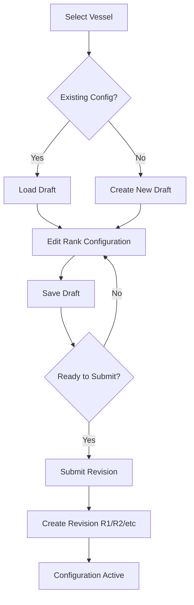
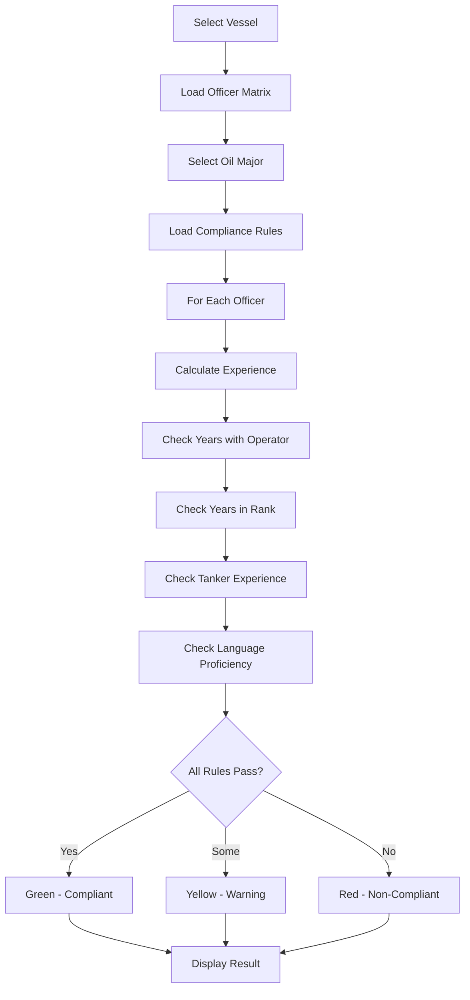
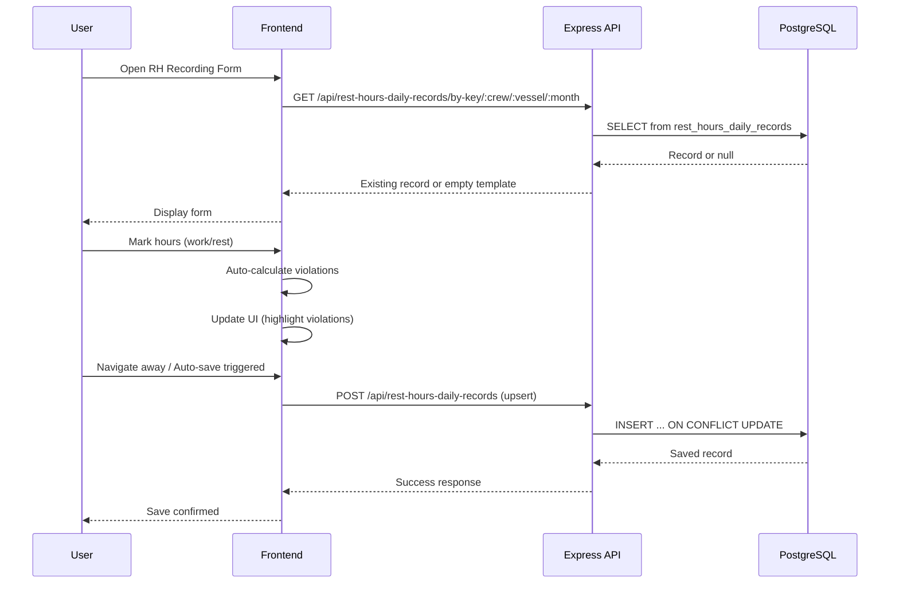

# System Workflow Diagrams

## Appraisal 3-Stage Workflow

## Rest Hours Recording Flow

## Rest Hours Review Workflow

## NC Report Workflow

## Crew Rotation Workflow

## Promotion Review Flow

## Vessel Configuration Flow

## Oil Major Compliance Check

## Data Flow: Rest Hours Recording

