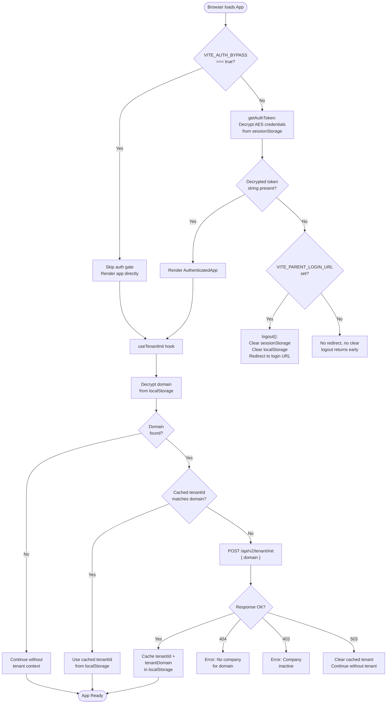
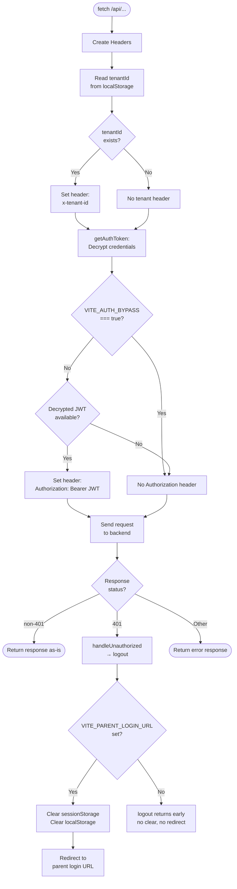
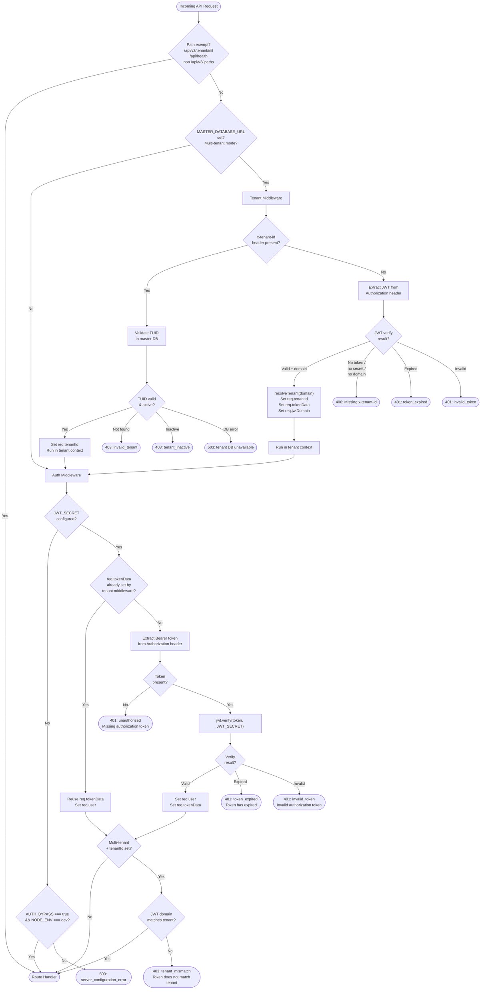
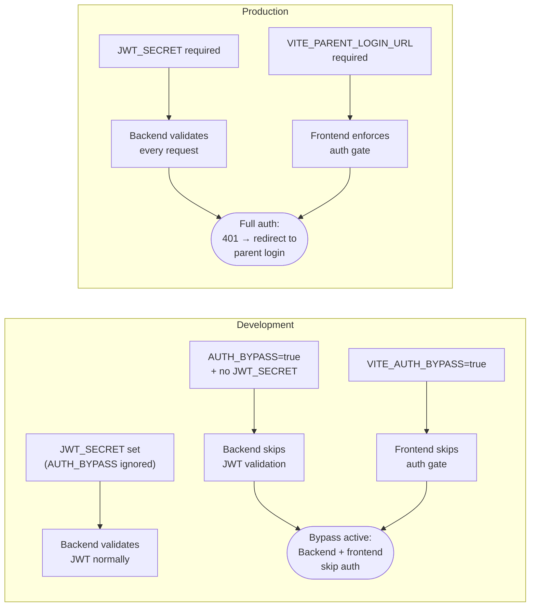

# JWT Authentication & Domain Flow

## Overview

This document provides Mermaid diagrams of the CrewingV2 authentication and multi-tenant domain resolution flow. The system integrates with a parent app (SAIL Audits) that stores an AES-encrypted JWT in `sessionStorage` under the `credentials` key.

**JWT Payload:** `{ id, domain, userType, iat, exp }`

---

## 1. Complete Authentication Flow

---

## 2. Frontend Request Pipeline

---

## 3. Backend Middleware Chain

---

## 4. Dev vs Production Behavior

---

## 5. Environment Variable Summary

| Variable | Side | Required | Auth Role |
|----------|------|----------|-----------|
| `JWT_SECRET` | Backend | Yes (prod) | Shared signing secret for JWT verify |
| `AUTH_BYPASS` | Backend | No | `"true"` skips auth in dev only |
| `VITE_AUTH_BYPASS` | Frontend | No | `"true"` skips auth gate + token attachment |
| `VITE_PARENT_LOGIN_URL` | Frontend | Yes (prod) | Redirect target for 401 / missing token |
| `VITE_CLIENT_ENCRYPTION_KEY` | Frontend | Yes | AES key to decrypt credentials from sessionStorage |
| `MASTER_DATABASE_URL` | Backend | No | Enables multi-tenant mode with domain-based routing |

---

## 6. Key Source Files

| File | Role |
|------|------|
| `client/src/App.tsx` | Auth gate: checks `isAuthRequired()` + `getAuthToken()` |
| `client/src/lib/authToken.ts` | `getAuthToken()`, `isAuthRequired()`, `logout()`, `handleUnauthorized()` |
| `client/src/lib/tenantFetch.ts` | Fetch interceptor: attaches JWT + tenant headers, handles 401 |
| `client/src/lib/encryptionService.ts` | AES decryption of credentials and domain from storage |
| `client/src/hooks/useTenantInit.ts` | Domain resolution → `/api/v2/tenant/init` → cache tenantId |
| `server/middleware/exemptPaths.ts` | Shared exempt path list for both middleware |
| `server/middleware/tenantMiddleware.ts` | Multi-tenant resolution: x-tenant-id or JWT domain fallback |
| `server/middleware/authMiddleware.ts` | JWT verification, AUTH_BYPASS, tenant binding check |
