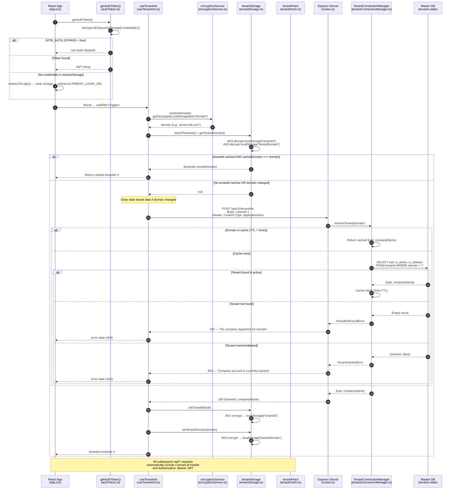
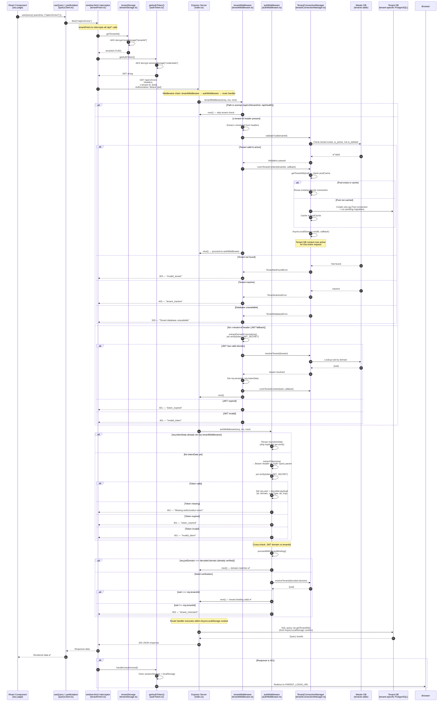

# Multi-Tenant Token Sequence Diagrams — CrewingV2

> Mermaid sequence diagrams showing the complete multi-tenant JWT authentication flow,
> from app initialization through tenant database connection.

---

## Phase 1 — Tenant Initialization (App Mount)

How the frontend resolves which tenant database to connect to when the app loads.

---

## Phase 2 — Subsequent API Request Flow (Frontend → Correct Tenant DB)

How every `/api/*` call flows from the frontend through middleware to the correct tenant database.

---

## Key Source Files Reference

| Layer | File | Role |
|-------|------|------|
| **Frontend** | `client/src/App.tsx` | App mount, auth gate, tenant error display |
| **Frontend** | `client/src/hooks/useTenantInit.ts` | Tenant initialization hook (Phase 1) |
| **Frontend** | `client/src/lib/authToken.ts` | JWT decrypt from sessionStorage, logout/redirect |
| **Frontend** | `client/src/lib/tenantStorage.ts` | Encrypted tenantId/tenantDomain in localStorage |
| **Frontend** | `client/src/lib/encryptionService.ts` | AES encrypt/decrypt for localStorage & sessionStorage |
| **Frontend** | `client/src/lib/tenantFetch.ts` | Fetch interceptor — injects x-tenant-id & Bearer headers |
| **Frontend** | `client/src/lib/queryClient.ts` | TanStack Query default fetcher with tenant headers |
| **Backend** | `server/routes.ts` | POST /api/v2/tenant/init endpoint |
| **Backend** | `server/middleware/tenantMiddleware.ts` | Validates x-tenant-id or JWT domain fallback |
| **Backend** | `server/middleware/authMiddleware.ts` | JWT verify, tenant binding cross-check |
| **Backend** | `server/middleware/exemptPaths.ts` | Paths that skip tenant + auth middleware |
| **Backend** | `server/utils/tenantConnectionManager.ts` | Master DB lookup, connection pooling, AsyncLocalStorage |

---

## Environment Variables

| Variable | Where | Purpose |
|----------|-------|---------|
| `JWT_SECRET` | Backend | Shared secret for jwt.verify() — must match parent SAIL Audits app |
| `AUTH_BYPASS` | Backend | Skip JWT auth in dev (only when JWT_SECRET is absent) |
| `VITE_AUTH_BYPASS` | Frontend | Skip auth entirely on client side |
| `VITE_PARENT_LOGIN_URL` | Frontend | Redirect target on 401 / logout |
| `VITE_CLIENT_ENCRYPTION_KEY` | Frontend | AES key for localStorage & sessionStorage encryption |
| `MASTER_DATABASE_URL` | Backend | Enables multi-tenant mode (master tenants DB) |
| `DATABASE_URL` | Backend | Default single-tenant database connection |
