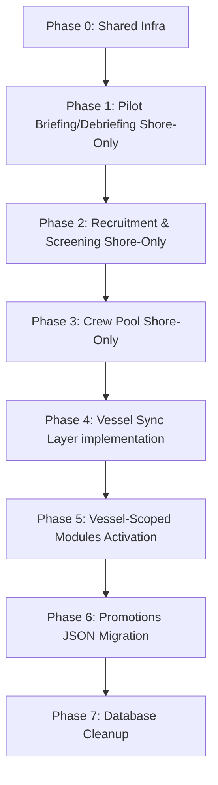

# Attachment Storage Master Migration Plan — base64→Filesystem

This document provides the definitive rollout roadmap, data migration script architecture, and rollback instructions for migrating the Crewing application's attachments.

---

## 1. Live Schema Re-Verification Findings

Every attachment-related table inside the live schemas (`shared/v2/**/*`) was scanned. The results are classified below to distinguish migration-relevant issues from other legacy inconsistencies.

### 1a. Deviations Relevant to This Migration (Scope: `file_name` & `file_path` only)
*   **Drugs & Alcohol Table Deviation**:
    *   **Table**: `da_attachments_v2` (`shared/v2/drugs-alcohol/schema.ts` L90-103)
    *   **Deviation**: Uses `filename: text("filename")` (L94) instead of standard `file_name`.
    *   **Action Needed**: Execute a database schema migration renaming the column to `file_name` and update Drizzle schema property mapping.
*   **Promotions Table Absence**:
    *   **Table**: `promo_checklist_progress_v2` (`shared/v2/promotions/schema.ts` L148-165)
    *   **Deviation**: No separate attachment table exists. Attachments are serialized as a base64 JSON array directly in `attachments_data` text column.
    *   **Action Needed**: Create a new table `promo_checklist_attachments_v2` adhering to the canonical standard (without `file_data`), and parse/migrate JSON entries into rows.

### 1b. Inconsistencies Observed but Explicitly Out of Scope
The following schema patterns deviate from standard crew pool/recruitment conventions but are **excluded** from standardizing updates under this plan to avoid unnecessary code churn:
*   **Uploader Column**: `da_attachments_v2` uses `uploadedBy: text("uploaded_by")`. Other tables use `uploadedByUuid: text("uploaded_by_uuid")`. (Left as-is).
*   **Upload Date Column**: `da_attachments_v2` and `vessel_planning_attachments_v2` both contain an extra `uploadDate: text("upload_date")` column. Other modules rely purely on `auditColumns.createdAt`. (Left as-is).

---

## 2. Phase-by-Phase Rollout Sequence

The rollout is divided into phases to minimize risk and establish core infrastructure before migrating operational modules.

> [!CAUTION]
> **Vessel-Scoped Blocking Rule**: Vessel-scoped modules (Medical, Briefing, De-briefing, Drugs & Alcohol, and Vessel Planning) contain data that must sync between vessel servers and shore databases. Because a file-based sync protocol does not currently exist, these modules are **sync-blocked** and cannot be deployed to production vessel-sides until a file-sync transport mechanism is implemented.

### Phase 0: Shared Infrastructure (Estimated Effort: 1-2 weeks)
*   **Objective**: Deploy the common helpers and configurations.
*   **Tasks**:
    1.  Create `server/v2/shared/fileStorageService.ts` containing file storage and name sanitization logic.
    2.  Write shared Express controller response helper `serveAttachmentFromFilePath`.
    3.  Add `.private/` folder path to `.gitignore`.
    4.  Update Nginx configs to guarantee `.private/` cannot be served directly.

### Phase 1: Pilot — Briefing & De-briefing Shore-Only (Estimated Effort: 1 week)
*   **Objective**: Validate the filesystem storage and dual-read using a low-traffic module on the shore installation.
*   **Vessel Sync Constraint**: Shore-side only. Do not sync folder content to shipboard servers yet.
*   **Tasks**:
    1.  Deploy database migration schema updating `crew_briefing_attachments` and `crew_debriefing_attachments` to use the filesystem on write paths.
    2.  Validate fallback read mechanism against historical inline base64 rows.

### Phase 2: Recruitment & Screening (Estimated Effort: 2 weeks)
*   **Objective**: Migrate shore-only data where no vessel sync exists.
*   **Modules in Scope**: 7 recruitment document tables, 7 screening stage tables (B1–B8, excluding B7 which has no attachments).
*   **Tasks**:
    1.  Update the `recruitment` and `screening` service write paths to parse base64 and write files using `fileStorageService`.
    2.  Introduce `/raw` serving endpoints for recruitment and screening stages.
    3.  Configure `FileAttachmentDialog.tsx` to handle recruitment attachments pathing.

### Phase 3: Crew Pool Shore-Safe Sub-Modules (Estimated Effort: 2 weeks)
*   **Objective**: Migrate the remaining shore-only sub-modules of the Crew Pool.
*   **Sub-modules in Scope**: Crew Documents, Visas, Education, Licenses, Training, and Sea Service attachments.
*   **Vessel Sync Constraint**: Crew Medical and Doctor Visits remain blocked because they are vessel-scoped.

### Phase 4: Sync Protocol Implementation (Estimated Effort: 3-4 weeks)
*   **Objective**: Design and build the missing ship/shore file transfer synchronization layer.
*   **Tasks**:
    1.  Establish HTTP/HTTPS push/pull endpoint or RSYNC transport mechanism to sync files inside `.private/`.
    2.  Integrate file transport status into the database-level sync logs.

### Phase 5: Vessel-Scoped Modules Activation (Estimated Effort: 2 weeks)
*   **Objective**: Release the sync-dependent modules once Phase 4 is verified.
*   **Modules in Scope**: Crew Medical, Doctor Visits, Drugs & Alcohol, Vessel Planning, and Vessel/Shore Briefing/De-briefing.
*   **Tasks**:
    1.  Deploy rename schema migration for Drugs & Alcohol `filename` → `file_name`.
    2.  Update backend call sites in D&A controller and services.
    3.  Activate file-sync schedules for these modules.

### Phase 6: Promotions Migration (Estimated Effort: 1-2 weeks)
*   **Objective**: Restructure the Promotion checklist progress attachments.
*   **Tasks**:
    1.  Create the `promo_checklist_attachments_v2` table.
    2.  Deploy the backfill migration script to extract attachments from `attachments_data` JSON to disk files, inserting catalog records into `promo_checklist_attachments_v2`.
    3.  Refactor `PromotionChecklistForm.tsx` and `promotionReviewsService.ts` to utilize the new table.

### Phase 7: Database Cleanup (Estimated Effort: 1 week)
*   **Objective**: Complete decommissioning of legacy storage.
*   **Tasks**:
    1.  Drop `file_data` columns from all 26 tables.
    2.  Drop `attachments_data` column from `promo_checklist_progress_v2`.

---

## 3. Data Migration & Extraction Strategy

To backfill historical base64 attachments to disk, a standalone node script must be executed on each tenant database.

### Extraction Flow (Algorithm)
For each of the 26 attachment tables (and the Promotions JSON arrays):
1.  Query all rows where `file_data` is NOT NULL and `file_path` IS NULL (or empty).
2.  For each row:
    *   Parse the base64 data URL string (e.g. `data:application/pdf;base64,...` → extract mime type and raw payload).
    *   Decode payload to raw bytes buffer.
    *   Call `fileStorageService.writeAttachment(tenantDomain, moduleName, fileName, buffer)` to write the file and get the relative path.
    *   Update the database row: set `file_path` to the generated path, and set `file_data` to `null`.
    *   Log successes and failures (retaining the base64 column intact in case of disk write failure).

---

## 4. Rollback Plan Per Module

If a filesystem write failure, directory permissions error, or disk-fill event occurs, the system must support zero-downtime rollback:

### Backend Dual-Read Fallback
Keep the `file_data` column nullable and active. If a critical issue is discovered on a newly migrated module, the code can be rolled back to write base64 inline to the DB connection without DDL changes, and the dual-read handler will continue serving files seamlessly.

### File Recovery Script
If code has already run and written attachments to disk, and we must perform a complete database restore:
1.  Run a reverse script that reads `file_path` references, encodes the files on disk back into base64 data URLs, and updates the `file_data` column.
2.  Only after this reverse sync is complete should the physical files be cleared, returning the application to its original base64-in-DB state.

---

## 5. Ship/Shore Sync Risk Handling

To prevent silent data desync or broken attachments on vessels:
1.  **Strict Path Logging**: The database-level sync configuration (`shared/syncConfig.ts`) must include the `file_path` column. This guarantees that when a record is created or updated on shore, the relative path string synchronizes to the ship.
2.  **File Sync Queue**: Physical files must transfer asynchronously. If a seafarer attempts to open an attachment on the ship and the file has not yet transferred:
    *   The UI must display a "Pending Sync: File is transferring from shore..." overlay rather than a broken image link.
    *   A transfer check query must run against the sync manifest.

---

## 6. Open Decisions Requiring Human Sign-Off

The following decisions require explicit sign-off from the technical steering committee:

| Decision Item | Proposed Approach | Risk & Considerations |
|---|---|---|
| **Timing of Dropping `file_data` Columns** | Defer dropping columns until Phase 7 (Final Cleanup). Maintain the columns as nullable throughout deployment phases. | **Risk**: Temporary duplication of storage size if dual-write is enabled during validation. **Benefit**: Safe rollback is guaranteed. |
| **Historical Row Extraction** | Run the backfill extraction script immediately post-deployment of each phase during a schedule maintenance window. | **Risk**: Disk space consumption on the server must be pre-calculated. **Benefit**: Eliminates database size issues quickly and standardizes database backups. |
| **Vessel Sync Blocker Strategy** | Enforce a hard block on shipboard deployment of the 5 vessel-scoped modules until the sync layer (Phase 4) is completed. | **Risk**: Delays shipboard rollout of updated versions of these specific modules. **Benefit**: Prevents users on ships from seeing empty/broken attachments. |
