# SAIL Crewing (CrewingV2) — System Overview

> Generated: 2026-07-06  
> Scope: Complete technical reference covering database schema, data field mapping, API routes, authentication/RBAC/approval-workflow engine, and tech stack/folder structure.

---

## Table of Contents
1. [Tech Stack & Folder Structure](#1-tech-stack--folder-structure)
2. [Shared UI Component Library & Design Tokens](#2-shared-ui-component-library--design-tokens)
3. [Complete Database Schema](#3-complete-database-schema)
4. [Key Maritime Data Fields](#4-key-maritime-data-fields)
5. [API Endpoints — Crew, Vessel & Assignment Data](#5-api-endpoints--crew-vessel--assignment-data)
6. [Authentication, RBAC & Approval-Workflow Engine](#6-authentication-rbac--approval-workflow-engine)

---

## 1. Tech Stack & Folder Structure

### 1.1 Runtime Stack

| Layer | Technology |
|---|---|
| **Frontend runtime** | React 18, Vite |
| **Frontend language** | TypeScript (strict mode) |
| **Styling** | Tailwind CSS v3, shadcn/ui, custom SAIL design system |
| **Data grids** | AG Grid Enterprise (`@ag-grid-community/react`, `@ag-grid-enterprise/all-modules`) |
| **State / cache** | TanStack Query v5 (`@tanstack/react-query`) |
| **Forms** | React Hook Form + Zod via `@hookform/resolvers/zod` |
| **Routing** | Wouter |
| **Icons** | Lucide React, react-icons/si |
| **Backend runtime** | Node.js, Express.js |
| **Backend language** | TypeScript |
| **Database** | PostgreSQL (one DB per tenant) |
| **ORM** | Drizzle ORM + `drizzle-zod` |
| **Multi-tenancy** | `TenantConnectionManager` + `AsyncLocalStorage` |
| **Auth** | JWT (RS256/HS256), AES-encrypted in `sessionStorage` |

### 1.2 Folder Structure

```
.
├── client/                       # React + Vite frontend
│   └── src/
│       ├── App.tsx               # Root component + Wouter router
│       ├── main.tsx              # Entry point
│       ├── components/           # Shared UI (shadcn/ui wrappers, AgGridTable, etc.)
│       │   ├── AgGrid/           # AgGridTable.tsx — enterprise wrapper
│       │   ├── ui/               # shadcn/ui primitives
│       │   └── ...               # FileAttachmentDialog, NotificationBell, AppErrorBoundary
│       ├── config/
│       │   └── sailDesignSystem.ts  # Color, typography, spacing tokens
│       ├── contexts/
│       │   ├── PermissionsContext.tsx  # RBAC canView/canEdit/canCreate/canDelete
│       │   └── EditSessionContext.tsx
│       ├── hooks/
│       │   └── v2/
│       │       ├── useMasterDataV2.ts   # vessels, nationalities, ranks, ports, manning-agents
│       │       ├── useRankNormalization.ts
│       │       ├── useRankOrdering.ts
│       │       └── useViewport.ts
│       ├── lib/
│       │   ├── queryClient.ts    # TanStack Query client + apiRequest helper
│       │   ├── tenantFetch.ts    # Auto-injects x-tenant-id + Authorization headers
│       │   └── authToken.ts      # Decrypt JWT from sessionStorage, redirect on 401
│       ├── micro-frontend/       # Micro-frontend integration helpers
│       ├── modules/              # Feature modules
│       │   ├── admin/            # RBAC admin, form config, approval workflow UI
│       │   ├── crewing/          # Crewing dashboard
│       │   ├── crew-pool/        # Crew profiles, terminations, briefing/debriefing
│       │   ├── drugs-alcohol/    # D&A testing module
│       │   ├── promotions/       # Promotion review workflow
│       │   ├── recruitment/      # Candidate pipeline (B1–B8)
│       │   ├── rest-hours/       # MLC/STCW rest-hours compliance
│       │   ├── rotation/         # Rotation planning
│       │   ├── vessel/           # Vessel planning & manning matrix
│       │   ├── accounts/         # Payroll, contracts, allotments
│       │   └── ...
│       ├── pages/                # Top-level routed pages
│       ├── stores/               # Zustand stores
│       ├── styles/               # Global CSS
│       ├── types/                # Shared frontend types
│       └── utils/                # Frontend helpers
├── server/                       # Express + TypeScript backend
│   ├── index.ts                  # App entry + middleware stack
│   ├── db.ts                     # DB bootstrap (legacy single-tenant)
│   ├── routes.ts                 # Legacy / shared routes (health, tenant init)
│   ├── routes/                   # Route files for V1 + some V2 domains
│   ├── middleware/
│   │   ├── authMiddleware.ts     # JWT verification, req.user injection
│   │   └── tenantMiddleware.ts   # x-tenant-id resolution, AsyncLocalStorage context
│   ├── migrations/               # SQL migration files (auto-run per tenant)
│   ├── swagger-docs/             # OpenAPI docs
│   ├── utils/                    # Backend helpers
│   └── v2/                       # V2 domain modules
│       ├── db.ts                 # getDb() — reads from AsyncLocalStorage tenant context
│       ├── admin/                # RBAC, form config, rank/training masters
│       ├── appraisals/           # Appraisal workflow
│       ├── crew-pool/            # Crew profile CRUD + assignments
│       ├── drugs-alcohol/        # D&A test records
│       ├── masters/              # Vessel, nationality, port master data
│       ├── ports/
│       ├── promotions/           # Promotion review + execution ledger
│       ├── recruitment/          # Candidate pipeline
│       ├── reports/              # Analytics & reporting
│       ├── rest-hours/           # Rest-hours compliance
│       ├── rotation/             # Rotation drafts + deployment
│       ├── training-needs/
│       ├── training-retention/
│       └── vessel/               # Vessel planning, compliance matrix
├── shared/                       # Code shared between client and server
│   ├── schema.ts                 # Core Drizzle schema (legacy + master data tables)
│   └── v2/                       # Per-domain V2 Drizzle schemas
│       ├── accounts/schema.ts
│       ├── admin/schema.ts
│       ├── appraisals/schema.ts
│       ├── crew-pool/schema.ts
│       ├── drugs-alcohol/schema.ts
│       ├── promotions/schema.ts
│       ├── recruitment/schema.ts
│       ├── rest-hours/schema.ts
│       ├── rotation/schema.ts
│       ├── tenant/schema.ts
│       ├── training-needs/schema.ts
│       └── vessel/schema.ts
├── docs/                         # Architecture & API documentation
├── migrations/                   # Root migration assets
├── scripts/                      # Maintenance / setup scripts
├── tests/                        # Playwright / Vitest test suites
└── drizzle.config.ts, vite.config.ts, tailwind.config.ts, tsconfig.json, package.json
```

Each V2 domain module follows the pattern:
```
server/v2/<domain>/
├── routes.ts          # Express router (thin, Zod-validated)
├── controllers/       # Request handling
├── services/          # Business logic
├── repositories/      # DB queries via getDb()
└── types.ts           # Domain types
```

---

## 2. Shared UI Component Library & Design Tokens

### 2.1 Base Component Library

The application is built on **shadcn/ui** primitives (`Button`, `Dialog`, `Select`, `Card`, `Form`, `Tabs`, `Table`, `Badge`, `Avatar`, `Textarea`, etc.), all located under `client/src/components/ui/`.

### 2.2 AG Grid Enterprise

Heavy data tables use AG Grid Enterprise with a shared wrapper:

- **`client/src/components/AgGrid/AgGridTable.tsx`** — registers enterprise modules, applies the custom `alpine` theme, and handles responsive viewport sizing.
- Theme overrides live in `client/src/index.css` (e.g., `#52baf3` for header backgrounds).

### 2.3 SAIL Design System

Centralised in `client/src/config/sailDesignSystem.ts`:

| Token | Value |
|---|---|
| Primary colour | `#5fa5fa` |
| Success colour | `#20c43f` |
| Header text | `#16569e` |
| Font stack | Mulish, Helvetica, sans-serif |
| Form padding | `1.5rem` |
| Section spacing | `2rem` |

Helper functions: `getFormSectionClasses()`, `getTableClasses()`, `getButtonClasses()`.

CSS variables are declared in `client/src/index.css` in `H S% L%` format (no `hsl()` wrapper), consumed by `tailwind.config.ts`.

### 2.4 Reusable Form Infrastructure

| Component | Purpose |
|---|---|
| `BaseSubmoduleForm.tsx` | Standard multi-section form layout (side stepper, header actions, scrollable body) |
| `FormEditorFactory.tsx` | Dynamic form generation driven by JSON config (Appraisals, Promotions) |
| `FileAttachmentDialog` | Consistent document upload/preview across all modules |

### 2.5 Reusable Hooks

| Hook | Purpose |
|---|---|
| `useMasterDataV2` | Fetches vessels, nationalities, ranks, ports, manning-agents (30 min stale time) |
| `useRankNormalization` | Normalises vessel-specific rank naming (e.g. OS_1 → OS) |
| `useRankOrdering` | Orders ranks by seniority |
| `useViewport` | Returns `phone` / `tablet` / `desktop` for responsive styling |
| `usePermissions` | Exposes `canView`, `canEdit`, `canCreate`, `canDelete` from `PermissionsContext` |

### 2.6 Common Module UI Patterns

- **Workspace pattern** — list view (AG Grid) + side navigation + workspace wrapper (e.g. `RecruitmentModuleV2.tsx`).
- **Stepper forms** — left-hand or horizontal mobile stepper for multi-section crew/candidate profiles (sections A1, A2, B, C, etc.).
- **Filter bar** — horizontal bar with `Input` + `Select` above AG Grid, with a "Filters" toggle.
- **Action renderers** — AG Grid `cellRenderer` with Lucide icons for row-level Edit / Delete / Attachment actions.

---

## 3. Complete Database Schema

### 3.1 Schema conventions

Every V2 table has:
- A `serial("id")` surrogate primary key.
- A business `*_uuid` text column declared `.notNull().unique()` — the stable, externally-referenced identifier.
- Relationships expressed through `*_uuid` text foreign-key columns (no integer FK joins).
- Shared **audit columns** (`created_at`, `updated_at`, `created_by_uuid`, `updated_by_uuid`, `is_deleted`, `is_sync`).

### 3.2 Schema source files

| Domain | Schema file |
|---|---|
| Core / master data | `shared/schema.ts` |
| Tenant | `shared/v2/tenant/schema.ts` |
| Crew Pool | `shared/v2/crew-pool/schema.ts` |
| Vessel | `shared/v2/vessel/schema.ts` |
| Rotation | `shared/v2/rotation/schema.ts` |
| Accounts / Payroll | `shared/v2/accounts/schema.ts` |
| Appraisals | `shared/v2/appraisals/schema.ts` |
| Promotions | `shared/v2/promotions/schema.ts` |
| Recruitment | `shared/v2/recruitment/schema.ts` |
| Rest Hours | `shared/v2/rest-hours/schema.ts` |
| Drugs & Alcohol | `shared/v2/drugs-alcohol/schema.ts` |
| Admin / RBAC | `shared/v2/admin/schema.ts` |
| Training Needs | `shared/v2/training-needs/schema.ts` |

### 3.3 Table listing

#### Tenancy

| Table | PK | Key columns |
|---|---|---|
| `tenants` | `id` serial | `tuid` (unique), `domain` (unique), `company_name`, `is_active` |
| `users` | `id` serial | `username`, `password` |

#### Master / Reference Data (`shared/schema.ts`)

| Table | PK | Key columns |
|---|---|---|
| `data_masters` | `id` text | `name`, `description` |
| `master_data_entries` | `id` serial | `master_id` → `data_masters.id`, `entry_id`, `name`, many domain-specific columns |
| `master_nationalities` | `id` serial | `nat_uuid`, `country_code`, `country_name`, `nationality`, `country_ref_id` |
| `master_vessels` | `id` serial | `vessel_uuid`, `vessel`, `imo_number`, `flag`, `vessel_type` |
| `master_vessel_types` | `id` serial | `vt_uuid`, `vessel_type`, `tanker`, `oil_tanker`, `gas_tanker`, `chemical_tanker`, `container`, `dry`, `other` |
| `master_ports` | `id` serial | `port_uuid`, `name`, `latitude`, `longitude`, `country`, `port_code` |
| `master_fleet_groups` | `id` serial | `fg_uuid`, `name`, `vessels` (JSON) |
| `master_additional_groups` | `id` serial | `ag_uuid`, `name`, `vessels` (JSON) |
| `master_languages` | `id` serial | `lang_uuid`, `iso_code`, `language_name`, `native_name`, `is_foreign_language` |
| `master_countries` | `id` serial | `country_uuid`, `country_name` |
| `master_users` | `id` serial | `user_uuid`, `firstname`, `lastname`, `email`, `fullname`, `user_type`, `designation`, `department`, `role` |
| `master_licenses_dce` | `id` text | `entry_id`, `name`, `short_code`, `sort_order` |
| `master_manning_agents` | `id` text | `name`, `country`, `email`, `phone`, `address`, `contact_person` |
| `master_crew_pools` | `id` text | `name`, `description` |
| `master_appraisal_types` | `id` text | `entry_id`, `name` |
| `company_ranks` | `id` text | `rank`, `rank_id`, `role`, `officer`, `rating`, `senior_officer`, `deck_officer`, `eng_officer`, `petty_officer`, … (boolean category flags) |
| `promotion_hierarchies` | `id` serial | `group_name`, `rank_path` (JSON array of rank labels) |
| `cba_tables` | `id` serial | `name`, `description`, `table_data` (JSON) |
| `cba_table_entries` | `id` serial | `table_id` → `cba_tables.id`, `rank`, `vessel_type`, `category`, `value`, `effective_date`, `expiry_date`, `currency` |
| `id_counters` | `id` serial | `counter_type` (unique), `current_value`, `prefix`, `format` |

#### Crew Pool (`shared/v2/crew-pool/schema.ts`)

| Table | PK | Key columns |
|---|---|---|
| `crew_members_v2` | `id` serial | `crew_uuid` (unique), `emp_no` (unique), `employee_id`, `first_name`, `middle_name`, `family_name`, `gender`, `dob`, `nationality_uuid`, `vessel_type_uuid`, `present_rank`, `rank_applied_for`, `status`, `is_active`, `recruitment_date`, `not_for_hire`, `last_termination_date`, `last_termination_reason`, `last_termination_category`, `termination_initiated_by`, + audit cols |
| `crew_terminations` | `id` serial | `term_uuid` (unique), `crew_uuid`, `termination_date`, `initiated_by`, `reason`, `category`, `not_for_hire`, `comments`, `submitted_by_user_id`, `submitted_by_name`, `submitted_by_role`, `rank_id_snapshot`, `pool_id_snapshot`, `manning_agent_id_snapshot`, + audit cols |
| `crew_assignments` | `id` serial | `assign_uuid` (unique), `crew_uuid`, `vessel_uuid`, `last_vessel_uuid`, `is_current`, `sign_on_date`, `sign_off_date`, `contract_period`, `relief_due`, `reason`, `port_of_joining_uuid`, `port_of_leaving_uuid`, `assignment_type`, + audit cols |
| `crew_vessel_types_applied` | `id` serial | `cvta_uuid`, `crew_uuid`, `vessel_type_uuid`, `sort_order`, + audit cols |
| `crew_personal_details` | `id` serial | `cpd_uuid`, `crew_uuid`, `height_cm`, `weight_kg`, `bmi`, `age_in_years`, `place_of_birth_city`, `place_of_birth_country_uuid`, `native_language_uuid`, `foreign_languages`, `english_proficiency`, `manning_agent`, `crew_pool`, `availability`, `next_availability`, + audit cols |
| `crew_addresses` | `id` serial | `addr_uuid`, `crew_uuid`, `country_of_residence_uuid`, `nearest_airport`, `address_line1`, `address_line2`, `contact_landline`, `mobile`, `email`, + audit cols |
| `crew_family_info` | `id` serial | `fam_uuid`, `crew_uuid`, `marital_status`, `num_dependent_children`, `father_name`, `mother_name`, `spouse_first_name`, `spouse_middle_name`, `spouse_family_name`, `spouse_dob`, + audit cols |
| `crew_children` | `id` serial | `child_uuid`, `crew_uuid`, `first_name`, `middle_name`, `family_name`, `dob`, `gender`, `sort_order`, + audit cols |
| `crew_next_of_kin` | `id` serial | `nok_uuid`, `crew_uuid`, `first_name`, `middle_name`, `family_name`, `telephone`, `email`, `address`, `relationship`, + audit cols |
| `crew_documents` | `id` serial | `doc_uuid`, `crew_uuid`, `document_id`, `document_name`, `number`, `issued`, `expiry`, `issuing_authority`, `issuing_country_uuid`, `sort_order`, + audit cols |
| `crew_documents_attachments` | `id` serial | `att_uuid`, `doc_uuid`, `file_name`, `file_type`, `file_size`, `file_path`, `file_data`, `uploaded_by_uuid`, + audit cols |
| `crew_visas` | `id` serial | `visa_uuid`, `crew_uuid`, `country_uuid`, `country`, `serial_no`, `issued`, `expiry`, `visa_type`, + audit cols |
| `crew_visas_attachments` | `id` serial | `att_uuid`, `visa_uuid`, file cols, + audit cols |
| `crew_education` | `id` serial | `edu_uuid`, `crew_uuid`, `date_of_completion`, `institution`, `subjects_field`, `qualifications`, + audit cols |
| `crew_education_attachments` | `id` serial | `att_uuid`, `edu_uuid`, file cols, + audit cols |
| `crew_licenses` | `id` serial | `lic_uuid`, `crew_uuid`, `license_id`, `certificate_document`, `abbr`, `requirement`, `certificate_no`, `issuing_authority`, `issuing_country_uuid`, `issued`, `expiry`, `archived_at`, + audit cols |
| `crew_licenses_attachments` | `id` serial | `att_uuid`, `lic_uuid`, file cols, + audit cols |
| `crew_training_courses` | `id` serial | `train_uuid`, `crew_uuid`, `course_id`, `training_course`, `abbr`, `requirement`, `certificate_no`, `issuing_authority`, `issuing_country_uuid`, `issued`, `expiry`, + audit cols |
| `crew_training_attachments` | `id` serial | `att_uuid`, `train_uuid`, file cols, + audit cols |
| `crew_sea_service` | `id` serial | `sea_uuid`, `crew_uuid`, `service_type`, `vessel_name`, `vessel_uuid`, `vessel_type_uuid`, `deadweight`, `engine_type_power`, `owner_operator`, `rank`, `from_date`, `to_date`, `period_months`, `experience_categories` (text[]), + audit cols |
| `crew_sea_service_attachments` | `id` serial | `att_uuid`, `sea_uuid`, file cols, + audit cols |
| `crew_pre_joining_medicals` | `id` serial | `med_uuid`, `crew_uuid`, `vessel_uuid`, `vessel_name`, `examination_date`, `bp`, `weight`, `any_medication_prescribed`, `clinic_hospital`, `fit_for_duty`, `expiry_date`, + audit cols |
| `crew_medical_attachments` | `id` serial | `att_uuid`, `med_uuid`, file cols, + audit cols |
| `crew_doctor_visits` | `id` serial | `visit_uuid`, `crew_uuid`, `vessel`, `port`, `visit_date`, `doctor_name`, `clinic_hospital`, `reason`, `doctor_comments`, `diagnosis`, `treatment`, `follow_up_date`, + audit cols |
| `crew_doctor_visits_attachments` | `id` serial | `att_uuid`, `visit_uuid`, file cols, + audit cols |
| `crew_briefings` | `id` serial | `briefing_uuid`, `crew_uuid`, `vessel_uuid`, `vessel_name`, `joining_rank`, `date_sign_on`, + audit cols |
| `crew_briefing_attachments` | `id` serial | `att_uuid`, `briefing_uuid`, file cols, + audit cols |
| `crew_debriefings` | `id` serial | `debriefing_uuid`, `crew_uuid`, `vessel_uuid`, `vessel_name`, `rank_served`, `date_sign_on`, `date_signed_off`, `reason_for_sign_off`, + audit cols |
| `crew_debriefing_attachments` | `id` serial | `att_uuid`, `debriefing_uuid`, file cols, + audit cols |

#### Vessel Planning (`shared/v2/vessel/schema.ts`)

| Table | PK | Key columns |
|---|---|---|
| `vessel_planning_v2` | `id` serial | `plan_uuid` (unique), `vessel_uuid`, `active_revision_uuid`, `rank_id`, `rank`, `crew_uuid`, `crew_status` (`primary`/`secondary`), `sign_on_date`, `relief_due`, `sign_off_date`, `sign_off_port_uuid`, `sign_off_reason`, `relief_status`, `take_over_date`, `take_over_confirmation`, `hand_over_date`, `reliever_crew_uuid`, `reliever_sign_on_date`, `joining_port_uuid`, `joining_status`, `contract_period_months`, `contract_end_range_start_months`, `contract_end_range_end_months`, `reliever_contract_period_months`, `reliever_contract_end_range_start_months`, `reliever_contract_end_range_end_months`, `deployment_checklist_completed`, `applicable_docs_checked`, `admin_accept`, `is_archived`, `is_reliever_archived`, `archived_date`, + audit cols |
| `vessel_planning_attachments_v2` | `id` serial | `att_uuid`, `plan_uuid`, `file_name`, `file_type`, `file_size`, `file_path`, `file_data`, `uploaded_by_uuid`, `upload_date`, + audit cols |

#### Rotation (`shared/v2/rotation/schema.ts`)

| Table | PK | Key columns |
|---|---|---|
| `rotation_drafts_v2` | `id` serial | `draft_uuid` (unique), `draft_id`, `last_edited`, `plan_from_date`, `plan_to_date`, `created_by_uuid`, `plan_status` (In Draft/Proposed/…), `proposed_by_uuid`, `proposed_date`, `previous_plan_status`, + audit cols |
| `rotation_draft_vessels_v2` | `id` serial | `rv_uuid`, `draft_uuid`, `vessel_uuid`, `sort_order`, + audit cols |
| `rotation_draft_ranks_v2` | `id` serial | `rr_uuid`, `draft_uuid`, `rank_name`, `sort_order`, + audit cols |
| `rotation_entries_v2` | `id` serial | `entry_uuid` (unique), `draft_uuid`, `vessel_uuid`, `active_revision_uuid`, `rank_id`, `rank`, `crew_uuid`, `sign_on_date`, `joining_port_uuid`, `contract_period`, `sign_off_date`, `proposal_status` (Pending/Approved/Rejected/Deployed), `proposed_by_uuid`, `proposed_date`, `deployed_date`, `deployed_by_uuid`, `rejection_reason`, `deployed_to_plan_uuid`, `current_crew_uuid`, `current_crew_sign_on_date`, `current_crew_contract_end`, `current_crew_range_start`, `current_crew_range_end`, + audit cols |
| `rotation_archive_v2` | `id` serial | `archive_uuid`, `draft_uuid`, `entry_uuid`, `vessel_uuid`, `rank`, `crew_uuid`, `crew_name`, `sign_on_date`, `joining_port_uuid`, `contract_period`, `result` (Deployed/Rejected), `archived_by_uuid`, `archived_date`, `deployed_to_plan_uuid`, `rejection_reason`, `snapshot_data` (jsonb), `source_plan_id`, + audit cols |

#### Accounts / Payroll (`shared/v2/accounts/schema.ts`)

| Table | PK | Key columns |
|---|---|---|
| `acc_pay_elements_v2` | `id` serial | `pay_element_uuid` (unique), `code`, `name`, `type` (earning/deduction/contribution), `category`, `formula`, `rounding`, `ceiling`, `floor`, `effective_date`, `status`, `vessel_groups` (JSON), `reflect_in_contract`, + audit cols |
| `acc_contracts_v2` | `id` serial | `contract_uuid` (unique), `crew_uuid`, `vessel`, `vessel_group`, `applicable_from`, `status` (draft/active), `currency`, `modified_by`, + audit cols |
| `acc_contract_pay_elements_v2` | `id` serial | `contract_pay_element_uuid`, `contract_uuid`, `pay_element_uuid`, `pay_element_code`, `pay_element_name`, `category`, `type`, `applicable`, `formula`, `value`, `is_custom`, `is_inherited`, + audit cols |
| `acc_allotments_v2` | `id` serial | `allotment_uuid`, `crew_uuid`, `crew_name`, `rank`, `beneficiary_name`, `relationship`, `allotment_type` (percentage/fixed), `value`, `currency`, `bank_name`, `account_number`, `priority`, `valid_from`, `valid_to`, `status`, `kyc_complete`, `bank_verified`, + audit cols |
| `acc_advances_v2` | `id` serial | `advance_uuid`, `crew_uuid`, `crew_name`, `rank`, `amount`, `currency`, `reason`, `request_date`, `approver`, `status`, `cap_check`, `remaining_cap`, `recovery_amount`, `ctm_reference`, + audit cols |
| `acc_bond_items_v2` | `id` serial | `bond_item_uuid`, `crew_uuid`, `crew_name`, `item_name`, `category`, `quantity`, `unit_price`, `total_price`, `currency`, `sale_date`, `auto_deduct`, `deduction_amount`, `status`, + audit cols |
| `acc_payruns_v2` | `id` serial | `payrun_uuid`, `vessel_uuid`, `vessel`, `period`, `status` (draft/validated/approved/paid/posted), `currency`, `crew_count`, `net_total`, `warnings`, `last_updated_by`, `is_off_cycle`, + audit cols |
| `acc_payrun_entries_v2` | `id` serial | `payrun_entry_uuid`, `payrun_uuid`, `crew_uuid`, `crew_name`, `rank`, `gross_earnings`, `total_deductions`, `net_pay`, `currency`, `status`, + audit cols |

#### Appraisals (`shared/v2/appraisals/schema.ts`)

| Table | PK | Key columns |
|---|---|---|
| `appraisal_results_v2` | `id` serial | `appraisal_uuid`, `crew_member_id`, `form_uuid`, `appraisal_type`, `appraisal_date`, `seafarers_name`, `seafarers_rank`, `nationality`, `vessel`, `sign_on`, `appraisal_period_from`, `appraisal_period_to`, `overall_rating`, `status`, `stage1_status`…`stage3_status`, + audit cols |
| `appr_trainings_v2` | `id` serial | `training_uuid`, `appraisal_uuid`, `training`, `evaluation`, `comment`, `source`, + audit cols |
| `appr_competence_assessments_v2` | `id` serial | `ca_uuid`, `appraisal_uuid`, assessment fields, + audit cols |
| `appr_behavioural_assessments_v2` | `id` serial | `ba_uuid`, `appraisal_uuid`, assessment fields, + audit cols |
| `appr_targets_v2` | `id` serial | `target_uuid`, `appraisal_uuid`, target fields, + audit cols |
| `appr_appraiser_comments_v2` | `id` serial | `ac_uuid`, `appraisal_uuid`, comment fields, + audit cols |
| `appr_seafarer_comments_v2` | `id` serial | `sc_uuid`, `appraisal_uuid`, comment fields, + audit cols |
| `appr_office_reviews_v2` | `id` serial | `or_uuid`, `appraisal_uuid`, review fields, + audit cols |

#### Promotions (`shared/v2/promotions/schema.ts`)

| Table | PK | Key columns |
|---|---|---|
| `promo_criteria_master_v2` | `id` serial | `criteria_uuid`, `criteria_code`, `criteria_label`, `section`, `is_parent`, `sort_order`, + audit cols |
| `promotion_reviews_v2` | `id` serial | `review_uuid` (unique), `crew_member_id`, `promotion_to_rank`, `selected_vessel_type_for_a2_3b`, `promotion_confirmed`, `vessel_assigned`, `promotion_date`, `promotion_timing`, `part_a_notes`, `part_b_notes`, `part_c_notes`, `status` (draft/submitted/approved/rejected), `is_lock_form`, + audit cols |
| `promo_criteria_status_v2` | `id` serial | `cs_uuid`, `review_uuid`, `criteria_code`, `verified_status`, `meets_status`, + audit cols |
| `promo_ces_tests_v2` | `id` serial | `ct_uuid`, `review_uuid`, `test_id`, `description`, `date`, `min_score`, `score`, `result`, + audit cols |
| `promo_criteria_comments_v2` | `id` serial | `cc_uuid`, `review_uuid`, `criteria_code`, `comment_id`, `comment_user`, `comment_text`, + audit cols |
| `promo_training_comments_v2` | `id` serial | `tc_uuid`, `review_uuid`, `training_row_id`, comment fields, + audit cols |
| `promo_training_needs_v2` | `id` serial | `tn_uuid`, `review_uuid`, `training`, `category`, `status`, `completion_date`, + audit cols |
| `promo_approvals_v2` | `id` serial | `ap_uuid`, `review_uuid`, `approver_id`, `date`, `approver`, `status`, `approval`, `comments`, `is_from_part_a`, `is_selected_for_submission`, + audit cols |
| `promo_suitability_v2` | `id` serial | `ps_uuid`, `review_uuid` (unique), `vessel_types` (text[]), `fleet_groups` (text[]), + audit cols |
| `promo_execution_ledger_v2` | `id` serial | `ledger_uuid`, `review_uuid` (unique), `crew_member_id`, `crew_uuid`, `from_rank`, `to_rank`, `effective_date`, `promotion_timing`, `applied_by_uuid`, + audit cols |
| `promo_checklist_progress_v2` | `id` serial | `cp_uuid`, `review_uuid`, `section_id`, `assessment_point_id`, `completed`, `section_title`, `assessment_point_text`, `verifier_name`, `verifier_rank`, `date`, `verifications_data`, `comments_data`, + audit cols |
| `promo_checklist_attachments_v2` | `id` serial | `att_uuid`, `checklist_progress_uuid`, `file_name`, `file_path`, `file_size`, `file_type`, + audit cols |

#### Recruitment (`shared/v2/recruitment/schema.ts`)

| Table | PK | Key columns |
|---|---|---|
| `recruitment_candidates_v2` | `id` serial | `rec_can_uuid`, `file_no`, `first_name`, `middle_name`, `family_name`, `gender`, `dob`, `nationality_uuid`, `present_rank`, `rank_applied_for`, `status`, `screening_date`, + audit cols |
| `cand_vessel_types_applied` | `id` serial | `cvta_uuid`, `rec_can_uuid`, `vessel_type_uuid`, + audit cols |
| `cand_personal_details` | `id` serial | `cpd_uuid`, `rec_can_uuid`, physical/language fields, `manning_agent`, + audit cols |
| `cand_addresses` | `id` serial | `addr_uuid`, `rec_can_uuid`, address/contact fields, + audit cols |
| `cand_family_info` | `id` serial | `fam_uuid`, `rec_can_uuid`, family fields, + audit cols |
| Screening B1–B8 tables | — | One table per screening stage (Initial, References, Security, Certificates, Tests, Interviews, Training, Shortlisting), all linked by `rec_can_uuid` |
| `cand_suitability_v2` | `id` serial | `rec_can_uuid`, `vessel_types`, `fleet_groups`, + audit cols |

#### Rest Hours (`shared/v2/rest-hours/schema.ts`)

| Table | PK | Key columns |
|---|---|---|
| `rh_vessel_records_v2` | `id` serial | `rh_vessel_uuid`, `vessel_id`, `month`, `month_value`, `total_crew`, `recording_status_percent`, `total_violations`, `crew_with_violations`, `total_ncs`, `vessel_review_status`, `office_review_status`, `is_locked`, + audit cols |
| `rh_crew_records_v2` | `id` serial | `rh_crew_record_uuid`, `vessel_id`, `crew_member_id`, `rank`, `name`, `month`, `month_value`, `recording_status_percent`, `total_violations`, `total_ncs`, + audit cols |
| `rh_daily_records_v2` | `id` serial | `rh_daily_uuid`, `crew_member_id`, `vessel_id`, `rank`, `name`, `month_year`, `daily_records` (JSON hour-by-hour), `show_planning`, `opa_mode`, `watchkeeper`, `applicable_from`, `applicable_to` — unique index on `(crew_member_id, vessel_id, month_year, rank)` |
| `rh_vessel_violation_comments_v2` | `id` serial | `vessel_comment_uuid`, `vessel_id`, `month_value`, `comment`, + audit cols |
| `rh_office_violation_comments_v2` | `id` serial | `office_comment_uuid`, `vessel_id`, `month_value`, `comment`, + audit cols |
| `rh_nc_reports_v2` | `id` serial | Non-conformity report fields, + audit cols |
| `rh_fixed_tasks_v2` | `id` serial | Fixed work schedule definitions, + audit cols |
| `rh_variable_tasks_v2` | `id` serial | Variable work schedule definitions, + audit cols |

#### Drugs & Alcohol (`shared/v2/drugs-alcohol/schema.ts`)

| Table | PK | Key columns |
|---|---|---|
| `da_test_records_v2` | `id` serial | `da_uuid`, `vessel_id`, `test_type`, `alcohol_drug_type`, `place_location`, `date_time_test_completed`, `incident_id`, `violations`, `status`, `is_locked`, + audit cols |
| `da_testing_equipment_v2` | `id` serial | `eq_uuid`, `test_record_uuid`, `equipment_id`, `make_model`, `serial_no`, `last_calibrated`, + audit cols |
| `da_personnel_tested_v2` | `id` serial | `pt_uuid`, `test_record_uuid`, `crew_uuid`, individual test result fields, + audit cols |

#### Admin / RBAC (`shared/v2/admin/schema.ts`)

| Table | PK | Key columns |
|---|---|---|
| `adm_forms_v2` | `id` serial | `form_uuid`, `name`, `category`, `rank_group`, `version_no`, `version_date`, `configuration` (JSON), `shared_config` (JSON), `is_lock_form` |
| `adm_form_versions_v2` | `id` serial | `fv_uuid`, `form_id`, `rank_group_id`, `version_no`, `status`, `configuration` |
| `adm_rank_groups_v2` | `id` serial | `rg_uuid`, `form_id`, `name`, `ranks`, `configuration` |
| `adm_available_ranks_v2` | `id` serial | `ar_uuid`, `name`, `category`, `rank_id`, `label`, `applicable_to_company`, `is_system_rank` |
| `adm_promotion_hierarchies_v2` | `id` serial | `ph_uuid`, `group_name`, `rank_path` (JSON array of rank labels in order) |
| `adm_training_master_v2` | `id` serial | `tm_uuid`, `training_id` (unique), `training_name`, `category`, `training_group`, `requirement_reference`, `applicable_to_company` |
| `adm_company_training_groups_v2` | `id` serial | `ctg_uuid`, `code` (unique), `label`, `display_order` |
| `adm_company_trainings_v2` | `id` serial | `ct_uuid`, `training_master_id`, `company_id`, `training_label`, `abr`, `requirement`, `group_code` |
| `adm_company_training_requirements_v2` | `id` serial | `ctr_uuid`, `company_training_id`, `rank_id`, `status` |
| `adm_company_ranks_v2` | `id` text | `cr_uuid`, `rank`, `rank_id`, `role`, many boolean category flags (officer, rating, senior_officer, …) |
| `adm_vessel_groups_v2` | `id` serial | `vg_uuid`, `name`, `description`, `vessel_ids` |
| `adm_vessel_drafts_v2` | `id` serial | `vd_uuid`, `vessel_id`, `revision`, `draft_data` |
| `adm_vessel_revisions_v2` | `id` serial | `vr_uuid`, `vessel_id`, `revision`, `revision_date`, `revision_data` |
| `adm_training_matrix_vessel_drafts_v2` | `id` serial | `tmvd_uuid`, `vessel_id`, `revision`, `draft_data` |
| `adm_training_matrix_vessel_revisions_v2` | `id` serial | `tmvr_uuid`, `vessel_id`, `revision`, `revision_date`, `revision_data` |
| `adm_menumaster_ac` | `id` serial | `muid`, `name` (unique), `display_name`, `route` (unique), `parent_menu`, `is_active` |
| `adm_rolemaster_ac` | `id` serial | `ruid`, `assigned_role`, `roletype`, `orderby`, `is_active` |
| `adm_roleaccess_ac` | `id` serial | `rauid`, `canview`, `cancreate`, `canedit`, `candelete`, `menu_id` → `adm_menumaster_ac.muid`, `role_id` → `adm_rolemaster_ac.ruid` |
| `adm_vessel_org_chart_v2` | `id` serial | `oc_uuid`, `rank`, `rank_id`, `parent_rank_id`, `sort_order` |

#### Legacy Vessel Planning & Rotation (`shared/schema.ts`)

| Table | Notes |
|---|---|
| `vessel_planning` | V1 planning (largely superseded by `vessel_planning_v2`) |
| `rotation_plans` | V1 rotation (superseded by `rotation_drafts_v2` + `rotation_entries_v2`) |
| `rotation_archive` | V1 archive (superseded by `rotation_archive_v2`) |
| `promotion_forms` | V1 promotion forms (superseded by `promotion_reviews_v2`) |
| `promotion_reviews` | V1 promotion reviews (superseded by `promotion_reviews_v2`) |
| `forms` | Legacy appraisal form config |
| `crew_members` | V1 crew (superseded by `crew_members_v2`) |
| `vessels` | V1 vessels (superseded by `master_vessels`) |
| `revisions` | V1 vessel revisions |

### 3.4 Entity-Relationship Diagram (V2 Core)

```mermaid
erDiagram
    crew_members_v2 {
        serial id PK
        text crew_uuid UK
        text emp_no UK
        text employee_id
        text first_name
        text family_name
        text gender
        text dob
        text nationality_uuid
        text present_rank
        text status
        boolean is_active
        boolean not_for_hire
    }

    crew_personal_details {
        serial id PK
        text cpd_uuid UK
        text crew_uuid FK
        text height_cm
        text weight_kg
        text manning_agent
        text crew_pool
        text native_language_uuid
    }

    crew_addresses {
        serial id PK
        text addr_uuid UK
        text crew_uuid FK
        text country_of_residence_uuid
        text address_line1
        text mobile
        text email
    }

    crew_family_info {
        serial id PK
        text fam_uuid UK
        text crew_uuid FK
        text marital_status
        text spouse_first_name
    }

    crew_next_of_kin {
        serial id PK
        text nok_uuid UK
        text crew_uuid FK
        text first_name
        text relationship
    }

    crew_assignments {
        serial id PK
        text assign_uuid UK
        text crew_uuid FK
        text vessel_uuid FK
        boolean is_current
        text sign_on_date
        text sign_off_date
        text contract_period
        text relief_due
    }

    crew_terminations {
        serial id PK
        text term_uuid UK
        text crew_uuid FK
        text termination_date
        text reason
        text category
        boolean not_for_hire
        text rank_id_snapshot
        text manning_agent_id_snapshot
    }

    crew_sea_service {
        serial id PK
        text sea_uuid UK
        text crew_uuid FK
        text vessel_uuid
        text rank
        text from_date
        text to_date
        text period_months
    }

    crew_licenses {
        serial id PK
        text lic_uuid UK
        text crew_uuid FK
        text license_id
        text certificate_no
        text issued
        text expiry
    }

    crew_training_courses {
        serial id PK
        text train_uuid UK
        text crew_uuid FK
        text course_id
        text training_course
        text issued
        text expiry
    }

    crew_briefings {
        serial id PK
        text briefing_uuid UK
        text crew_uuid FK
        text vessel_uuid
        text joining_rank
        text date_sign_on
    }

    crew_debriefings {
        serial id PK
        text debriefing_uuid UK
        text crew_uuid FK
        text vessel_uuid
        text rank_served
        text date_sign_on
        text date_signed_off
        text reason_for_sign_off
    }

    vessel_planning_v2 {
        serial id PK
        text plan_uuid UK
        text vessel_uuid FK
        text rank_id
        text crew_uuid FK
        text crew_status
        text sign_on_date
        text relief_due
        text sign_off_date
        text reliever_crew_uuid FK
        integer contract_period_months
    }

    rotation_drafts_v2 {
        serial id PK
        text draft_uuid UK
        text plan_status
        text plan_from_date
        text plan_to_date
    }

    rotation_entries_v2 {
        serial id PK
        text entry_uuid UK
        text draft_uuid FK
        text vessel_uuid FK
        text crew_uuid FK
        text sign_on_date
        integer contract_period
        text proposal_status
    }

    promotion_reviews_v2 {
        serial id PK
        text review_uuid UK
        text crew_member_id FK
        text promotion_to_rank
        text status
    }

    promo_execution_ledger_v2 {
        serial id PK
        text ledger_uuid UK
        text review_uuid UK
        text crew_member_id FK
        text from_rank
        text to_rank
        text effective_date
    }

    promo_approvals_v2 {
        serial id PK
        text ap_uuid UK
        text review_uuid FK
        text approver
        text status
        text approval
    }

    acc_contracts_v2 {
        serial id PK
        text contract_uuid UK
        text crew_uuid FK
        text vessel
        text vessel_group
        text status
        text currency
    }

    acc_allotments_v2 {
        serial id PK
        text allotment_uuid UK
        text crew_uuid FK
        text beneficiary_name
        text bank_name
        text account_number
        text allotment_type
        integer value
    }

    acc_payruns_v2 {
        serial id PK
        text payrun_uuid UK
        text vessel_uuid FK
        text period
        text status
    }

    acc_payrun_entries_v2 {
        serial id PK
        text payrun_entry_uuid UK
        text payrun_uuid FK
        text crew_uuid FK
        integer gross_earnings
        integer total_deductions
        integer net_pay
    }

    adm_menumaster_ac {
        serial id PK
        text muid UK
        text name UK
        text route UK
    }

    adm_rolemaster_ac {
        serial id PK
        text ruid UK
        text assigned_role
        text roletype
    }

    adm_roleaccess_ac {
        serial id PK
        text rauid UK
        text menu_id FK
        text role_id FK
        boolean canview
        boolean cancreate
        boolean canedit
        boolean candelete
    }

    master_nationalities {
        serial id PK
        text nat_uuid
        text country_code
        text nationality
    }

    master_vessels {
        serial id PK
        text vessel_uuid
        text vessel
        text imo_number
        text flag
    }

    master_manning_agents {
        text id PK
        text name
        text country
        text email
    }

    crew_members_v2 ||--o{ crew_personal_details : "crew_uuid"
    crew_members_v2 ||--o{ crew_addresses : "crew_uuid"
    crew_members_v2 ||--o{ crew_family_info : "crew_uuid"
    crew_members_v2 ||--o{ crew_next_of_kin : "crew_uuid"
    crew_members_v2 ||--o{ crew_assignments : "crew_uuid"
    crew_members_v2 ||--o{ crew_terminations : "crew_uuid"
    crew_members_v2 ||--o{ crew_sea_service : "crew_uuid"
    crew_members_v2 ||--o{ crew_licenses : "crew_uuid"
    crew_members_v2 ||--o{ crew_training_courses : "crew_uuid"
    crew_members_v2 ||--o{ crew_briefings : "crew_uuid"
    crew_members_v2 ||--o{ crew_debriefings : "crew_uuid"
    crew_members_v2 ||--o{ vessel_planning_v2 : "crew_uuid (on-board)"
    crew_members_v2 ||--o{ vessel_planning_v2 : "reliever_crew_uuid"
    crew_members_v2 ||--o{ promotion_reviews_v2 : "crew_member_id"
    crew_members_v2 ||--o{ acc_contracts_v2 : "crew_uuid"
    crew_members_v2 ||--o{ acc_allotments_v2 : "crew_uuid"
    crew_members_v2 ||--o{ acc_payrun_entries_v2 : "crew_uuid"
    crew_assignments }o--|| master_vessels : "vessel_uuid"
    vessel_planning_v2 }o--|| master_vessels : "vessel_uuid"
    rotation_entries_v2 }o--|| rotation_drafts_v2 : "draft_uuid"
    rotation_entries_v2 }o--|| master_vessels : "vessel_uuid"
    rotation_entries_v2 }o--|| crew_members_v2 : "crew_uuid"
    promotion_reviews_v2 ||--o{ promo_approvals_v2 : "review_uuid"
    promotion_reviews_v2 ||--|| promo_execution_ledger_v2 : "review_uuid"
    acc_payruns_v2 ||--o{ acc_payrun_entries_v2 : "payrun_uuid"
    adm_roleaccess_ac }o--|| adm_menumaster_ac : "menu_id"
    adm_roleaccess_ac }o--|| adm_rolemaster_ac : "role_id"
    crew_members_v2 }o--|| master_nationalities : "nationality_uuid"
    crew_personal_details }o--|| master_manning_agents : "manning_agent"
```



---

## 4. Key Maritime Data Fields

This section maps specific maritime data categories to their exact table(s) and columns.

### 4.1 Crew Personal Particulars

| Data point | Table | Column(s) |
|---|---|---|
| Full name | `crew_members_v2` | `first_name`, `middle_name`, `family_name` |
| Date of birth | `crew_members_v2` | `dob` |
| Gender | `crew_members_v2` | `gender` |
| Employee number | `crew_members_v2` | `emp_no` |
| Employee ID | `crew_members_v2` | `employee_id` |
| Photo | `crew_members_v2` | `uploaded_photo` (base64) |
| Height / Weight / BMI | `crew_personal_details` | `height_cm`, `weight_kg`, `bmi` |
| Place of birth | `crew_personal_details` | `place_of_birth_city`, `place_of_birth_country_uuid` |
| Native language | `crew_personal_details` | `native_language_uuid` → `master_languages` |
| Foreign languages | `crew_personal_details` | `foreign_languages` |
| English proficiency | `crew_personal_details` | `english_proficiency` |
| Marital status / children | `crew_family_info` | `marital_status`, `num_dependent_children` |
| Spouse details | `crew_family_info` | `spouse_first_name`, `spouse_family_name`, `spouse_dob` |
| Children | `crew_children` | `first_name`, `family_name`, `dob`, `gender` |
| Residential address | `crew_addresses` | `address_line1`, `address_line2`, `country_of_residence_uuid`, `nearest_airport` |
| Contact | `crew_addresses` | `mobile`, `contact_landline`, `email` |
| Next of kin | `crew_next_of_kin` | `first_name`, `family_name`, `telephone`, `email`, `address`, `relationship` |

### 4.2 Rank

| Data point | Table | Column(s) |
|---|---|---|
| Current rank | `crew_members_v2` | `present_rank` (text label) |
| Rank applied for | `crew_members_v2` | `rank_applied_for` |
| Rank at promotion | `promo_execution_ledger_v2` | `from_rank`, `to_rank` |
| Rank during sea service | `crew_sea_service` | `rank` |
| Rank during briefing | `crew_briefings` | `joining_rank` |
| Rank during debriefing | `crew_debriefings` | `rank_served` |
| Company rank master | `adm_company_ranks_v2` | `rank`, `rank_id`, category flags |
| Rank hierarchy | `adm_promotion_hierarchies_v2` | `rank_path` (JSON array) |

### 4.3 Nationality

| Data point | Table | Column(s) |
|---|---|---|
| Crew nationality | `crew_members_v2` | `nationality_uuid` → `master_nationalities.nat_uuid` |
| Nationality master | `master_nationalities` | `nat_uuid`, `country_code`, `country_name`, `nationality` |
| Snapshot at termination | `crew_terminations` | (inferred from `crew_members_v2` at time of termination) |

### 4.4 Bank / Payment Details

| Data point | Table | Column(s) |
|---|---|---|
| Bank allotments | `acc_allotments_v2` | `bank_name`, `account_number`, `beneficiary_name`, `relationship`, `allotment_type` (percentage/fixed), `value`, `currency`, `kyc_complete`, `bank_verified` |
| Cash advances | `acc_advances_v2` | `amount`, `currency`, `reason`, `approver`, `status`, `recovery_amount` |
| Bond purchases (ship store deductions) | `acc_bond_items_v2` | `item_name`, `unit_price`, `total_price`, `auto_deduct`, `deduction_amount` |
| Payroll — earnings, deductions, net | `acc_payrun_entries_v2` | `gross_earnings`, `total_deductions`, `net_pay`, `currency` |
| Contract pay elements | `acc_contract_pay_elements_v2` | `pay_element_code`, `pay_element_name`, `type`, `value`, `formula` |

> **Note:** No raw IBAN or SWIFT/BIC fields are stored — only `bank_name` and `account_number` text columns in `acc_allotments_v2`.

### 4.5 Vessel Assignments

| Data point | Table | Column(s) |
|---|---|---|
| Current active assignment | `crew_assignments` | `crew_uuid`, `vessel_uuid`, `is_current = true` |
| Historical assignments | `crew_assignments` | all rows for `crew_uuid` |
| Vessel master | `master_vessels` | `vessel_uuid`, `vessel`, `imo_number`, `flag`, `vessel_type` |
| Live planning slot | `vessel_planning_v2` | `vessel_uuid`, `crew_uuid`, `rank_id`, `crew_status` (primary/secondary) |

### 4.6 Sign-On and Sign-Off Dates

| Data point | Table | Column(s) |
|---|---|---|
| Sign-on date (assignment history) | `crew_assignments` | `sign_on_date` |
| Sign-off date (assignment history) | `crew_assignments` | `sign_off_date` |
| Sign-on date (live planning) | `vessel_planning_v2` | `sign_on_date` |
| Sign-off date (live planning) | `vessel_planning_v2` | `sign_off_date`, `sign_off_port_uuid`, `sign_off_reason` |
| Reliever planned sign-on | `vessel_planning_v2` | `reliever_sign_on_date` |
| Reliever joining status | `vessel_planning_v2` | `joining_status` (Proposed / Planned / Confirmed / In Transit / Signed On) |
| Take-over date (handover) | `vessel_planning_v2` | `take_over_date`, `take_over_confirmation` |
| Briefing sign-on | `crew_briefings` | `date_sign_on` |
| Debriefing sign-on / sign-off | `crew_debriefings` | `date_sign_on`, `date_signed_off` |
| Rotation entry sign-on | `rotation_entries_v2` | `sign_on_date` |
| Rotation entry sign-off | `rotation_entries_v2` | `sign_off_date` |

### 4.7 Contract Duration

| Data point | Table | Column(s) |
|---|---|---|
| Contract period (assignment record) | `crew_assignments` | `contract_period` (text, free-form) |
| Contract period months (live planning, on-board crew) | `vessel_planning_v2` | `contract_period_months` (integer) |
| Contract end range | `vessel_planning_v2` | `contract_end_range_start_months`, `contract_end_range_end_months` |
| Reliever contract period | `vessel_planning_v2` | `reliever_contract_period_months`, `reliever_contract_end_range_start_months`, `reliever_contract_end_range_end_months` |
| Relief due date | `vessel_planning_v2` | `relief_due` |
| Relief due date (assignment) | `crew_assignments` | `relief_due` |
| Contract period (rotation entry) | `rotation_entries_v2` | `contract_period` (integer, months) |
| Payroll contract | `acc_contracts_v2` | `applicable_from`, `vessel_group`, `status` |

### 4.8 Promotions / Rank-Change History

| Data point | Table | Column(s) |
|---|---|---|
| Promotion review (workflow) | `promotion_reviews_v2` | `review_uuid`, `crew_member_id`, `promotion_to_rank`, `status`, `promotion_date`, `promotion_timing` |
| Rank-change execution record | `promo_execution_ledger_v2` | `from_rank`, `to_rank`, `effective_date`, `promotion_timing`, `applied_by_uuid` — unique per `review_uuid`, ensuring at-most-once application |
| Approval chain per review | `promo_approvals_v2` | `approver`, `status`, `approval`, `comments`, `date` |
| Promotion criteria checklist | `promo_checklist_progress_v2` | `section_id`, `assessment_point_id`, `completed`, `verifier_name`, `date` |
| V1 promotion forms (legacy) | `promotion_forms` | `current_rank`, `proposed_rank`, `effective_date`, `status` |

### 4.9 Manning Agent

| Data point | Table | Column(s) |
|---|---|---|
| Manning agent assigned to crew | `crew_personal_details` | `manning_agent` (text — agent name or ID) |
| Manning agent at termination (snapshot) | `crew_terminations` | `manning_agent_id_snapshot` |
| Manning agent master | `master_manning_agents` | `id`, `name`, `country`, `email`, `phone`, `address`, `contact_person` |
| Candidate's manning agent | `cand_personal_details` | `manning_agent` |

---

## 5. API Endpoints — Crew, Vessel & Assignment Data

All V2 routes are mounted under their domain prefix and are protected by `tenantMiddleware` + `authMiddleware`. Request bodies are Zod-validated at the route level.

### 5.1 Crew Pool (`/api/v2/crew-pool`)

| Method | Path | Description |
|---|---|---|
| GET | `/crew` | List all crew members (basic) |
| GET | `/crew/enriched` | List crew with rank, status, vessel metadata |
| GET | `/crew/details` | List crew with full sub-record details |
| POST | `/crew` | Create a new crew member |
| POST | `/crew/with-data` | Create crew member with related profile sub-records |
| GET | `/crew/by-emp-no/:empNo` | Get crew by Employee Number |
| GET | `/crew/:crewUuid` | Get crew member by UUID |
| GET | `/crew/:crewUuid/profile` | Full profile (all sections) |
| PATCH | `/crew/:crewUuid` | Update basic crew info |
| DELETE | `/crew/:crewUuid` | Archive crew member (soft delete) |
| POST | `/crew/:crewUuid/terminations` | Record employment termination |
| GET | `/crew/:crewUuid/assignments` | All vessel assignments (history) |
| GET | `/crew/:crewUuid/assignments/current` | Active vessel assignment |
| POST | `/crew/:crewUuid/assign` | Assign crew to vessel |
| POST | `/crew/:crewUuid/sign-off` | Record sign-off |
| GET | `/vessels/:vesselUuid/crew` | All crew on a specific vessel |
| GET | `/crew/:crewUuid/personal` | Personal details sub-record |
| PUT | `/crew/:crewUuid/personal` | Upsert personal details |
| GET | `/crew/:crewUuid/family` | Family info |
| GET | `/crew/:crewUuid/documents` | Travel/identity documents |
| GET | `/crew/:crewUuid/licenses` | Professional licenses / DCEs |
| GET | `/crew/:crewUuid/training` | Training certificates |
| GET | `/crew/:crewUuid/sea-service` | Sea service history |
| GET | `/crew/:crewUuid/medicals` | Medical records |
| GET | `/crew/:crewUuid/briefings` | Pre-joining briefing records (G1) |
| GET | `/crew/:crewUuid/debriefings` | Post-sign-off debriefing records (G2) |
| POST | `/transfer/recruitment` | Transfer candidate → crew pool |

### 5.2 Vessel (`/api/v2/vessel`)

| Method | Path | Description |
|---|---|---|
| GET | `/list` | List all vessels from master data |
| GET | `/planning` | All planning records (global conflict detection) |
| GET | `/crew-counts` | On-board crew counts per vessel |
| GET | `/compliance/matrix/:vesselUuid` | Manning compliance matrix for vessel |
| POST | `/compliance/matrix/:vesselUuid/simulated` | Simulated compliance check |
| GET | `/training/:vesselUuid` | Training matrix for vessel's crew |
| GET | `/:vesselUuid/planning` | Active planning for specific vessel |
| GET | `/planning/check-sign-on-conflict/:crewUuid` | Conflict check for crew sign-on |
| POST | `/:vesselUuid/planning` | Create planning entry |
| PATCH | `/planning/:planUuid` | Update planning entry |
| POST | `/planning/:planUuid/sign-on` | Execute sign-on (reliever becomes on-board) |
| POST | `/planning/:planUuid/sign-off` | Execute sign-off |
| GET | `/officer-matrix/:crewUuid` | Officer Matrix (OCIMF/CDI) experience data |

### 5.3 Rotation (`/api/v2/rotation`)

| Method | Path | Description |
|---|---|---|
| GET | `/due-crew` | Crew members due for relief |
| GET | `/drafts` | List rotation plan drafts |
| POST | `/drafts` | Create rotation plan draft |
| POST | `/entries` | Create entry in a draft (assign reliever) |
| POST | `/entries/:entryUuid/deploy` | Deploy entry to vessel planning |

### 5.4 Recruitment (`/api/v2/recruitment`)

| Method | Path | Description |
|---|---|---|
| GET | `/candidates` | List all candidates |
| POST | `/candidates` | Create candidate profile |
| GET | `/candidates/:recCanUuid` | Get candidate by UUID |
| PATCH | `/candidates/:recCanUuid` | Update candidate status or info |
| GET/PUT | `/candidates/:recCanUuid/screening/b1` … `/b8` | Get/update each screening stage |
| PUT | `/candidates/:recCanUuid/suitability` | Upsert suitability assessment |
| PUT | `/candidates/:recCanUuid/decision` | Final decision (Select/Reject/Pool) |

### 5.5 Accounts & Payroll (`/api/v2/accounts`)

| Method | Path | Description |
|---|---|---|
| GET | `/contract-data/:crewUuid` | Crew contract with earnings & deductions |
| GET | `/contracts/:contractUuid/pay-elements` | Pay elements for a contract |
| GET | `/allotments/crew/:crewUuid` | Bank allotments for crew |
| GET | `/advances/crew/:crewUuid` | Cash advances for crew |
| GET | `/payruns` | Payroll runs |
| PUT | `/payruns/:uuid/entries` | Save payroll entries |

### 5.6 Legacy & Global (`server/routes.ts`)

| Method | Path | Description |
|---|---|---|
| GET | `/api/crew-members` | Legacy crew listing with derived vessel/exp data |
| POST | `/api/v2/tenant/init` | Tenant initialisation / domain resolution |
| GET | `/api/health` | Server and DB health check |

### 5.7 Admin / RBAC (`/api/v2/admin`)

| Category | Endpoints |
|---|---|
| Roles | CRUD for `adm_rolemaster_ac` |
| Menus | CRUD for `adm_menumaster_ac` |
| Role Access | CRUD for `adm_roleaccess_ac` |
| My Permissions | `GET /access-control/my-permissions` — returns current user's RBAC permissions |
| Company Ranks | CRUD for `adm_company_ranks_v2` |
| Training Master | CRUD for `adm_training_master_v2` |
| Forms | CRUD for `adm_forms_v2` |

---

## 6. Authentication, RBAC & Approval-Workflow Engine

### 6.1 Authentication

**No standalone login.** The application delegates authentication entirely to the parent app (SAIL Audits).

| Step | Detail |
|---|---|
| **Token storage** | Parent app stores an AES-encrypted JWT in `sessionStorage` under the key `credentials`. |
| **Decryption** | `client/src/lib/authToken.ts` decrypts the token, exposes the payload, and triggers logout + redirect to `VITE_PARENT_LOGIN_URL` on 401 responses or token absence. |
| **Injection** | `client/src/lib/tenantFetch.ts` wraps every API call to inject `Authorization: Bearer <jwt>` and `x-tenant-id: <tenantId>` headers automatically. All modules must use `tenantFetch` (or the TanStack Query client which uses it) — never raw `fetch`. |
| **Dev bypass** | `AUTH_BYPASS=true` (backend) and `VITE_AUTH_BYPASS=true` (frontend) skip JWT verification in development. |
| **File downloads** | `?sail=<token>` query-parameter support for authenticated file access where headers cannot be set (e.g. PDF iframe embeds). |

**Backend middleware chain** (applied to every V2 route):
```
Request
  → tenantMiddleware  (resolves x-tenant-id → tenant DB pool → AsyncLocalStorage)
  → authMiddleware    (verifies JWT, attaches req.user)
  → route handler
```

Key files:
- `server/middleware/authMiddleware.ts` — JWT verification via `JWT_SECRET`.
- `server/middleware/tenantMiddleware.ts` — resolves tenant, calls `TenantConnectionManager.runInTenantContext`.
- `server/v2/db.ts` — exports `getDb()` which reads the tenant DB from AsyncLocalStorage.

### 6.2 Multi-Tenancy

| Mechanism | Implementation |
|---|---|
| Tenant resolution | `x-tenant-id` header (primary) or `domain` claim in JWT (fallback) |
| DB isolation | Separate PostgreSQL database per tenant; `TenantConnectionManager` maintains dynamic connection pools |
| Context propagation | `AsyncLocalStorage` ensures the correct tenant DB is used for every `getDb()` call in any downstream service/repository — no global state |
| Frontend | Tenant ID stored AES-encrypted in `localStorage` via `tenantStorage.ts`; injected in every request by `tenantFetch.ts` |

### 6.3 Role-Based Access Control (RBAC)

**Storage** (three tables in `shared/v2/admin/schema.ts`):

| Table | Purpose |
|---|---|
| `adm_menumaster_ac` | Menu / module registry. Each row is a named application section with a route. |
| `adm_rolemaster_ac` | Role registry. Each row is a named role (e.g. "Crewing Manager", "Admin"). |
| `adm_roleaccess_ac` | Permission mapping: one row per (role × menu), with boolean columns `canview`, `cancreate`, `canedit`, `candelete`. |

**Client enforcement:**

1. `PermissionsContext.tsx` — on mount, calls `GET /api/v2/admin/access-control/my-permissions` (passing the current user's role from the JWT). Stores the full permission map.
2. `usePermissions()` hook — exposes `canView(menuName)`, `canEdit(menuName)`, `canCreate(menuName)`, `canDelete(menuName)` helper functions.
3. `ProtectedRoute` component — wraps routes and redirects users who lack `canView` for the target menu.

**New module integration:** A new module becomes RBAC-protected by:
1. Adding a row to `adm_menumaster_ac` (the module's route and name).
2. Configuring rows in `adm_roleaccess_ac` for each role.
3. Wrapping the frontend route with `<ProtectedRoute menuName="...">`.
4. Checking `canEdit` / `canCreate` / `canDelete` at UI level.

### 6.4 Approval Workflow Engine

There is **no single centralised workflow engine**. Instead, the platform uses a **consistent architectural pattern** that any new module can replicate:

#### Pattern structure

```
Module database tables:
  <domain>_reviews / <domain>_candidates   ← parent entity with a `status` column
  <domain>_approvals                        ← one row per approver step

Module backend:
  approvalsRepository.ts   ← DB queries for approval rows
  approvalsService.ts      ← state transition logic
  routes.ts                ← POST /submit, POST /approve, POST /reject endpoints

Module frontend:
  Approval panel component ← renders per-step status, captures comments
```

#### Status state machines (examples)

**Promotion review** (`promotion_reviews_v2.status`):
```
draft → submitted → approved → completed
                 ↘ rejected
```

**Rotation entry** (`rotation_entries_v2.proposal_status`):
```
Pending → Approved → Deployed
        ↘ Rejected
```

**Recruitment candidate** (`recruitment_candidates_v2.status`):
```
Draft → Screening (B1 … B8) → Shortlisted → Selected / Rejected / Pooled
```

#### Approval data stored per step (`promo_approvals_v2` as example)

| Column | Meaning |
|---|---|
| `review_uuid` | Parent entity |
| `approver_id` | User UUID of approver |
| `approver` | Display name (snapshot at time of approval) |
| `status` | Pending / Approved / Rejected |
| `approval` | Approval decision value |
| `comments` | Free-text rationale |
| `date` | Date of decision |
| `is_from_part_a` | Whether this approver was configured in Part A criteria |
| `is_selected_for_submission` | Whether this approver was chosen for this submission |

#### Idempotency safeguard (Promotions)

`promo_execution_ledger_v2` has a **unique constraint on `review_uuid`**. The rank-propagation service checks for an existing ledger entry before applying a promotion, guaranteeing exactly-once rank updates even if the endpoint is called multiple times.

#### Reusability checklist for a new module

To add approval workflow to a new module:

- [ ] Add a `status` column to the parent entity table.
- [ ] Create an `<domain>_approvals` table (approver, status, comments, date, parent FK).
- [ ] Implement `approvalsRepository.ts` with query methods.
- [ ] Implement `approvalsService.ts` with `submit()`, `approve()`, `reject()` state-transition methods.
- [ ] Expose POST endpoints in `routes.ts`.
- [ ] Build the approval panel UI component (renders current step, collects input).
- [ ] (Optional) Add an execution ledger table with a unique constraint on the parent FK for idempotent side-effects.

The `ApprovalWorkflowPage.tsx` in the Admin module provides a cross-system view of configured workflows and is intended as the future centralised configuration surface.

---

*End of document.*
